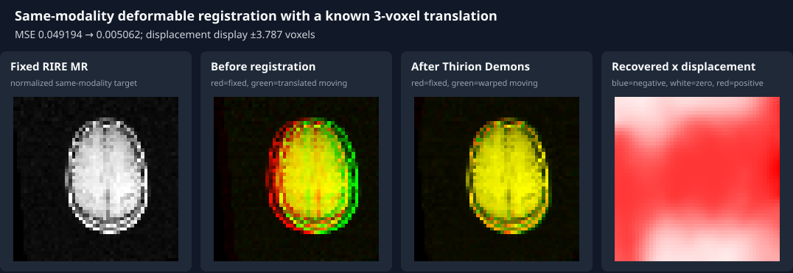

# Deformable Registration

RITK's classic Thirion Demons implementation estimates a dense displacement
field from the fixed-image gradient and the moving-to-fixed intensity
difference. Each iteration applies a bounded force update, optional fluid
regularization, optional diffusion regularization, and a forward warp. The
result carries the warped moving image, the three displacement components, the
final MSE, and the performed iteration count.

The public API is intentionally slice-oriented:

```rust,ignore
use ritk_registration::demons::{DemonsConfig, ThirionDemonsRegistration};

let registration = ThirionDemonsRegistration::new(DemonsConfig::default());
let result = registration.register(
    &fixed,
    &moving,
    [depth, height, width],
    [spacing_z, spacing_y, spacing_x],
)?;
```

The `dims` order is `[z, y, x]`, matching RITK's contiguous volume contract.
The returned `disp_x` uses the forward-warp convention implemented by the
engine. A registration result is not accepted merely because the call returns
`Ok`: deformable registration examples must compare the output against an
identity baseline and inspect the displacement field.

## Dataset-backed translation example

The runnable book example loads the RIRE Patient 001 T1 MR volume, extracts a
bounded central crop, normalizes it, and creates the moving image with a known
three-voxel translation. Using one MR acquisition on both sides is important:
classic Demons minimizes an intensity-difference objective, so applying it
directly to raw CT and MR intensities would be mathematically invalid.

The identity overlay below has separated red/green anatomy and yellow overlap.
After Demons, those fringes approach coincidence and the measured mean-squared
error falls from `0.049194` to `0.005062`. The final panel renders the recovered
x-displacement field on a signed scale; its positive interior direction agrees
with RITK's forward-warp convention.



Regenerate the figure from the real dataset and algorithm:

~~~text
cargo run -p ritk-registration --example book_demons_registration -- \
  docs/book/figures/demons_registration.svg
~~~

The example rejects non-finite displacement values and fails unless the
measured post-registration MSE is lower than the identity baseline. Its
`6 × 48 × 48` crop and 35 iterations preserve the anatomical registration
signal while keeping the already-built example runtime below one second.

For cross-modality registration, use
[CT/MR Mutual-Information Registration](examples/registration_compare_figure.md).
That example uses the RIRE fiducial transform as its geometric reference and a
mutual-information metric that does not assume matching CT and MR intensities.
