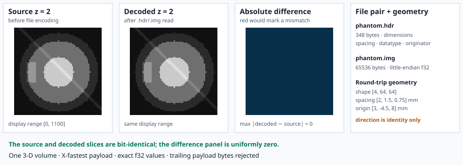

# Example: Analyze 7.5 Round Trip

This example writes and reads a deterministic 4 × 64 × 64 `f32` volume through
the public Analyze API. The phantom contains concentric structures, an
off-center marker, a z-dependent diagonal, and a per-slice intensity offset.
Those features make axis reversal, slice duplication, and value corruption
visible and detectable.



## How to read the figure

The first two panels use the same display range `[0, 1100]`. They should look
identical because the writer stores `f32` and the reader returns those values
without quantization. Similar appearance alone is not the oracle.

The third panel is the explicit comparison:

- dark blue means the displayed source and decoded voxel bits are equal;
- red would identify any mismatch;
- `max |decoded − source| = 0` is calculated from the actual slices.

The executable also compares every voxel in all four slices before generating
the SVG. A wrong shape, geometry field, slice order, or value stops the example.

## Public API

```rust,ignore
use coeus_core::SequentialBackend;
use ritk_analyze::{read_analyze, write_analyze};

let backend = SequentialBackend;
write_analyze("phantom.hdr", &source, &backend)?;
let decoded = read_analyze("phantom.hdr", &backend)?;
```

The `.hdr` file is 348 bytes. For shape `[4, 64, 64]`, the `.img` payload is
`4 × 64 × 64 × 4 = 65,536` bytes. The final panel reports those measured file
sizes and the geometry that the format can reproduce under RITK's convention.

Direction is identity because Analyze 7.5 has no full direction matrix. The
chosen origin is an exact integer multiple of spacing on each physical axis;
otherwise the `originator` convention would round it to the nearest voxel.

After producing the figure, the executable appends one byte to the temporary
payload and confirms that the reader rejects the trailing data. The malformed
pair never becomes an image.

## Run it

From the repository root:

```text
cargo run -p ritk-analyze --example book_analyze -- \
  docs/book/figures/analyze_roundtrip.svg
```

The Analyze pair is temporary. Only the deterministic SVG is retained. The
complete source is `crates/ritk-analyze/examples/book_analyze.rs`.
