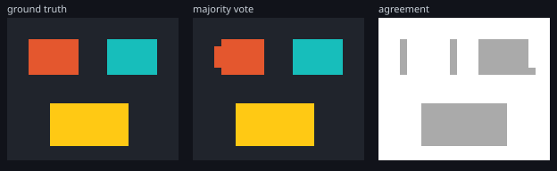

# Example: Atlas Parcellation of a Synthetic Subject

Atlas propagation is easy to run and hard to check. A parcellation is a volume
of integers that always looks plausible, so a pipeline that has silently
mis-registered returns something a reader cannot distinguish from a correct
result. This example removes that problem by synthesising the subject: the
correct parcellation is known exactly, so every number below is an overlap
against a truth rather than a claim that the pipeline returned something.

```bash
cargo run --release -p ritk-registration --example book_parcellation
```



## What is synthesised

The subject is a 16 × 20 × 24 volume at 2.0 × 1.5 × 1.0 mm containing three
structures of different size, position, and aspect ratio, each at its own
intensity. The shape and the spacing are unequal on every axis on purpose: a
cubic volume on an isotropic grid cannot fail an axis-order test, because
reversing the axes leaves every array the same length and every voxel the same
size, so a transposition would cancel itself out and the example would pass
while the geometry was wrong.

Each atlas is that anatomy displaced by a different whole-voxel shift. That is
the situation atlas propagation exists for — the anatomy corresponds but the
coordinates do not — and it is what the registration has to undo before the
labels mean anything. The displacement is whole voxels because a label volume
cannot be interpolated: shifting by half a voxel would require inventing labels
at the boundary, which is the one thing [the chapter](../parcellation.md) says
never to do.

The third atlas is *mislabelled*: its anatomy matches the others exactly, and
only its label volume swaps two structures. The distinction matters. Swapping
its intensities as well would make it a different brain, which a registration is
entitled to match poorly, and the fusion would then be resolving a disagreement
about anatomy. Mislabelling is the case fusion actually exists for: every atlas
fits the subject equally well and only the naming is in dispute.

## What the run reports

```text
atlases, before any registration:
  0: shifted by [1, 0, -1] voxels, Dice vs truth [0.69, 0.69, 0.73]
  1: shifted by [-1, 1, 1] voxels, Dice vs truth [0.57, 0.51, 0.58]
  2: shifted by [0, -1, 2] voxels, Dice vs truth [0.60, 0.00, 0.00]

majority vote:
  Dice vs truth [1.00, 1.00, 1.00]
  3 regions, mean agreement 0.964
  final cross-correlation per atlas [0.9642, 0.9254, 0.9001]

mean agreement inside each structure, majority vote:
  structure 1: 0.952
  structure 2: 0.667
  structure 3: 0.667
```

Three things in that output are worth reading carefully.

The atlases start between 0.51 and 0.73 Dice and the fused result reaches 1.00.
That gap is the registration doing the work; without it the labels would arrive
at the displaced positions and the parcellation would be the average of three
wrong answers.

The mislabelled atlas scores 0.00 on the two structures it swapped, and the
fused result is still 1.00 on both. That is majority voting surviving one
dissenting atlas, which is the reason for using more than one.

The agreement is 0.952 on the structure all three atlases named correctly and
exactly 0.667 on the two the third atlas renamed — two of three. The agreement
map is a measured vote share, not a decoration, and the figure's third panel
shows it as the grey blocks over the two disputed structures against the white
unanimous background. The thin grey strips elsewhere are the parcel boundaries,
where the residual registration error is: precisely where a connectome's
streamline endpoints land.

## Where weighting has nothing to work with

The example also runs both fusion rules over atlases with *none* mislabelled.
Nothing is then in dispute except each atlas's own registration error:

```text
control — interchangeable atlases, none mislabelled:
  majority vote: Dice vs truth [1.00, 1.00, 1.00]
  joint fusion:  Dice vs truth [0.88, 0.95, 0.91]
```

Voting wins, and the reason is the assumption each rule makes rather than a
fault in either. Joint label fusion buys its advantage by trusting whichever
atlas matches the subject best in each neighbourhood — which requires the
atlases to differ in local registration quality *and* for the intensities to
reveal that difference. Here all three are the same anatomy under different
whole-voxel shifts, so they fit equally well everywhere, the weights come out
near-equal, and following the locally best one means inheriting that one
atlas's warp error. Voting instead averages three independent errors, which is
exactly what averaging is good at.

Read that as a statement about the fixture, not a ranking. On real cohorts the
atlases are different brains that register with genuinely different local
quality, which is the situation joint fusion was designed for and this
synthetic one deliberately is not. What the control establishes is the boundary
of the claim in [the chapter](../parcellation.md): majority voting is right
when the atlases are interchangeable, and this is what "interchangeable" costs
the alternative.

## What the example does not show

It does not show whether the pipeline works on a brain. Synthetic blocks have
sharp intensity boundaries and no noise, no partial volume, no lesion, and no
anatomical variability, so the registration's job here is far easier than on
real data. What the example establishes is that the pipeline is wired correctly
end to end and that its reported agreement means what it says — necessary
conditions, not sufficient ones. Validation against a labelled cohort is a
different tier of evidence, and this is not it.
