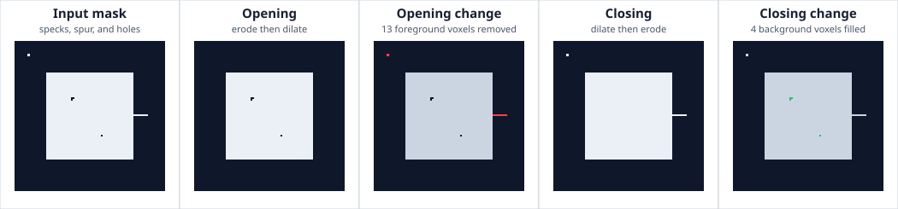

# Example: Binary Opening and Closing

Binary opening and closing are dual compositions with visibly different
purposes:

- `open_B(A) = (A ⊖ B) ⊕ B` removes structures that cannot contain the
  structuring element;
- `close_B(A) = (A ⊕ B) ⊖ B` fills gaps that cannot contain the reflected
  structuring element.

Opening is anti-extensive: it removes foreground structures that cannot
contain the structuring element. Closing is extensive: it fills background
gaps that cannot contain the reflected element.

The runnable example uses one deterministic 3-D mask containing both defect
classes. The isolated speck and one-voxel spur give opening something to
remove; the small internal holes give closing something to fill. The red and
green change maps make those distinct effects explicit:



## Source and command

Source: `crates/ritk-filter/examples/book_binary_morphology.rs`

```text
cargo run -p ritk-filter --example book_binary_morphology -- \
  docs/book/figures/binary_morphology.svg
```

The example executes `BinaryMorphologicalOpening::apply_native` and
`BinaryMorphologicalClosing::apply_native` with radius one. It fails unless:

- opening preserves geometry and every displayed interior output voxel is
  less than or equal to its input voxel;
- closing preserves geometry and every displayed interior output voxel is
  greater than or equal to its input voxel;
- opening removes at least one foreground voxel;
- closing fills at least one background voxel; and
- the opening and closing outputs differ.

The contract is checked on the center slice because RITK's documented
zero-background boundary condition can remove foreground at the outermost
volume planes during the erosion stage of closing.

The [complete processing pipeline](processing_pipeline.md) shows the same
operations in a longer filter chain. Tests additionally cover radius-zero
identity, border behavior, foreground values, and native/generic parity.
