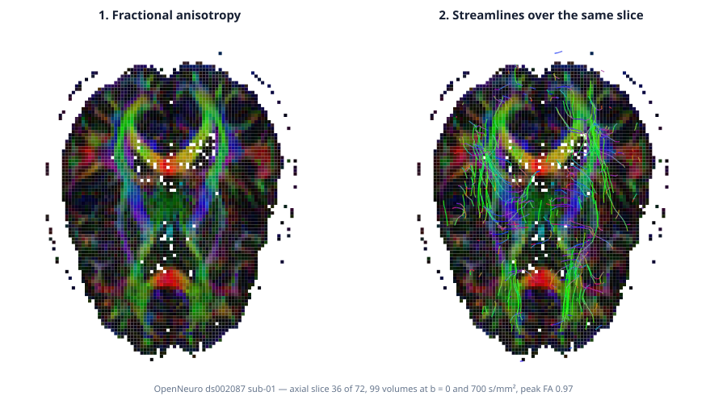

# Human Tractography and Connectomics

The analytical [signal-to-streamlines example](diffusion_tractography.md) can
test recovery against a known fibre axis. Human diffusion MRI has no equivalent
voxelwise ground truth. This workflow therefore makes a narrower claim: RITK
can reproducibly fit a complete public human acquisition, create a whole-brain
tractogram, assign endpoints to an aligned anatomical parcellation, and expose
the validation evidence and residual limitations with the result.



## Data and provenance

The input is the [Stanford HARDI dataset](https://purl.stanford.edu/yx282xq2090):
81 × 106 × 76 human diffusion MRI voxels, 150 directions at
\(b=2000\) s/mm², 10 \(b=0\) volumes, and a DWI-aligned reduced FreeSurfer
parcellation. The repository record states that the diffusion series was
motion-corrected to the mean \(b=0\) image but was not eddy-current corrected.

The data use the [Open Data Commons PDDL 1.0](https://opendatacommons.org/licenses/pddl/1-0/)
public-domain dedication. Stanford's record also prohibits attempts to identify
participants or infringe their privacy. This example performs aggregate method
demonstration only.

Imaging bytes are gitignored. The download script resolves each Stanford object
directly and verifies the five MD5 digests published with the dataset fetcher:

```bash
bash test_data/diffusion/download.sh
cargo run --release -p ritk-diffusion --example book_brain_tractography
```

The executable exits without writing when the data are absent. A successful
run replaces both the figure above and the complete
[connectivity matrix JSON](../figures/brain_connectome.json).

## Creation workflow

The example executes one deterministic path:

1. Parse all 160 FSL gradient entries. Six-decimal unit vectors are normalised
   only when their norm error is within the derived \(10^{-5}\) rounding
   envelope; larger errors remain invalid input.
2. Read the DWI and reduced parcellation through RITK's native NIfTI boundary.
   Their shape, origin, spacing, and direction matrix must match exactly.
3. Fit a diffusion tensor at every valid voxel. Seed image labels 1 and 2
   (cerebral white matter and corpus callosum) at fractional anisotropy
   \(\mathrm{FA}\geq0.25\).
4. Track bidirectionally with 0.5-voxel Euler steps, sign-invariant trilinear
   orientation interpolation, a 60-degree turn limit, and a continuation floor
   of \(\mathrm{FA}=0.15\). FSL `(column,row,depth)` direction components are
   explicitly reordered to RITK's `[depth,row,column]` image-index axes before
   integration.
5. Convert the tracker's `[depth,row,column]` coordinates to parcellation
   `[x,y,z]`, then count each endpoint pair in the undirected regional matrix.
   White-matter labels are background for endpoint assignment; only
   grey-matter labels actually present in the image become graph nodes.
6. Transform each streamline through the reference image geometry before
   reporting its physical length in millimetres.

These are explicit method choices, not tuned claims of anatomical optimality.
The source is
[`book_brain_tractography.rs`](https://github.com/ryancinsight/ritk/blob/main/crates/ritk-diffusion/examples/book_brain_tractography.rs).

## Computed result

The committed artifacts are generated from the checksummed acquisition:

| Measure | Result |
|---|---:|
| Tensor-fitted voxels | 222,880 |
| White-matter seeds | 9,737 |
| Generated streamlines | 9,737 |
| Median physical length | 70.0 mm |
| Streamlines assigned to a region pair | 2,350 (24.1 %) |
| Same-region assignments | 355 |
| Inter-region assignments | 1,995 |
| Image-present grey-matter regions | 84 |
| Nonzero inter-region edges | 368 |
| Graph density | 0.106 |

The strongest non-self edges are descriptive outputs of this tracking and
endpoint policy:

| Source | Target | Streamlines |
|---|---|---:|
| left superior frontal | right superior frontal | 232 |
| right inferior parietal | right superior parietal | 44 |
| left precuneus | right precuneus | 43 |
| left superior parietal | left thalamus proper | 39 |
| left superior parietal | right precuneus | 38 |

The complete JSON preserves all 84 labels, the fully symmetric 84 × 84 weight
array — both `(i, j)` and `(j, i)` carry the weight — and the streamline
accounting: how many were supplied, how many produced an inter-region edge, how
many stayed within one region, and how many could not be assigned. A table entry
is a streamline count, not an axon count, connection probability, or effect
size.

## Reading the figure

**1. Directionally encoded FA.** Brightness is fractional anisotropy. Hue is
the absolute principal-eigenvector direction in anatomical axes: red
left-right, green anterior-posterior, blue superior-inferior. The callosal arc,
bilateral projection anatomy, dark ventricles, and darker cortical rim are
visible. Colour channels are derived from the NIfTI direction matrix instead
of assuming storage axes.

**2. Whole-brain streamlines.** The middle panel projects a bounded sample of
the three-dimensional tractogram over the same axial plane. Each polyline's
colour encodes its endpoint-to-endpoint direction. All 9,737 streamlines
contribute to the reported measures and connectome even though at most 900 are
drawn.

**3. Endpoint connectome.** The symmetric heat map uses
\(\log(1+w)\) colour scaling so both weak and strong nonzero edges remain
visible. The upper-left and lower-right blocks are within-hemisphere edges; the
off-diagonal blocks are inter-hemisphere edges. Empty cells are zero, not
missing observations.

## Validation evidence

The workflow checks claims at distinct levels:

| Level | Executed oracle | Established claim |
|---|---|---|
| Provenance | Exact MD5 for all five downloaded files | The run uses the identified public objects |
| Gradient boundary | 160-entry count, finite values, and bounded unit-vector normalisation | FSL metadata enters the tensor model without accepting materially invalid directions |
| Spatial alignment | Exact shape, origin, spacing, and direction equality | DWI index points and parcellation labels share one transform |
| Tracking accounting | Seeds attempted = streamlines generated = 9,737 | Every selected seed produced one retained streamline |
| Connectome accounting | \(9737=7387+355+1995\) and the matrix sum is 2,350 | Every streamline is classified exactly once; assigned weights are neither lost nor duplicated |
| Matrix symmetry | `weight(a,b) == weight(b,a)` for every region pair | Undirected queries agree with the stored upper triangle |
| Visual inspection | Generated anatomy, tracks, labels, and printed metrics inspected together | The figure depicts the computed acquisition and not placeholder geometry |

These checks establish reproducibility and internal consistency. The
[DIPY Stanford connectivity example](https://docs.dipy.org/1.12.0/examples_built/streamline_analysis/streamline_tools.html)
uses the same aligned DWI/label relationship and endpoint-count interpretation,
which supplies an independent convention check rather than a numeric oracle.

## Limits of the result

- The input is one subject and retains acquisition artefacts: no eddy-current
  or susceptibility correction is applied here.
- A tensor model uses one orientation per voxel even though the HARDI
  acquisition can support multi-fibre modelling. Crossing fibres therefore
  remain unresolved.
- Tracking is deterministic and is not anatomically constrained. The 24.1 %
  exact endpoint-assignment rate exposes that many tracks terminate in
  white matter or background under this policy; the example does not dilate
  labels or search nearby cortex to inflate the count.
- Raw streamline counts depend on seeding, stopping, length, geometry, and
  parcellation. No SIFT-class correction, null model, population normalisation,
  or test-retest analysis is applied.
- A coherent tractogram can contain false-positive bundles. The international
  tractography challenge found this even among state-of-the-art pipelines
  ([Maier-Hein et al., Nature Communications 8, 1349, 2017](https://doi.org/10.1038/s41467-017-01285-x)).

Consequently this is method and software validation, not anatomical ground
truth or clinical validation. Stronger biological evidence requires an
independent reference such as physical phantoms, tracer or histological data,
and a prospectively specified population protocol.
