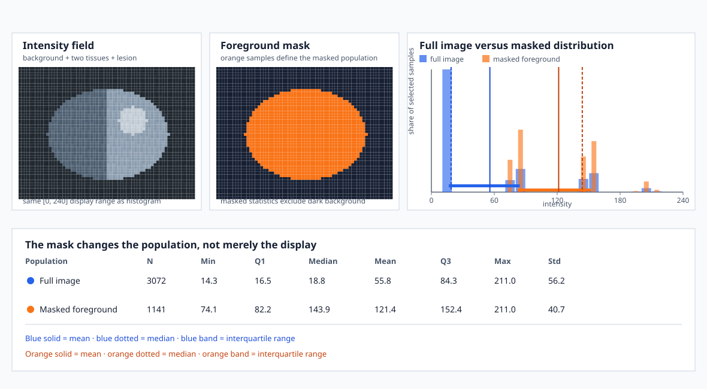

# Example: Full-image and Masked Distributions

This example creates a deterministic intensity field with dark background,
two foreground tissue groups, and a bright lesion. It then computes full-image
and masked-foreground statistics through RITK's public slice APIs.



The panels answer three separate questions:

1. **Intensity field** — what values are present and where?
2. **Foreground mask** — exactly which samples define the masked population?
3. **Distribution comparison** — how do the selected populations differ on
   one intensity axis?

Blue bars are the share of all image samples in each bin. Orange bars are the
share of masked samples in the same bins. Each population is normalized by its
own sample count, so bar heights compare distribution shape rather than mask
size. Solid lines mark means, dotted lines mark medians, and the narrow bands
at the base mark interquartile ranges.

The numeric table makes the change measurable. The full-image median remains
in the dark background peak, while the masked median lies in foreground
tissue. This is why an empty-mask fallback would be misleading: full-image and
masked statistics are not interchangeable views of one population.

## Source and command

Source: `crates/ritk-statistics/examples/book_descriptive_statistics.rs`

```text
cargo run -p ritk-statistics --example book_descriptive_statistics -- \
  docs/book/figures/descriptive_statistics.svg
```

The example fails before writing the figure if:

- RITK's min, max, mean, standard deviation, or floor-rank quartiles disagree
  with an independent full-sort reference;
- either histogram total differs from its source population;
- the image or mask violates the finite-input contract; or
- the phantom does not produce a large enough mean and median separation to
  make the comparison visually meaningful.

## Adapt the workflow

```rust,ignore
let full = compute_statistics_from_slice(image_values, 0)?;
let masked = masked_statistics_from_slices(image_values, mask_values, 0)?;

let full_histogram = histogram_from_slice(image_values, 0.0, 240.0, 24)?;
let masked_histogram =
    histogram_from_slice(masked_values, 0.0, 240.0, 24)?;
```

Use identical histogram edges when comparing populations. Different ranges or
bin counts can make the same data appear different and invalidate a visual
comparison.
