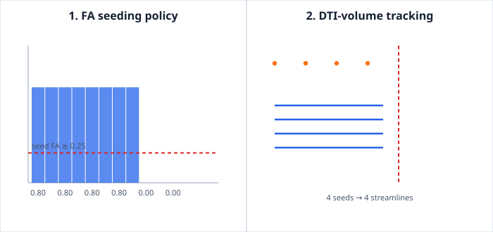

# Example: Reusable DTI-Volume Tracking

This example exercises the complete reusable DTI tractography boundary. It
fits a known prolate tensor for eight image-axis voxels and a low-anisotropy
tensor for four voxels, places those maps in a `DtiVolume`, selects seeds by an
inclusive FA threshold, and tracks through the validated volume.



The first panel plots the fitted FA for every voxel. Blue bars are the values
returned by `DiffusionMaps::fractional_anisotropy`; the red line is the seed
threshold. The orange points are the seeds returned by
`dti_volume_seed_points`, not hand-selected coordinates. The second panel
plots the streamlines returned by `dti_volume_tractography`; its boundary marks
the first low-anisotropy voxel where `DtiVolume` stops the field.

The example asserts before writing the SVG that:

- the fitted high- and low-anisotropy regimes lie on the expected sides of the
  seed and tracking thresholds;
- the tracking result attempted and generated exactly the computed seed count;
- every generated line terminates at a field boundary or the configured step
  limit; and
- the SVG contains exactly one bar, seed marker, and streamline primitive for
  each corresponding computed value.

## Source and command

Source: `crates/ritk-tractography/examples/book_dti_volume_tractography.rs`

```text
cargo run --locked -p ritk-tractography --example book_dti_volume_tractography -- \
  docs/book/figures/dti_volume_tractography.svg
```

The output is deterministic because the gradient scheme, tensor values, and
rendering coordinates are fixed. This is a code and numerical-contract
verification example. It is not anatomical or clinical validation.
