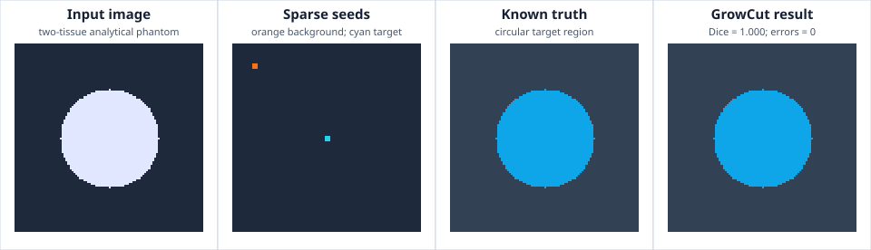

# Example: GrowCut from Sparse Seeds

The runnable example constructs a deterministic two-tissue image with a
circular target, places a \(3\times3\) background seed and a \(3\times3\)
target seed, and executes `GrowCutFilter::apply_native`.



The four panels keep the algorithm's inputs and oracle separate:

- the input panel shows the two intensity classes;
- orange and cyan marks show the actual seed voxels;
- the truth panel is generated analytically from the known circle equation;
- the result panel is generated from RITK's returned label image and reports
  foreground Dice and the exact label-error count.

## Source and command

Source: `crates/ritk-segmentation/examples/book_growcut.rs`

```text
cargo run -p ritk-segmentation --example book_growcut -- \
  docs/book/figures/growcut.svg
```

The example fails unless GrowCut:

- preserves shape, origin, spacing, and direction;
- labels every voxel exactly as the analytical circle specifies;
- returns zero false labels; and
- produces foreground Dice \(=1\).

The analytical phantom verifies label propagation, competition at a
high-contrast boundary, and spatial metadata. It does not establish clinical
accuracy on heterogeneous anatomy.
