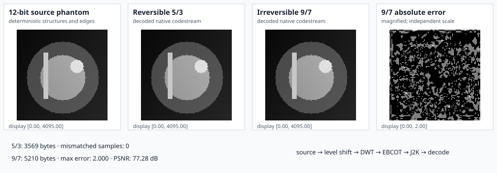

# Example: JPEG 2000 Quality and Size

This example creates one deterministic 96 × 96, 12-bit medical-style phantom.
It encodes and decodes that same image three times through RITK's public native
API: three-level reversible 5/3, three-level irreversible 9/7 with `Δ = 1`, and
the same irreversible path with `Δ = 32`.



All four anatomy panels use the same `[0, 4095]` display range. The reversible
panel must match the source both visually and numerically. Comparing `Δ = 1`
with `Δ = 32` isolates scalar quantization: transform depth and source stay
fixed. The fifth panel is not another contrast-stretched anatomy image; it is
`abs(coarse - source)`, displayed on `[0, max error]` with a
black→red→yellow heat map. Its independent scale, distinct palette, and printed
maximum error expose where coarse quantization removes detail.

The metrics below the panels are computed from the same arrays that are
rendered:

- the 5/3 mismatch count is an exact equality oracle and must be zero;
- each codestream size is the actual returned byte length;
- both 9/7 maximum errors are measured per sample;
- PSNR uses the declared 12-bit peak value, 4095; and
- the executable fails if `Δ = 32` does not reduce bytes and increase error
  relative to `Δ = 1` on this fixed phantom.

## Source and command

Source: `crates/ritk-codecs/examples/book_jpeg_2000.rs`

```text
cargo run -p ritk-codecs --example book_jpeg_2000 -- \
  docs/book/figures/jpeg_2000_codec.svg
```

The example fails rather than writing a misleading figure if reversible
reconstruction differs at any sample, either lossy error panel is degenerate,
the coarse size/error tradeoff is reversed, or rendered arrays do not match
the declared geometry.

## Adapt the workflow

For an unsigned grayscale image:

```rust,ignore
use ritk_codecs::jpeg_2000::encoder::{encode_grayscale_j2k, Jpeg2000Encoding};
use ritk_codecs::{decode_jpeg2000_fragment, PixelLayout, PixelSignedness};

let codestream = encode_grayscale_j2k(
    &samples,
    rows,
    columns,
    bits_stored,
    PixelSignedness::Unsigned,
    Jpeg2000Encoding::Lossless {
        decomposition_levels,
    },
)?;

let reconstructed = decode_jpeg2000_fragment(
    &codestream,
    PixelLayout {
        rows: usize::try_from(rows)?,
        cols: usize::try_from(columns)?,
        samples_per_pixel: 1,
        bits_allocated: u16::try_from(bits_stored)?,
        pixel_representation: PixelSignedness::Unsigned,
        rescale_slope: 1.0,
        rescale_intercept: 0.0,
    },
)?;
```

Use `Jpeg2000Encoding::Lossless` for the lossless DICOM transfer syntax. For an
irreversible stream, construct `QuantizationStep::new(delta)` and pass it in
`Jpeg2000Encoding::Lossy`. Increase `delta` only after measuring reconstruction
error on the intended image class. The value controls scalar quantization, not
a promised file size or bitrate.
