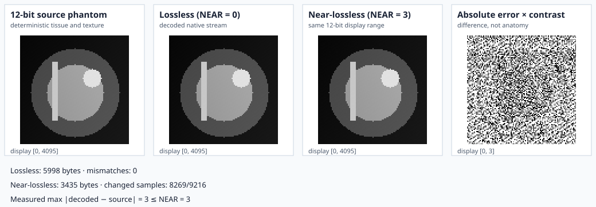

# Example: Lossless and Near-Lossless JPEG-LS

This example creates one deterministic 96 × 96, 12-bit medical-style phantom.
It encodes and decodes the same image twice through RITK's public native API:
lossless `NEAR = 0` and near-lossless `NEAR = 3`.



The first three panels deliberately use the same `[0, 4095]` display range.
That makes their anatomy directly comparable, but an error of at most three
gray levels is difficult to see across a 12-bit range. The fourth panel solves
that visibility problem: it displays
`abs(near_lossless - source)` on `[0, 3]`. It is an error map, not another
contrast-stretched anatomy image.

The metrics below the panels are computed from the arrays that are rendered:

- the lossless mismatch count is an exact equality oracle and must be zero;
- each encoded size is the actual returned stream length;
- changed-sample count reports how many near-lossless values differ; and
- maximum absolute error must be no greater than the declared `NEAR = 3`.

## Source and command

Source: `crates/ritk-codecs/examples/book_jpeg_ls.rs`

```text
cargo run -p ritk-codecs --example book_jpeg_ls -- \
  docs/book/figures/jpeg_ls_codec.svg
```

The example fails instead of writing a misleading figure if lossless
reconstruction differs at any sample, near-lossless error exceeds `NEAR`, the
near-lossless path produces a degenerate all-zero error map, malformed input
does not return `PixelCountMismatch`, or any rendered array disagrees with the
declared geometry.

## Adapt the workflow

```rust,ignore
let stream = encode_grayscale_jpeg_ls(
    &samples,
    rows,
    columns,
    bits_stored,
    near,
)?;

let reconstructed = decode_jpeg_ls_fragment(
    &stream,
    PixelLayout {
        rows: usize::try_from(rows)?,
        cols: usize::try_from(columns)?,
        samples_per_pixel: 1,
        bits_allocated: if bits_stored <= 8 { 8 } else { 16 },
        pixel_representation: PixelSignedness::Unsigned,
        rescale_slope: 1.0,
        rescale_intercept: 0.0,
    },
)?;
```

Use `near = 0` when every stored integer must be preserved. A nonzero value
permits a bounded per-sample change; whether that is clinically acceptable is
a dataset and workflow policy outside the codec.
