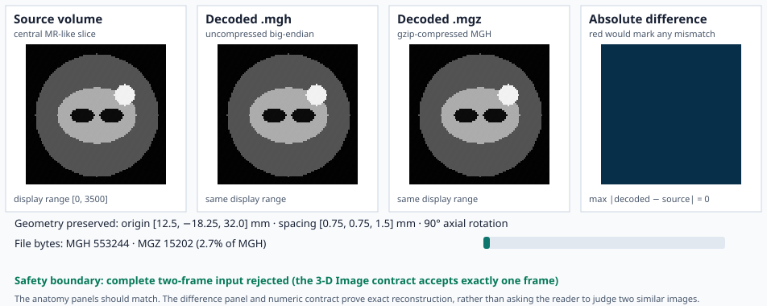

# Example: MGH and MGZ Round Trip

This example creates one deterministic 15 × 96 × 96 MR-like volume with
non-default origin, spacing, and direction. It writes the volume as both MGH
and MGZ, reads both files through the public API, and checks:

1. shape equality;
2. bit-exact `f32` voxel equality;
3. origin, spacing, and direction equality;
4. rejection of a complete two-frame MGH input.

The central-slice images are expected to look identical. The fourth panel is
the decisive comparison: it displays the per-voxel absolute error, uses red
for any nonzero mismatch, and reports the maximum error numerically.



In this deterministic input, gzip reduces MGZ to a small fraction of the MGH
size because the synthetic tissues contain large repeated regions. That ratio
is an example result, not a general medical-image compression guarantee.

## Public API

The core workflow is:

```rust,ignore
use coeus_core::SequentialBackend;
use ritk_mgh::{read_mgh, write_mgh};

let backend = SequentialBackend;
write_mgh(&source, "brain.mgh", &backend)?;
write_mgh(&source, "brain.mgz", &backend)?;

let decoded_mgh = read_mgh("brain.mgh", &backend)?;
let decoded_mgz = read_mgh("brain.mgz", &backend)?;
```

Compression is selected by `.mgz` or `.mgh.gz`; the caller does not select a
second codec API. The uncompressed `.mgh` path is useful when another tool
requires direct field access, while `.mgz` is the normal storage-efficient
representation.

## Why the explicit difference panel matters

Placing source and reconstruction side by side is necessary but insufficient:
a few changed voxels, a small intensity bias, or a display-window mismatch can
be invisible at page scale. The runnable example compares `f32::to_bits()` for
every voxel before producing the figure. The image panel then communicates the
same result:

```text
error(x, y) = max(
    |MGH(x, y) - source(x, y)|,
    |MGZ(x, y) - source(x, y)|
)
```

The all-blue error panel means every value is zero. Any nonzero value would be
red, and the figure generator fails before writing the SVG.

## Geometry check

The example uses:

```text
origin    = [12.5, -18.25, 32.0] mm
spacing   = [0.75, 0.75, 1.5] mm
direction = [[0, -1, 0],
             [1,  0, 0],
             [0,  0, 1]]
```

These binary-exact values exercise the RAS-center conversion without requiring
a plotting tolerance. The example fails if either decoded image changes any
geometry component.

## Run it

From the repository root:

```text
cargo run -p ritk-mgh --example book_mgh -- \
  docs/book/figures/mgh_roundtrip.svg
```

The program uses temporary files for MGH, MGZ, and the malformed multi-frame
fixture. Only the deterministic SVG is retained. The complete runnable source
is `crates/ritk-mgh/examples/book_mgh.rs`.
