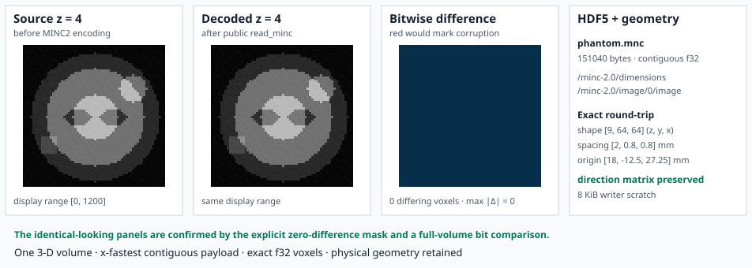

# Example: MINC2 Round Trip

This example constructs a deterministic 9 × 64 × 64 MR-like phantom with an
off-center lesion, asymmetric marker, slice-dependent texture, anisotropic
spacing, nonzero origin, and a non-identity direction matrix. It writes and
reads the volume through `write_minc` and `read_minc`.



## How to read the figure

The source and decoded panels use the same display range `[0, 1200]`. They are
expected to look identical, but appearance is not the correctness test. The
third panel is a direct bitwise comparison:

- dark blue means the source and decoded `f32` bits match;
- red would mark a corrupted voxel;
- the displayed mismatch count and maximum absolute error are computed from
  the actual central slices.

The executable also compares every voxel and every geometry field over the
complete volume before writing the SVG. A wrong shape, axis order, origin,
spacing, direction, or value stops generation.

The lower panel is intentionally different. It writes a second, foreign-style
`i16` MINC2 fixture with stored codes `[0, 25, 50, 100]` in each of two slices.
Both slices use `valid_range = [0, 100]`, but their real ranges differ:

- slice 0 maps to `[-1000, 1000]`;
- slice 1 maps to `[0, 200]`.

The displayed decoded rows come from `read_minc`. They expose the mapping as
numbers so the scaling effect cannot be hidden by automatic image contrast.

## What crosses the format boundary

The last panel reports the measured file size and the actual source geometry.
The payload is one x-fastest contiguous little-endian `f32` dataset. Shape,
voxel bits, origin, spacing, and direction round-trip exactly in RITK's current
profile. The lower panel separately exercises per-slice quantitative integer
scaling. Compression, chunking, patient/study metadata, integer-valued writing
through the public writer, and multiresolution images remain outside this
example.

The writer converts the 36,864 voxels in 2,048-value chunks. Its conversion
scratch remains 8 KiB rather than growing to another 147,456-byte volume-sized
buffer.

## Run it

From the repository root:

```text
cargo run -p ritk-minc --example book_minc -- \
  docs/book/figures/minc_roundtrip.svg
```

The `.mnc` file is temporary. Only the deterministic SVG is retained. The
complete source is `crates/ritk-minc/examples/book_minc.rs`.
