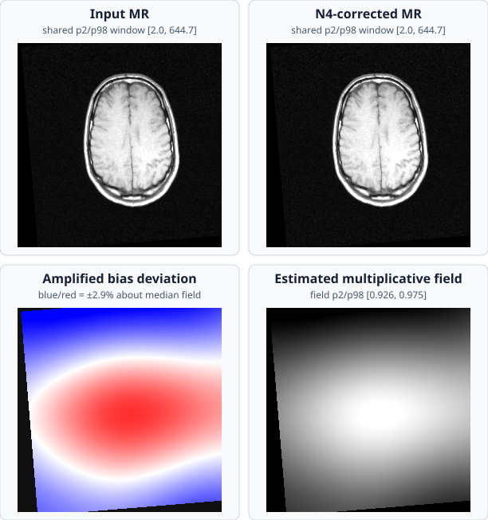

# Example: N4 Bias-Field Correction

MRI intensity is not spatially uniform even when the underlying tissue is.
The N4 model writes the measured image as

\[
I(x) = S(x) B(x), \qquad \log I(x) = \log S(x) + \log B(x),
\]

where \(S\) is the tissue signal and \(B\) is a slowly varying multiplicative
bias field. RITK estimates the log-bias with histogram sharpening and a
multi-resolution cubic B-spline fit, then returns \(\exp(\log I - \widehat b)\).
The implementation follows Tustison et al., *N4ITK: Improved N3 Bias
Correction*, IEEE TMI 29(6), 1310–1320 (2010), which is also cited by the
filter's Rustdoc.

The figure uses the real RIRE Patient 001 T1 volume:



The four panels use a two-by-two layout:

1. the source MR slice;
2. the native N4-corrected slice;
3. the estimated field's percentage deviation from its foreground median,
   using blue for lower and red for higher multiplicative bias; and
4. the estimated multiplicative field \(I / I_{corrected}\).

The first two panels intentionally use one shared robust intensity window
formed from both slices' 2nd–98th percentile ranges. Their labels repeat that
window so the comparison cannot be mistaken for independently normalized
images. Because N4 correction is spatially smooth and can remain subtle in
anatomical views, the third panel removes the field's global median scale and
amplifies its spatial deviation. It is masked outside the bright foreground
and clipped only to its 98th-percentile absolute deviation for display; the
underlying correction is not altered.

The third and fourth panels are computed from the same input and corrected
output. They are diagnostics of the correction estimated by N4, not
hand-authored illustrations.

## Source and command

Source: `crates/ritk-registration/examples/book_n4_bias.rs`

```text
cargo run -p ritk-registration --example book_n4_bias -- \
  docs/book/figures/n4_bias_correction.svg
```

The example reads `test_data/registration/rire/training_001_mr_T1.mha`, runs
the Coeus-native `N4BiasFieldCorrectionFilter`, and preserves the volume shape
and physical metadata. It uses two fitting levels and twelve iterations per
level so the documentation example remains bounded while exercising the real
multi-resolution path. The full filter defaults remain available through
`N4Config::default()` for production workloads.

## Verification

- The source and corrected arrays have identical voxel counts and geometry.
- The corrected output contains finite positive intensities.
- The figure is regenerated by the runnable Rust example from the RIRE input.
- Filter correctness is covered by the package's analytical and native-path
  N4 tests; this figure checks the real-data visual behavior separately.
