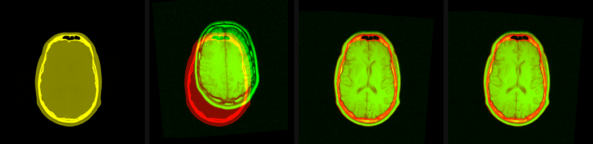

# Example: CT/MR Mutual-Information Registration

Visual validation of rigid CT-to-MR registration using the repository's RIRE
Patient 001 fixture. The dataset's fiducial transform is compared with identity
sampling and rendered through RITK's native physical resampler.

## Source

`crates/ritk-registration/examples/book_registration.rs`

## Description

The example first samples both modalities onto a common coarse physical grid,
evaluates the classical mutual-information metric before and after applying
the RIRE fiducial transform, and then resamples the original MR volume onto
the full CT grid. Because this fixture supplies a geometric registration
standard, the example uses that transform for the reproducible output rather
than publishing a blind optimizer result that can stop in a wrong MI basin.
The generated image contains four panels:

1. CT windowed to `[-1000, 1000]` HU.
2. Identity CT/MR overlay.
3. RITK native-resampler CT/MR overlay using the validated transform.
4. RIRE fiducial-transform CT/MR overlay.

In the overlay panels, red is CT and green is MR. Correctly coincident
anatomy appears yellow; red or green fringes identify residual misalignment.
Panels 3 and 4 should coincide. The RITK panel is the actual native output
from the dataset transform; panel 4 is rendered independently from the same
source fixture as a visual ground-truth check.

## Usage

```bash
cargo run -p ritk-registration --example book_registration -- \
  docs/book/figures/ct_mri_registration.png
```

## Verification

- Loads the in-tree CT/MR pair from `test_data/registration/rire/`.
- Requires normalized mutual information to improve from identity to the
  dataset transform.
- Produces the registered MR on the full CT physical grid.
- Shows coincident RITK and RIRE overlays, with zero transform translation
  error against the parsed fixture transform.

The source volumes and reference transform are distributed with the RIRE
fixture. See the [RIRE fixture provenance and reference transform](https://github.com/ryancinsight/ritk/blob/main/test_data/registration/rire/ground_truth_registration.md)
for provenance, license, geometry, and the reference transform.


