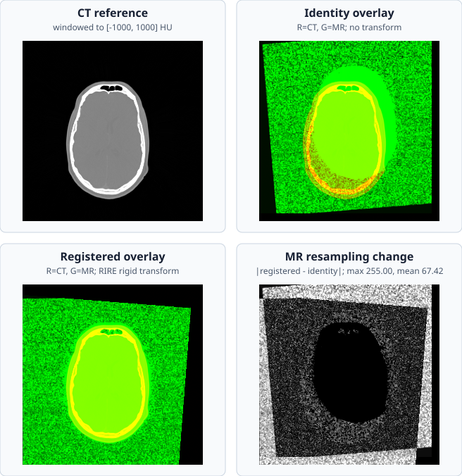

# Example: CT/MR Mutual-Information Registration

Visual validation of rigid CT-to-MR registration using the repository's RIRE
Patient 001 fixture. The dataset's fiducial transform is compared with identity
sampling and rendered through RITK's native physical resampler. The figure is
explicitly labeled so the registration change can be read without guessing
which panel is pre-registration or post-registration.

## Source

`crates/ritk-registration/examples/book_registration.rs`

## Description

The example first samples both modalities onto a common coarse physical grid,
evaluates moving-linear partial-volume NMI before and after applying the RIRE
fiducial transform, prepares packed MIND-SSC descriptors on at most 8,192
deterministically selected complete-support CT centers within a conventional
`[-200, 200]` HU soft-tissue mask, and scores MR directly at those centers
before and after the transform. It then resamples the original MR volume onto
the full CT grid. Because this fixture supplies a geometric registration
standard, the example uses that transform for the reproducible output rather
than publishing a blind optimizer result that can stop in a wrong MI basin.
The generated SVG contains four labeled panels:

1. CT windowed to `[-1000, 1000]` HU.
2. Identity CT/MR overlay.
3. Registered CT/MR overlay using the RIRE fiducial transform through the
   native resampler.
4. Absolute MR intensity change between the identity and registered samples.

In the overlay panels, red is CT and green is MR. Correctly coincident
anatomy appears yellow; red or green fringes identify residual misalignment.
Their subtitles report fixed-denominator MIND-SSC similarity. The score uses
the classical physical `[z,y,x]` affine through RITK's axis-convention bridge,
then samples native `[x,y,z]` image geometry; the example does not reinterpret
an already-physical affine as an index transform.
The fourth panel is not a second registration result: it is a data-derived
diagnostic showing where the transform changes the sampled MR values. Its
subtitle reports the maximum and mean absolute change for the displayed slice.

## Usage

```bash
cargo run -p ritk-registration --example book_registration -- \
  docs/book/figures/ct_mri_registration.svg
```

## Verification

- Loads the in-tree CT/MR pair from `test_data/registration/rire/`.
- Requires normalized mutual information to improve from identity to the
  dataset transform.
- Reports fixed-denominator MIND-SSC at identity and at the dataset transform,
  together with its deterministic center count and exact retained heap
  payload. The metric is an independent diagnostic here; this fixture does not
  assert that one raw CT soft-tissue mask validates MIND-SSC across modalities.
- Produces the registered MR on the full CT physical grid.
- Uses one parsed RIRE transform and one native resampling call for the
  registered panel, avoiding a duplicate reference panel.
- Reports the maximum and mean absolute MR change between identity and
  registered sampling.

The source volumes and reference transform are distributed with the RIRE
fixture. See the [RIRE fixture provenance and reference transform](https://github.com/ryancinsight/ritk/blob/main/test_data/registration/rire/ground_truth_registration.md)
for provenance, license, geometry, and the reference transform.


