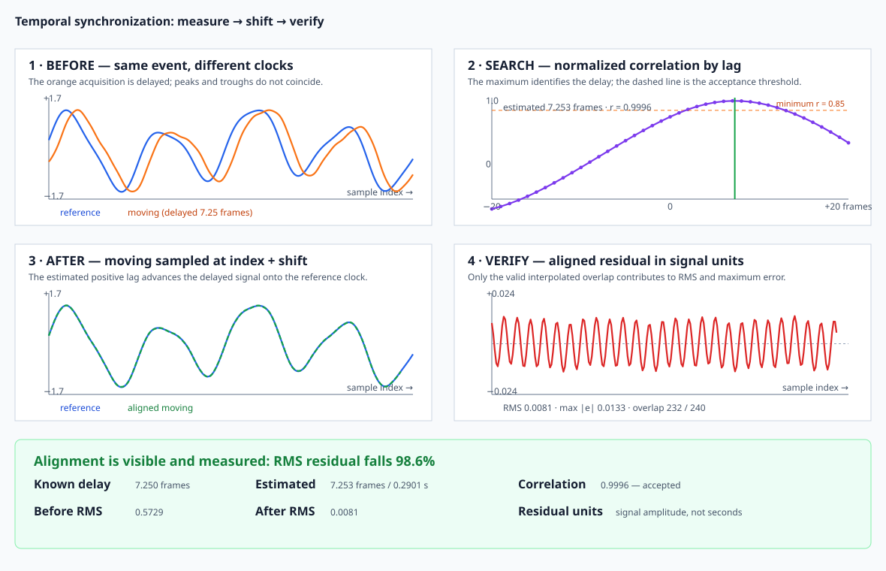

# Example: Before and After Temporal Alignment

The same delayed synthetic acquisition drives every panel and every number in
this figure. The example fails before writing the SVG if the estimated delay,
acceptance status, correlation, overlap, or independently recomputed
residuals contradict the displayed result.



## Read the panels in order

1. **Before** — blue and orange peaks refer to the same waveform but occur at
   different sample indices. This is the error being corrected.
2. **Search** — normalized correlation is evaluated over the configured lag
   window. The green vertical line marks the fractional estimate; the orange
   dashed line is the minimum accepted correlation.
3. **After** — the delayed moving signal is sampled at
   `reference_index + shift_frames`. The dashed green trace should lie over
   the blue reference through the valid overlap.
4. **Verify** — the residual has its own expanded vertical scale. This prevents
   a visually overlapping pair from hiding systematic error.

The summary strip reports the known and estimated shifts separately, gives
seconds only for the timing result, and labels RMS residuals as signal
amplitude. “Before RMS” compares signals at the same uncorrected indices;
“After RMS” uses only the valid interpolated overlap.

## Source and command

Source: `crates/ritk-registration/examples/book_temporal_sync.rs`

```text
cargo run -p ritk-registration --example book_temporal_sync -- \
  docs/book/figures/temporal_synchronization.svg
```

The example uses a 7.25-frame delay, 40 ms frame spacing, a ±20-frame search,
and a minimum correlation of 0.85. Small deterministic acquisition noise keeps
the example realistic without making the expected delay ambiguous.

Before rendering, it verifies that:

- fractional refinement is closer to 7.25 frames than integer quantization;
- peak correlation is at least 0.99 and the result is accepted;
- independently interpolated RMS, maximum residual, and overlap equal RITK's
  public diagnostics; and
- temporal alignment reduces RMS residual by at least 85%.

## Interpreting a real acquisition

A high peak is necessary but not sufficient. Inspect whether:

- the peak is isolated rather than one of many periodic aliases;
- it lies inside the search range rather than at its boundary;
- enough overlap remains after shifting;
- residual structure is noise-like rather than a repeated physiological
  feature; and
- frame spacing is the actual acquisition cadence.

If delay changes over the recording, one global shift is the wrong model. Split
the acquisition only when the domain supports piecewise stationarity, or use a
method designed for time-varying correspondence.
