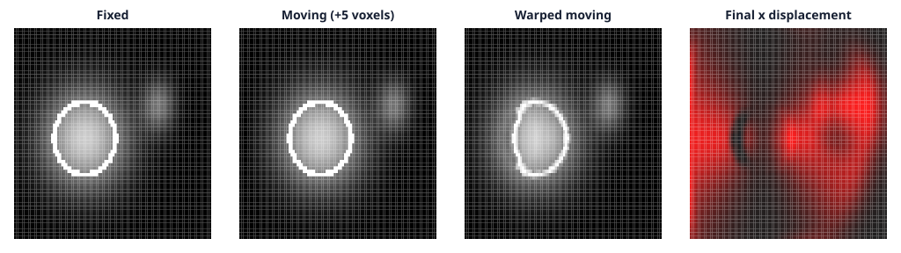

# Example: Thirion Demons

This runnable example registers a translated synthetic volume with the public
`ThirionDemonsRegistration` API. The input is deterministic, small enough for
a documentation build machine, and contains two structures with different
spatial scales so the displacement field is visible.

## Source and command

Source: `crates/ritk-registration/examples/book_registration.rs`

```text
cargo run -p ritk-registration --example book_registration -- \
  docs/book/figures/thirion_demons.svg
```

The program computes the pre-registration MSE, runs 30 iterations with
diffusion sigma 1.0, rejects a non-improving result, and writes the following
four-panel figure when executed:



The panels are fixed, moving, warped moving, and final `disp_x` at the middle
axial slice. This is a behavioral example of the real algorithm rather than a
placeholder computation: the regenerated artifact depends on the computed
warp and displacement field.
