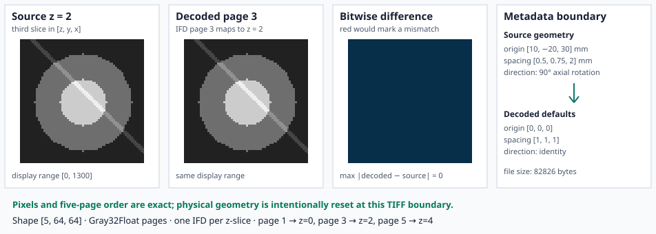

# Example: Multi-page TIFF Round Trip

This example constructs a deterministic 5 × 64 × 64 volume. Slice intensity
and a diagonal marker both vary with `z`, so reversing or duplicating IFD pages
would change visible data and fail the exact voxel comparison. The source uses
non-default medical geometry to exercise the separate metadata contract.



The first two panels intentionally use the same display range. They should
look identical. The third panel is the decisive comparison: blue means every
displayed voxel is bit-identical, red would mark any mismatch, and the numeric
maximum must remain zero. The final panel is expected to differ because the
current TIFF writer and reader do not carry RITK's full physical geometry.

## Public API

```rust,ignore
use coeus_core::SequentialBackend;
use ritk_tiff::{read_tiff, write_tiff};

let backend = SequentialBackend;
write_tiff(&source, "stack.tiff", &backend)?;
let decoded = read_tiff("stack.tiff", &backend)?;
```

The decoded shape is `[number_of_IFDs, rows, columns]`. In this example:

```text
page 1 → z = 0
page 3 → z = 2
page 5 → z = 4
```

The program compares `f32::to_bits()` at every voxel before writing the
figure. A page-order, value, or shape defect therefore stops the example
instead of producing a plausible image.

## Geometry restoration is explicit

The source uses origin `[10, -20, 30]` mm, spacing `[0.5, 0.75, 2]` mm, and a
90-degree axial rotation. The decoded TIFF correctly has zero origin, unit
spacing, and identity direction under the current API contract. Applications
must replace those defaults from a trusted source before physical resampling
or registration.

## Run it

From the repository root:

```text
cargo run -p ritk-tiff --example book_tiff -- \
  docs/book/figures/tiff_roundtrip.svg
```

The TIFF itself is temporary. Only the deterministic SVG is retained. The
complete runnable source is `crates/ritk-tiff/examples/book_tiff.rs`.
