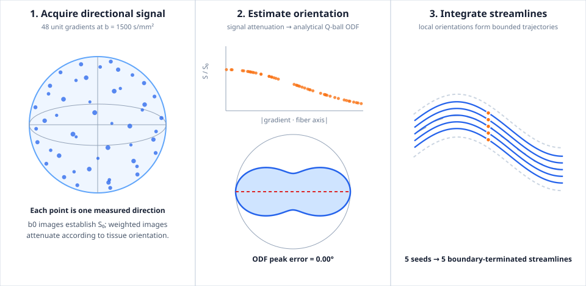

# Creating and Validating Deterministic Tractography

`ritk-tractography` integrates a local orientation field into curves, producing
Gaia polyline geometry. It does not directly reconstruct axons and it does not
resolve the biological cause of a local orientation. The current algorithm is a
deterministic Euler baseline — explicit stepping with direction continuity,
turn-angle gating, and step-count bounding — designed for reproducible
examples and baseline algorithms.

This chapter shows how to create a tractogram through the public API, validate
it against an analytical field, and export it for comparison with reference
toolchains. It also documents the integration algorithm and the direction-field
helpers that bridge diffusion models to tractography.

## Integration rule

For a physical seed point \\(\\mathbf x_0\\), step size \\(h > 0\\), and local unit
orientation \\(\\mathbf v(\\mathbf x)\\), one forward step is

\\[
\\mathbf x_{k+1} = \\mathbf x_k + h \\, \\mathbf v(\\mathbf x_k).
\\]

At each sample the integrator validates the returned direction:
non-finite components or a norm that deviates from unity beyond \\(10^{-6}\\)
produce a typed `InvalidDirection` error rather than a silently dropped
streamline.

### Sign continuity

Diffusion orientations are antipodally symmetric: \\(\\mathbf v\\) and
\\(-\\mathbf v\\) describe the same physical axis. An ODF peak extractor,
spherical harmonic evaluator, or eigendecomposition may return either sign
arbitrarily. At each step the integrator computes the dot product between
the current direction and the returned direction. When the dot product is
negative, the direction is flipped so the streamline continues forward
rather than reversing:

~~~rust,ignore
if current_direction.dot(&next_direction) < 0.0 {
    next_direction = -next_direction;
}
~~~

This prevents arbitrary sign choices from making a streamline reverse
direction mid-integration.

### Bidirectional tracking

`TrackingDirection::Bidirectional` integrates both signs from the seed —
one half along `+v` and one along `-v` — reverses the backward half, and
joins the two halves with the seed appearing exactly once. The joined
polyline runs from the backward termination point through the seed to the
forward termination point.

`TrackingDirection::Forward` integrates only along the initial direction
returned at the seed. The backward termination reason is `None` in the
output.

## Configuration

`TractographyConfig` carries four validated parameters:

| Parameter | Type | Default | Constraint |
|---|---|---|---|
| `step_size` | `f64` | 0.5 mm | Finite, \\(> 0\\) |
| `max_steps` | `usize` | 1 000 | Nonzero, seed + steps fits in `usize` |
| `max_turn_degrees` | `f64` | 60° | Finite, \\(\\in [0, 180]\\) |
| `tracking_direction` | `TrackingDirection` | `Bidirectional` | — |

Construction validates every parameter and returns `InvalidStepSize`,
`InvalidMaxSteps`, or `InvalidTurnLimit` for out-of-range values:

```rust,ignore
use ritk_tractography::{TractographyConfig, TrackingDirection};

let config = TractographyConfig::new(0.5, 1_000, 45.0, TrackingDirection::Bidirectional)?;
```

The turn-angle cosine limit is precomputed once at construction:
`cos(max_turn_degrees.to_radians())`. A turn-angle check fails when the
dot product between consecutive (sign-aligned) directions falls below this
threshold.

## Termination is part of the result

Every half-streamline records exactly one `TerminationReason`:

| Variant | Condition | The out-of-domain point |
|---|---|---|
| `FieldBoundary` | Direction field returns `None` at the proposal | Not appended |
| `TurningAngle` | Sign-aligned direction dot product \\(< \\cos(\\theta_{\\max})\\) | Appended (it was reached) |
| `StepLimit` | `max_steps` accepted steps exhausted | N/A — last step was accepted |

The distinction between `FieldBoundary` and `TurningAngle` matters for
interpretation. `FieldBoundary` means that the caller-defined direction field
returned no orientation at the proposal. That boundary may come from an image
extent, tissue mask, anisotropy threshold, or model-fit failure; it is not by
itself evidence of an anatomical endpoint. `TurningAngle` means that the next
valid orientation exceeded the configured limit and may reflect noise, a
crossing-fibre region, or genuine curvature rejected by the configuration.

A seed at which the field returns `None` at the first query is a normal
untrackable seed — it produces no streamline and is not an error.

## Direction fields

A direction field is any closure `Fn(&Point<3>) -> Option<Vector<3>>`.
`ritk-tractography` provides five pre-built helpers that bridge diffusion
models to the integration algorithm, and the caller can supply a custom
closure for ad-hoc or synthetic fields.

### Single-voxel fields

`dti_pev_direction_field` and `fod_peak_direction_field` extract one
direction from a single-voxel fit and return the same direction at every
query point. They are useful for bootstrapping and unit testing:

```rust,ignore
use ritk_tractography::{euler_tractography, dti_pev_direction_field};

let tensor = ritk_diffusion::dti::estimate_dti(&scheme, &signals, config)?;
let result = euler_tractography(&seeds, track_config, dti_pev_direction_field(&tensor))?;
```

`dti_pev_direction_field` returns `None` when the fitted tensor has
near-zero FA (\\(< 10^{-10}\\)), i.e. it is isotropic and the PEV is not
trackable.

`fod_peak_direction_field` pre-extracts the strongest fODF peak via
`FodField::find_peaks(50, 100, 0.1)` and returns `None` when no peak
meets the 10% relative-amplitude threshold:

```rust,ignore
use ritk_tractography::fod_peak_direction_field;

let result = euler_tractography(&seeds, track_config, fod_peak_direction_field(&fod))?;
```

### Whole-brain fields

`fod_volume_direction_field` and `noddi_direction_field` perform spatial
neighbourhood lookups at each integration step — they query a 3-D volume
of pre-computed model fits rather than a single voxel.

`fod_volume_direction_field` trilinearly interpolates fODF coefficients
from the surrounding 2×2×2 voxel neighbourhood at each step, then extracts
the strongest peak via a 50×100 spherical-grid search with a 10%
relative-amplitude threshold:

```rust,ignore
use ritk_tractography::fod_volume_direction_field;

let result = euler_tractography(&seeds, track_config, fod_volume_direction_field(&volume))?;
```

`noddi_direction_field` uses nearest-neighbour spatial lookup — NODDI
intrinsically yields a single fibre orientation per voxel, so no peak
extraction is needed:

```rust,ignore
use ritk_tractography::noddi_direction_field;

let result = euler_tractography(&seeds, track_config, noddi_direction_field(&volume))?;
```

### Custom fields

Any closure satisfying `Fn(&Point<3>) -> Option<Vector<3>>` is a valid
direction field. The closure defines the tracking domain: return `None`
outside the domain boundary and a unit `Vector<3>` inside it:

```rust,ignore
let result = euler_tractography(&seeds, config, |point| {
    let [x, y, z] = point.to_array();
    // Track only within a 10 mm radius sphere.
    let r_sq = x * x + y * y + z * z;
    if r_sq > 100.0 {
        return None;
    }
    // Constant horizontal field — every trackable point yields +x.
    Some(Vector::new([1.0, 0.0, 0.0]))
})?;
```

The integrator validates unit-norm at every sample; a non-unit direction
is a typed error, not silently corrected.

## Reusable DTI-volume pipeline

`DtiVolume` already owns the validated image-index grid, fitted-voxel mask, and
tracking anisotropy floor. `ritk-tractography` owns the remaining policy in
`DtiTractographyConfig`: inclusive FA-threshold seed selection, an optional
evenly strided seed cap, and Euler integration through the volume's direction
field. This keeps downstream applications from reimplementing the policy at a
CLI or application boundary.

```rust,ignore
use ritk_tractography::{
    DtiTractographyConfig, TrackingDirection, TractographyConfig,
    dti_volume_seed_points, dti_volume_tractography,
};

let tracking = TractographyConfig::new(
    0.5,
    1_000,
    60.0,
    TrackingDirection::Bidirectional,
)?;
let policy = DtiTractographyConfig::new(0.25, 10_000, tracking)?;
let seeds = dti_volume_seed_points(&volume, policy.seed_anisotropy(), policy.max_seeds())?;
let tracks = dti_volume_tractography(&volume, policy)?;
```

The seed threshold is inclusive and the volume mask is authoritative, so an
unfitted voxel cannot become a seed at threshold zero. `max_seeds == 0` selects
all qualifying voxels; a nonzero cap uses a stride through the qualifying
storage order rather than truncating at the first cap-sized prefix. The
orchestration function returns `NoSeeds` with the threshold and fitted FA peak
instead of producing an apparently successful empty tractogram.

The [reusable DTI-volume example](examples/dti_volume_tractography.md) fits a
known two-regime synthetic volume, verifies the seed and streamline counts, and
generates the figure used on that page. It verifies software behavior only; it
does not claim anatomical or clinical validity.

## Create and validate a tractogram

A smooth tractogram is not a correctness oracle. The strongest local check
starts from a direction field whose domain and expected path behavior are
known before tracking. RITK's runnable book example uses the curved analytical
bundle below so creation and validation exercise the same public API without
using the implementation as its own oracle.



### 1. Define a physical field and seeds

The closure returns a unit tangent inside the bundle and `None` outside it.
This makes the dashed bundle boundary in the figure an executable stopping
oracle rather than a visual annotation:

```rust,ignore
use ritk_spatial::{Point, Vector};

fn bundle_center(x: f64) -> f64 {
    20.0 + 5.0 * (x / 8.0).sin()
}

fn direction_field(point: &Point<3>) -> Option<Vector<3>> {
    let [x, y, z] = point.to_array();
    if !(2.0..=38.0).contains(&x)
        || (y - bundle_center(x)).abs() > 4.0
        || z.abs() > 0.5
    {
        return None;
    }

    let slope = 0.625 * (x / 8.0).cos();
    let norm = (1.0 + slope * slope).sqrt();
    Some(Vector::new([1.0 / norm, slope / norm, 0.0]))
}

let seed_x = 20.0;
let seeds = [-2.5, -1.25, 0.0, 1.25, 2.5]
    .map(|offset| Point::new([seed_x, bundle_center(seed_x) + offset, 0.0]));
```

The seeds, field, and output use physical coordinates. A voxel-index field
must be converted with the image geometry before export; use
`TractographyResult::map_points` when tracking occurred in index space.

### 2. Create streamlines

Construct a validated configuration, then integrate the seeds. The selected
step size, turn limit, and field domain are part of the experiment and must be
reported with any downstream result:

```rust,ignore
use ritk_tractography::{
    TrackingDirection, TractographyConfig, euler_tractography,
};

let config = TractographyConfig::new(
    0.35,
    160,
    20.0,
    TrackingDirection::Bidirectional,
)?;
let result = euler_tractography(&seeds, config, direction_field)?;
```

### 3. Validate value semantics before rendering

The analytical example requires one output per seed, boundary termination in
both directions, and containment of every emitted point. These assertions fail
if tracking silently drops a valid seed, records the wrong stopping cause, or
appends the first out-of-domain proposal:

```rust,ignore
use ritk_tractography::TerminationReason;

assert_eq!(result.seeds_attempted(), seeds.len());
assert_eq!(result.streamlines_generated(), seeds.len());

for streamline in result.streamlines() {
    assert_eq!(
        streamline.forward_termination(),
        TerminationReason::FieldBoundary,
    );
    assert_eq!(
        streamline.backward_termination(),
        Some(TerminationReason::FieldBoundary),
    );

    assert!(streamline.geometry().points().iter().all(|point| {
        direction_field(&Point::new([point.x, point.y, point.z])).is_some()
    }));
}
```

The runnable source also verifies the independently known diffusion axis before
rendering. Run it from the repository root:

```text
cargo run --locked -p ritk-diffusion --example book_diffusion_tractography -- \
  docs/book/figures/diffusion_tractography.svg
```

The command writes the checked SVG plus `.trk`, `.tck`, and `.tsf` artifacts.
See [Signal to Streamlines](examples/diffusion_tractography.md) for the signal
model, angular oracle, exported scalar layout, and interpretation of each panel.

### Validation ladder

Each check supports a different claim. Passing a lower level does not imply a
higher one:

| Level | Oracle | Claim established |
|---|---|---|
| Input contract | Validated configuration, finite seeds, unit directions | The integrator receives values in its declared domain |
| Numerical integration | Known field, seed count, step/turn limits, exact termination variants | The algorithm follows its deterministic contract |
| Geometric containment | Every point remains inside the analytical bundle | No out-of-domain proposal enters the polyline |
| Visual output | Generated metrics agree with labels, seeds, boundaries, and curves | The figure represents the computed data |
| Format interoperability | Read the exported tractogram in the target tool and compare coordinates, counts, and scalars | The selected file boundary preserves the checked result |
| Anatomical validation | Independent physical phantom, histology, tracer data, or established anatomical constraints | The reconstructed paths correspond to evidence not generated by the same model |
| Clinical validation | A task-specific protocol, population, outcomes, and prospective acceptance criteria | The method is fit for that defined clinical use |

The first four levels are covered by the deterministic book example and crate
tests. Exporting a file does not complete the interoperability level, and the
real-subject figure demonstrates execution on scanner data rather than ground
truth. Diffusion tractography can produce coherent false-positive bundles even
when local orientations are accurate; Maier-Hein et al.'s ground-truth
challenge therefore cautions against treating tractography alone as anatomical
evidence ([Nature Communications 8, 1349, 2017](https://doi.org/10.1038/s41467-017-01285-x),
Results: “Tractograms contained more invalid than valid bundles”).

## Streamline export

`TractographyResult` provides export methods for all three tractogram
interchange formats. Tractography points are in physical millimetre
coordinates (the native coordinate system for all three formats).

### .trk — DSI Studio / TrackVis

`to_trk` writes the header with an identity voxel-to-RAS affine. Callers
that need anatomical space should set `dim` and `voxel_size` to match the
reference image:

```rust,ignore
let trk = result.to_trk(
    [128, 128, 60],   // dim
    [1.5, 1.5, 2.0],  // voxel_size (mm)
);
// trk can be written via ritk_trk::write_trk(&trk, path)?;
```

`to_trk_header` accepts an optional custom `vox_to_ras` affine:

```rust,ignore
let trk = result.to_trk_header(dim, voxel_size, Some(vox_to_ras_affine));
```

`to_trk_with_scalars` attaches per-point scalar values (e.g. FA, MD)
for DSI Studio colour-coding. Each inner `Box<[f32]>` must contain
`n_points × n_scalars` values in row-major (per-point scalar stride)
order:

```rust,ignore
let trk = result.to_trk_with_scalars(
    dim, voxel_size,
    &["FA", "MD"],
    fa_md_scalars,
);
```

### .tck — MRtrix3

`to_tck` writes with a default header (Float32LE datatype, no transform):

```rust,ignore
let tck = result.to_tck();
// tck can be written via ritk_tck::write_tck(&tck, path)?;
```

`to_tck_header` accepts optional `mrtrix_version`, `comments`, and a
4×4 voxel-to-scanner transform:

```rust,ignore
let tck = result.to_tck_header(
    Some("3.0.4".into()),
    Some("RITK Euler tractography".into()),
    Some(transform_matrix),
);
```

Per-point scalars are not stored natively in the `.tck` format; use the
MRtrix3 `tckmap` weights sidecar (`ritk_tck::write_tck_weights`) when
scalar export is needed.

### .trx — Tractography Reference eXchange

`to_trx` writes with a default header (`"float32"` dtype):

```rust,ignore
let trx = result.to_trx();
// trx can be written as a directory via ritk_trx::write_dir(&trx, path)?;
```

`to_trx_with_dpv` attaches per-vertex data arrays (DPV) such as FA and
MD. The caller must populate the header's `dpv` map with `TrxArrayDef`
entries declaring each array's dtype and component count, and provide the
corresponding raw encoded byte buffers:

```rust,ignore
use std::collections::HashMap;
let mut trx = result.to_trx_with_dpv(HashMap::new());
trx.header.dpv.insert(
    "FA".into(),
    ritk_trx::TrxArrayDef { dtype: "float32".into(), n_components: 1 },
);
trx.dpv_data.insert("FA".into(), fa_bytes);
```

### Format comparison

| Property | `.trk` | `.tck` | `.trx` |
|---|---|---|---|
| Coordinate system | Voxel (affine → RAS) | Scanner mm | Physical mm |
| Per-point scalars | Yes (header `n_scalars`) | No (tckmap weights sidecar) | Yes (`dpv` arrays) |
| Per-streamline properties | Yes | No | Yes (`dps` arrays) |
| Binary layout | Single file, binary | Single file, binary | Directory of .raw files + JSON header |

## Error types

`TractographyError` covers every failure mode with seed and step indices
for localisation:

| Variant | Condition | Index context |
|---|---|---|
| `InvalidStepSize` | `step_size` is NaN, ∞, zero, or negative | — (config validation) |
| `InvalidMaxSteps` | `max_steps` is zero or overflows `usize` | — |
| `InvalidTurnLimit` | Turn angle not in `[0°, 180°]` | — |
| `InvalidDirection` | Field returned non-finite or non-unit vector | `(seed_index, step_index)` |
| `NonFinitePoint` | A proposed point became NaN or ∞ | `(seed_index, step_index)` |
| `Allocation` | Vec pre-allocation failed | Requested capacity |
| `Geometry` | Gaia rejected the generated polyline | Propagated from `PolylineError` |

A seed at which the field returns `None`, or whose integration produces
fewer than two points, is an expected untrackable seed — it produces no
line and is not an error.

## Output types

`Streamline` pairs Gaia polyline geometry with termination diagnostics:

| Method | Returns |
|---|---|
| `geometry()` | `&Polyline<f64>` |
| `forward_termination()` | `TerminationReason` |
| `backward_termination()` | `Option<TerminationReason>` — `None` for forward-only |

`TractographyResult` aggregates the output of one call to
`euler_tractography`:

| Method | Returns |
|---|---|
| `streamlines()` | `&[Streamline]` — in seed order, excluding untrackable seeds |
| `seeds_attempted()` | Total input seeds queried |
| `streamlines_generated()` | Number of `Streamline` values |

## What the current algorithm establishes

The implementation and tests establish deterministic geometry, sign
continuity, bounded memory growth, explicit stopping reasons, and rejection
of invalid field samples. They do not establish anatomical validity,
clinical utility, crossing-fibre resolution, uncertainty, or invariance to
acquisition and preprocessing choices. Apply the validation ladder above and
state the highest level for which an independent oracle was actually run.

The [signal-to-streamlines example](examples/diffusion_tractography.md)
closes the loop end-to-end: known tensor → synthetic signals → model fit
→ direction field → streamlines. Each visual element — seeds, orientation
glyphs, domain boundaries, generated trajectories — has a defined meaning.

The [human tractography and connectomics example](examples/brain_tractography.md)
then runs the same public tracking boundary on a checksummed 160-volume human
HARDI acquisition. It adds exact DWI/parcellation alignment, endpoint
accounting, an 84-region connectivity matrix, and an explicit separation
between internal software validation and biological validation.
