# Verify a synthetic DICOM study

This workflow generates three small Part 10 instances, opens them through
the viewer's directory and dropped-byte loaders, checks their decoded values
and physical coordinates, and captures three orthogonal scalar and RGB slice
buffers plus a patient-coordinate fusion buffer.
It needs no downloaded datasets or patient information.

RITK owns the DICOM boundary used by presentation hosts. A host that receives
files or browser drops passes the named Part 10 byte batch to
`ritk_io::scan_dicom_part10_bytes` (or its budgeted form), then passes the
validated descriptor to `ritk_io::load_dicom_from_series`. The scanner and
loader retain the validated bytes, enforce the parser, retained-study, and
decoded-workspace budgets, and return the RITK `Image` plus
`DicomReadMetadata`. No GUI framework type or parser object crosses this
boundary; the host owns only input and presentation lifecycle.

This workflow is the DICOM opening demonstration for both the current eframe
shell and the migrated Windows Métis shell. The code, fixtures, visual goldens,
and rejection tests remain in RITK so a framework migration cannot fork
medical-data semantics.

## Actual application gallery

The first visual proof is a real public MRI-DIR CT study opened by RITK and
presented through the Métis native window. It contains axial, coronal, sagittal,
and axial maximum-intensity-projection panels captured from the running Windows
HWND. The image is application output from 409 DICOM files, not generated
artwork; its source revisions, input bounds, panel counts, repeat digest, and
orderly close are recorded in the [window provenance record](images/dicom-metis-real-ct-mip-window.json).

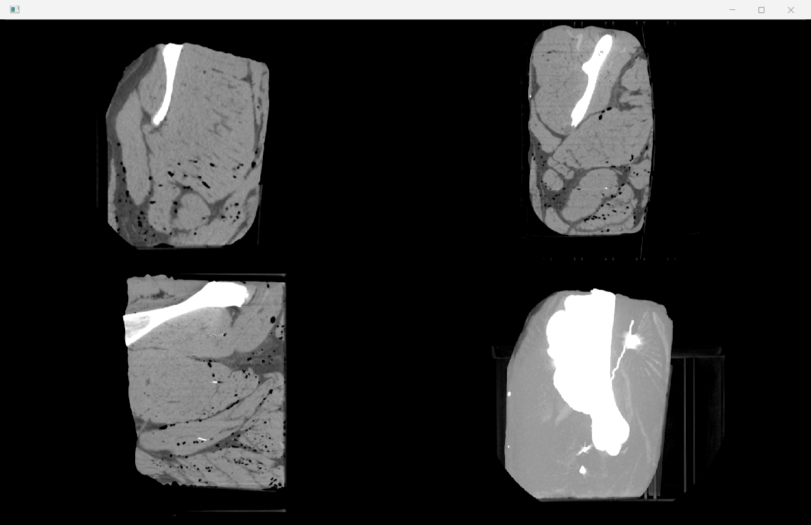

The detailed synthetic, native, eframe, browser, and saved-study workflows
below explain how to reproduce and inspect each component boundary. RITK owns
scanning, decoding, geometry, and clinical presentation; Métis owns the bounded
host, canvas, and window lifecycle.

Build from a standalone RITK checkout, then run the bounded demonstration:

```console
cargo build --locked -p ritk-snap --example dicom_workflow
python scripts/viewer.py target/debug/examples/dicom_workflow
```

On Windows the binary ends in `.exe`. Under Atlas, use the configured shared
target directory (`D:/atlas/target/debug/examples/dicom_workflow.exe`). Atlas's
development overlay changes dependency resolution; verification against the
committed standalone lock must run outside that overlay while retaining the
shared target and build settings.

The runner requires Python 3.11 or newer, enforces a 60-second deadline per process and replaces the fixed
artifact set in `scratch/viewer/`. Its `workflow.json` records the actual
decoded voxels, geometry, capture dimensions and SHA-256 hashes of the binary
and images. A failed run invalidates its previous success report.
It compares the generated PNG bytes exactly against the reviewed manual
images; the deterministic software renderer needs no tolerance. Use
`--update-goldens` only to regenerate deliberately changed captures, then
inspect the images and independent pixel tests before accepting them.

The example and required loader tests share the
[fixture source](../../crates/ritk-snap/src/dicom/loader/tests/fixtures.rs).
The fixture uses unsigned 8-bit, uncompressed, single-frame images with
MONOCHROME2 photometric interpretation. CT and MR modality labels are tested;
this small Secondary Capture object is not a complete CT or MR acquisition IOD.
Filenames and instance numbers run backwards relative to spatial position,
so sorting them by name would give the wrong answer.

| Quantity | Expected value |
| --- | --- |
| Volume shape `[depth, row, column]` | `[3, 2, 4]` |
| Stored samples in spatial order | `0, 10, …, 230` |
| Modality rescale | `decoded = 2 × stored − 20` |
| Decoded voxels | `−20, 0, …, 440` |
| Spacing `[depth, row, column]`, mm | `[2, 1.5, 0.5]` |
| First voxel LPS position, mm | `[10, 20, 30]` |
| Voxel `[2, 1, 3]` LPS position, mm | `[14, 21.5, 31.5]` |

Position and orientation give the independent coordinate equation
`P(d,r,c) = [10 + 2d, 20 + 0.5c, 30 + 1.5r]` mm. DICOM defines the row/column
spacing and orientation mapping in
[PS3.3 C.7.6.2.1.1, Equation C.7.6.2.1-1](https://dicom.nema.org/medical/dicom/current/output/chtml/part03/sect_C.7.6.2.html#sect_C.7.6.2.1.1).

## Open a multi-frame object

RITK inspects `NumberOfFrames` on each scanned member before choosing the
single-frame series decoder. A multi-frame object is decoded through
`ritk_io::load_dicom_multiframe_flat` (or its byte-payload counterpart), so
the resulting `LoadedVolume` has one depth entry for every decoded frame.
The path and dropped-byte entry points share the same frame buffer, modality
rescale, spatial orientation, and spacing checks. RGB multi-frame objects use
RITK's interleaved color reader and retain three channels per voxel.

The viewer rejects a multi-frame object that declares more than one temporal
position or names `TemporalPositionIndex` in its dimension organization. It
also rejects a batch that mixes a multi-frame object with conventional
single-frame members; neither case is silently presented as a spatial stack.
The regression fixtures use two distinct 2 × 2 frames with decoded values
`[-8,-6,-4,-2]` and `[12,14,16,18]`, assert both file and byte workflows, and
render each axial frame through `SliceRenderer` with independent pixel
oracles. A declared three-frame object with only two frames is rejected during
decode.

## Preserve RGB presentation

The same workflow writes a two-frame RGB object with interleaved unsigned
8-bit samples. RITK's color reader admits only `PhotometricInterpretation=RGB`,
`SamplesPerPixel=3`, `PlanarConfiguration=0`, and supported uncompressed or
codec-backed transfer syntaxes. Scalar, palette, YBR, CMYK, planar, signed, or
unsupported codec inputs fail at the DICOM boundary; they are never reduced to
the first channel.

The color object has shape `[depth, rows, columns] = [2, 2, 2]` and channel
samples `[red, green, blue, white]` in frame zero followed by
`[cyan, magenta, yellow, neutral]` in frame one. The filesystem and dropped-byte
loaders must return the same interleaved samples. `SliceRenderer` copies these
decoded channels directly into the display image for axial, coronal, and
sagittal views. Scalar window/level and colormap parameters are intentionally
not applied to RGB data, so a red source voxel remains red in the submitted
texture.

The images below are the actual RGB slice buffers enlarged with nearest-neighbor
sampling. The color-channel tests compare every RGBA pixel, and `viewer.py`
compares these grid bytes with the reviewed manual images.


## Present signed grayscale data

The scalar viewer follows the DICOM grayscale presentation contract after RITK
IO has decoded the stored samples and applied modality rescale. `MONOCHROME2`
keeps the mapped value and `MONOCHROME1` inverts it once after the VOI mapping.
When `VOI LUT Function (0028,1056)` is absent, the viewer uses DICOM's default
`LINEAR` function. Explicit `LINEAR_EXACT` and `SIGMOID` values select their
specified equations; an unsupported value or table-based `VOI LUT Sequence`
fails at load instead of being approximated as a window.

The workflow fixture stores signed samples `−10, 0, 10, 20`, applies slope `2`
and intercept `−10`, and declares `MONOCHROME1` with `LINEAR_EXACT`. The
decoded modality values are therefore `−30, −10, 10, 30`; with centre `0` and
width `40`, the displayed bytes are `255, 191, 64, 0`. The image is generated
by `SliceRenderer` and checked byte-for-byte by `scripts/viewer.py`.


The same presentation value is shared by scalar slices, MIP, volume rendering,
fused comparison, and native GPU paths. This keeps CPU and GPU output aligned
and prevents a second inversion or a renderer-specific window equation.

The images below come from `SliceRenderer`, which uses Iris's grayscale map.
They show the decoded pixel grid enlarged by nearest-neighbour sampling.
These are software slice-buffer captures before texture upload; they do not
show the application window or physical-aspect-ratio display. Axis labels refer
to storage dimensions because this study has a nonidentity orientation.

Depth index 1, size 4 × 2: expected bytes `80,90,100,110 / 120,130,140,150`.


Row index 1, size 4 × 3: expected bytes
`40,50,60,70 / 120,130,140,150 / 200,210,220,230`.

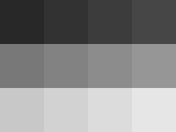

Column index 2, size 2 × 3: expected bytes `20,60 / 100,140 / 180,220`.

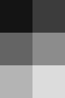

The chosen center 235 and width 510 cancel the fixture's modality rescale under
explicit `LINEAR_EXACT` metadata, so each grayscale byte equals its stored
sample. The tests also check the scratch-buffer rendering
path and reject malformed and truncated byte inputs. They separately verify
exact NIfTI file/byte roundtrips for `.nii` and `.nii.gz`.

## Open, select, and restore a study

Use **File → Open DICOM file…** to select a particular acquisition in a folder
containing several series. The selected instance's SeriesInstanceUID determines
which neighbouring image files load. **Open DICOM folder…** discovers the series
browser; if the folder contains several series, choose a series there instead of
accepting an arbitrary largest series. The highlighted series changes after
successful loading. Selecting a secondary series retains its own exact files.

For a scripted startup or a Métis-native capture, pass the selected
SeriesInstanceUID explicitly. RITK discovers the path and verifies the exact
member list again before pixel decode:

```console
cargo run --locked -p ritk-snap -- path/to/study \
  --series-instance-uid 2.25.20260905001 --metis-native --capture selected.png
```

An unknown UID, a non-DICOM path, or a changed member list fails with a typed
diagnostic. The launcher never chooses the largest or first series. This is the
safe path for saved patient folders that contain multiple acquisitions; keep
clinical files local and do not add them to the repository or its captures.

**Open DICOMDIR…** uses the index's referenced image set. Missing references or
an invalid index report an error; unreferenced subdirectories do not supply a
replacement study. The reader follows the linked PATIENT/STUDY/SERIES/IMAGE
record tree, excludes inactive or unreachable records, rejects cycles and
out-of-sequence offsets, and verifies each IMAGE record's SOP class, SOP
instance, and transfer syntax against its referenced file. Dropped byte batches
must identify one image series.

Saving a session records the primary study's UID and exact files along with the
presentation controls. Restore validates those members before replacing the
current volume or controls. A missing member, changed UID, or member that is no
longer an image fails explicitly and leaves the current study displayed.
Older path-based sessions remain readable, but an ambiguous folder requires
selection. See the [public API migration guide](../migration_selected_dicom.md).
This session format does not persist the secondary comparison acquisition.

Native tests exercise actual egui series-row pointer events, primary/secondary
loads, failed replacement, and session restore with deterministic Part 10 files.
The IO tests load a complete synthetic linked PATIENT/STUDY/SERIES/IMAGE index,
then exercise inactive and unreachable records, malformed links, identity
mismatches, and final-component symlinks. They compare active member paths and
exact pixel values and geometry with explicit member loading. DICOMDIR member
reads use `moirai_pal::fs::open_file_within_root`, which walks from the selected
root directory handle and returns the handle RITK reads. The Moirai PAL tests
reject parent traversal and intermediate/final links; browser file entries use
the DOM provider because the native path contract is unsupported on WebAssembly.

## Select a saved DICOM series from Python

The Python binding uses the same RITK-owned scanner and native loader. Pass
`series_instance_uid` when a saved directory contains more than one acquisition;
the UID is matched before pixel decode. This keeps acquisition selection in RITK
and leaves Metis format-neutral. The public MRI-DIR CT directory is a real
409-slice series, so it exercises the full native decode and explicit UID path
without exposing private clinical data. The multi-series and fail-closed
selection behavior is covered by the RITK integration test below:

```powershell
python -c "import hashlib, numpy as np, ritk; p=r'test_data\\3_head_ct_mridir\\DICOM'; uid='1.3.6.1.4.1.14519.5.2.1.1706.4996.115936088547498980797393821518'; image=ritk.io.read_image(p, series_instance_uid=uid); values=np.asarray(image.to_numpy()); print({'shape': values.shape, 'dtype': str(values.dtype), 'spacing': image.spacing, 'origin': image.origin, 'min': float(values.min()), 'max': float(values.max()), 'nonzero': int(np.count_nonzero(values)), 'sha256': hashlib.sha256(values.tobytes()).hexdigest()})"
```

The Windows `ritk-0.12.79-cp39-abi3-win_amd64.whl` built from this workflow
reported the following values for the saved public CT series:

| Quantity | Observed value |
| --- | --- |
| Shape | `(409, 512, 512)` |
| Dtype | `float32` |
| Spacing `(sz, sy, sx)` | `(0.390625, 0.390625, 0.625)` mm |
| Origin `(oz, oy, ox)` | `(-122.25, -100.0, -100.0)` mm |
| Intensity range | `[-2048.0, 3071.0]` HU |
| Non-zero voxels | `107130061` |
| Voxel byte SHA-256 | `70c414f86a387227ba4b79e92db43dc71551cd1cd911c2eb07b3ad3d33e2eec5` |

The command must report a three-dimensional `float32` array and a non-zero
voxel count. Omitting the UID for a directory with multiple series, passing an unknown or empty
UID, or passing a non-directory with a UID raises `OSError`; there is no
first-series fallback. The Rust integration test
`native_dicom_uid_selection_reads_only_the_requested_series` covers the same
positive and fail-closed cases with two generated acquisitions and exact voxel
assertions. The Python smoke test covers the keyword and non-directory error
boundary against the built extension.

## Resource-bounded DICOM ingress

The RITK DICOM boundary runs a structural Part 10 preflight before dicom-rs
materializes an object. `ritk_dicom::ParseBudget` limits the encoded byte span,
structural element count, and sequence nesting depth. The scanner checks
declared value spans, sequence and item delimiters, implicit sequence tags, and
encapsulated pixel fragments without copying their values. The reader exposes
matching `scan_dicom_*_with_budget` entry points and the series loaders expose
`load_*_with_budget` counterparts. They accept the typed `DicomReadBudget`,
which combines the parser budget with separate retained-study and
decoded-workspace ceilings. The default forms use finite shared ceilings;
constrained hosts can construct a smaller budget with
`DicomReadBudget::try_new(ParseBudget::new(...), retained_bytes, decoded_bytes)`.

The preflight accepts implicit little-endian, explicit little-endian, and
explicit big-endian datasets, plus the encapsulated pixel syntaxes used by the
native RITK codecs. Deflated dataset input is rejected with an explicit error
because the locked dicom-rs registry does not provide a bounded deflate decoder.
The DICOMDIR index uses the same parser preflight. Filesystem reads resolve and
open one path handle, compare its metadata with the resolved path, and read from
that handle; DICOMDIR member reads additionally use Moirai PAL's root-confined
directory-handle walk. Scanned slices retain the exact validated bytes for pixel decode.
The reader charges retained bytes before storing each member. The loader plans
the peak decoded frame, resample, and contiguous-volume workspace before any of
those buffers are allocated, including the temporary frame-vector handles.
Deterministic tests cover parser, DICOMDIR, retained-byte, decoded-workspace,
and replacement cases. Unix reads reject a final symlink with `O_NOFOLLOW`;
Windows reads request a reparse-point handle and reject a final reparse point.
The DICOMDIR record-tree and referenced-identity contract is delivered by
[RITK-SNAP-DIRECTORY-001](../../backlog.md#RITK-SNAP-DIRECTORY-001); the
root-confined filesystem contract is provided by Moirai PAL.

For a conventional scalar series, the scan retains each validated Part-10
payload only through reconstruction. The loader now writes uniform-spacing
frames directly into the destination volume, releases each temporary decoded
frame after its copy, and clears the encoded payloads before returning
`DicomReadMetadata`. This preserves the scan-to-decode replacement guarantee
without keeping a second encoded copy for the viewer lifetime. Irregular
spacing still uses the bounded frame set required by its interpolation
contract.

The Windows lifecycle measurement below reruns the saved public CT through the
same Métis command three times at a 100 ms sampling interval. It compares the
old collected-frame path with the bounded destination-write path; the metric is
the aggregate mean of the process tree's peak private bytes.

| Decoder path | RITK revision | Mean peak private bytes | Mean peak (GiB) |
| --- | --- | ---: | ---: |
| Collected decoded frames | `d365e339` | 2,938,277,888 B | 2.736 GiB |
| Bounded destination writes | `b2772322` | 2,336,589,141 B | 2.176 GiB |

The measured reduction is 20.48% in peak private bytes. All three runs of the
bounded path exited with code 0, and the real 1280 × 800 pixel capture remained
byte-identical (`4fac3ea73e58325755c780de51c1b1504c0fc391da5c48ed2f578810ff46ddcb`).
The repeat count, executable digest, sample summaries and dataset identity are
recorded in [the resource provenance record](images/dicom-metis-real-ct-resource.json).

## Capture the eframe application

Build the binary alongside the example and run:

```console
cargo build --locked -p ritk-snap --bins --example dicom_workflow
python scripts/viewer.py target/debug/examples/dicom_workflow --native-binary target/debug/ritk-snap
```

Use `.exe` suffixes on Windows and the shared Atlas target paths when applicable.
The optional eframe workflow launches the real viewer with the generated study,
saves its rendered root viewport to `scratch/viewer/window.png`, and exits. It
then launches with a missing study and requires an explicit failure without a
screenshot. Each of the three processes has a 60-second limit; the complete
native workflow therefore has a maximum 180-second subprocess budget.

Capture uses the normal viewer update and egui/eframe screenshot response. The
capture wrapper keeps requesting bounded repaints while RITK's background load
publishes, then takes the screenshot; a failed or over-deadline load returns an
error instead of saving an empty frame. For your own local study, run
`ritk-snap path/to/study --capture window.png`. The supplied study must load and
the PNG must save before success is reported.
Native window images depend on the host renderer and fonts; the exact pixel
goldens above remain the deterministic software-rendering check.

For the migrated Windows host, run the same generated study through Métis:

```console
target/debug/ritk-snap.exe scratch/viewer/study --metis-native
```

The Métis host owns the window handle, finite event wait, retained framebuffer,
resize/minimize handling, DPI updates and terminal cleanup. RITK owns the file
open, DICOM decode, selected volume, window/level, colormap, slice navigation
and action reduction. The host receives only a bounded RGBA
`PresentationFrame`; no DICOM identifier, path, parser object or decoded volume
crosses the seam. Plain vertical wheel input steps the active slice, and
Ctrl/Command plus vertical wheel applies the existing zoom policy. Focus loss
cancels an in-progress pointer gesture.

The deterministic Métis capture path is hidden and bounded: it exits after the
first idle event batch and writes the complete three-panel RITK composition as
PNG. The fixed capture surface is 1280 × 800 pixels; the panels are axial,
coronal, and sagittal from left to right, separated by four-pixel black gaps.

```console
target/debug/ritk-snap.exe scratch/viewer/study --metis-native --capture scratch/viewer/metis-frame.png
```

This capture checks real DICOM opening, RITK rendering, orthogonal slice
selection, physical-aspect placement, and Métis framebuffer transfer. It is a
content capture without OS chrome or application overlays; the native host owns
the surface while RITK owns every DICOM and clinical display decision. This
pixel-only form remains the deterministic framebuffer check. To demonstrate
the viewer content state as it appears in the Métis surface, request the
bounded RITK application overlay explicitly:

```powershell
cargo build --locked -p ritk-snap
target\debug\ritk-snap.exe `
  test_data\3_head_ct_mridir\DICOM `
  --metis-native `
  --capture-application `
  --capture scratch\viewer\real-dicom-metis-application.png
```

The overlay is drawn into the same 1280 × 800 framebuffer after the real
decoded planes are composed. It identifies the Métis/RITK host, plane, slice
range, frame dimensions, and window/level values without adding patient
metadata. Operating-system decorations remain outside the capture contract.
The reviewed public CT result is [the application-content capture](images/dicom-metis-real-ct-application.png), with machine-readable
[provenance](images/dicom-metis-real-ct-application.json).


This image is application output from the saved public DICOM pixel data; it is
not an illustration or a generated image. The default capture and the
application-content capture share the same RITK decode and presentation path;
the latter adds only bounded viewer labels for visual inspection.

### Show the real study with the native MIP panel

The native host can expose the same scalar axial MIP already used by the RITK
eframe viewer. The option is explicit so the default three-panel capture stays
stable, while a matched capture can show all four RITK projections through the
same Métis framebuffer:

```powershell
cargo run --locked -p ritk-snap -- `
  test_data\3_head_ct_mridir\DICOM `
  --series-instance-uid `
  1.3.6.1.4.1.14519.5.2.1.1706.4996.115936088547498980797393821518 `
  --metis-native `
  --metis-native-layout orthogonal-with-mip `
  --capture-application `
  --capture scratch\viewer\real-dicom-metis-mip.png
```

The lower-right panel is the RITK axial MIP. The other three panels keep their
existing axial, coronal, and sagittal event routing; the MIP is display-only.
This command opens the saved public 409-slice CT series and writes actual
decoded DICOM pixels. The committed image and its provenance record below are
the visual demonstration; no generated or private patient image is used.

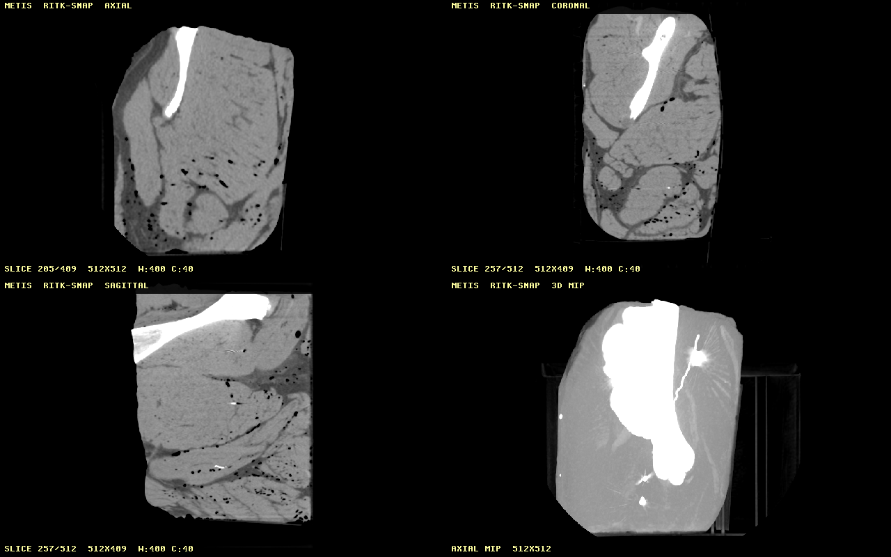

The capture metadata, source revisions, panel order, dimensions, and digest are
in the accompanying [MIP provenance record](images/dicom-metis-real-ct-mip.json).

### Capture the complete Métis application window

The framebuffer capture above intentionally excludes operating-system chrome.
To inspect the application as a user sees it, run the generic Métis Windows
capture utility against the visible RITK process. The utility passes each
argument separately, follows the supervised frontend process, captures the
first visible top-level HWND and closes the process with `WM_CLOSE`:

```powershell
$target = (cargo metadata --format-version 1 --no-deps |
  ConvertFrom-Json).target_directory
python ..\metis\scripts\python_native_capture.py `
  --command (Join-Path $target "debug\ritk-snap.exe") `
  --argument=test_data\3_head_ct_mridir\DICOM `
  --argument=--series-instance-uid `
  --argument=1.3.6.1.4.1.14519.5.2.1.1706.4996.115936088547498980797393821518 `
  --argument=--metis-native `
  --output docs\manual\images\dicom-metis-real-ct-window.png
```

The reviewed [complete-window capture](images/dicom-metis-real-ct-window.png)
is 1296 × 839 pixels: a 1280 × 800 Métis client surface inside the visible
Windows frame. It shows the actual saved public CT volume in axial, coronal and
sagittal views. Its executable, runtime, dimensions and image digest are in
the accompanying [provenance record](images/dicom-metis-real-ct-window.json).
The capture includes host decorations and therefore varies with Windows theme,
scale and font rasterization; the deterministic 1280 × 800 framebuffer remains
the pixel-level regression oracle. Private patient studies and identifiers stay
local and are never committed.

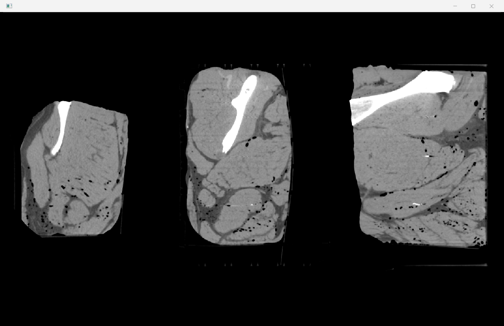

### Capture the complete MIP application window

The same visible-window check can select the explicit four-panel native layout.
This command leaves the RITK process running for the capture utility, so the
result includes the operating-system frame as well as the Métis client surface:

```powershell
python ..\metis\scripts\python_native_capture.py `
  --command (Join-Path $target "debug\ritk-snap.exe") `
  --argument=test_data\3_head_ct_mridir\DICOM `
  --argument=--series-instance-uid `
  --argument=1.3.6.1.4.1.14519.5.2.1.1706.4996.115936088547498980797393821518 `
  --argument=--metis-native `
  --argument=--metis-native-layout `
  --argument=orthogonal-with-mip `
  --output docs\manual\images\dicom-metis-real-ct-mip-window.png
```

The reviewed [complete MIP window](images/dicom-metis-real-ct-mip-window.png)
shows the saved public CT in axial, coronal, sagittal, and axial-MIP panels
inside the visible Windows frame. Two independent launches produced the same
PNG digest. Dimensions, source revisions, executable digest, panel counts, and
the orderly close are recorded in the [MIP window provenance record](images/dicom-metis-real-ct-mip-window.json).
The gallery at the front of this manual displays this capture; it is produced
by the running RITK/Métis application and is not a generated illustration.

The complete synthetic workflow can run this Métis check; it records the
executable hash, invalid-study rejection and `metis-frame.png` hash in
`scratch/viewer/workflow.json`:

```console
python scripts/viewer.py target/debug/examples/dicom_workflow.exe --native-binary target/debug/ritk-snap.exe --metis-native
```

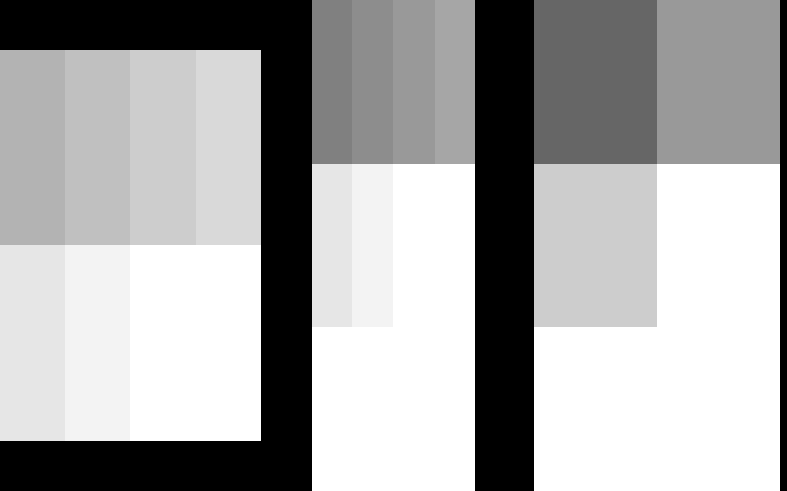

The reviewed image is generated by the command above and compared byte-for-byte
by the workflow script. It is a deterministic application-content snapshot,
not a screenshot of Windows decorations or host fonts.

The same workflow passed on Windows at RITK revision
`7b33d9455e578ccfe2b7c558837dae0c27cfa9d1`. Its report recorded the synthetic
study shape `[3, 2, 4]`, spacing `[2.0, 1.5, 0.5]` mm, the expected landmark
at `[14.0, 21.5, 31.5]` mm, the Métis content-frame digest, and a non-zero
exit for the invalid-study probe. This binds the end-to-end evidence to an
RITK-owned DICOM decode and a format-neutral Métis frame transfer; no DICOM
parser or clinical state is present in the Métis workspace.

## Capture an actual DICOM study through Métis

The repository also includes the acquired MRI-DIR CT series under
`test_data/3_head_ct_mridir/DICOM/`. It is a public CC BY 4.0 porcine-head
phantom series from TCIA, not a generated Part 10 fixture and not private
patient data. The series contains 409 512 × 512 CT slices; its provenance and
license are recorded in [`test_data/README.md`](../../test_data/README.md).

Build the viewer, then pass that DICOM directory to the same RITK-owned loader
and Métis native surface used by the synthetic workflow:

```powershell
cargo build --locked -p ritk-snap
target\debug\ritk-snap.exe `
  test_data\3_head_ct_mridir\DICOM `
  --metis-native `
  --capture scratch\viewer\real-dicom-metis.png
```

The command decodes the real series, selects the current orthogonal slices,
renders their RGBA frames in RITK, and transfers those frames to the Métis
surface. The capture is 1280 × 800 pixels with axial, coronal, and sagittal
views from left to right. The reviewed output below is the actual run from
this workflow (SHA-256
`4fac3ea73e58325755c780de51c1b1504c0fc391da5c48ed2f578810ff46ddcb`):

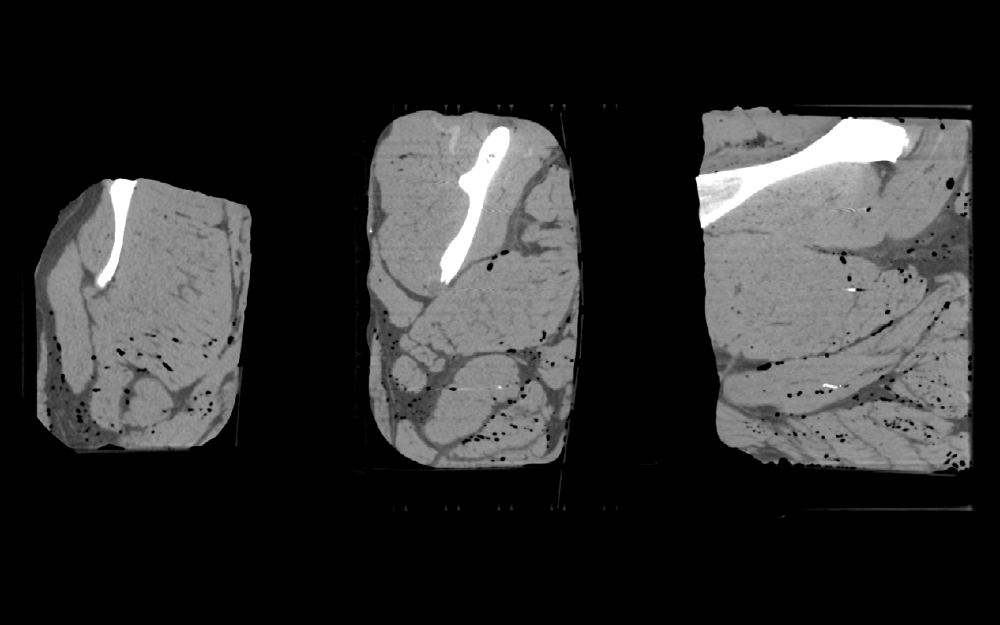

This image is application output from DICOM pixel data; it is not an
illustration or a generated image. The PNG is a documentation snapshot of the
public phantom series. A private clinical study must remain outside the
repository and can be passed as the positional path locally; neither the
study files nor their identifiers belong in the manual or a public artifact.

This command proves the native Métis frame path. It does not claim a browser
WebDriver, WebGPU, or cross-engine run; those require configured browser
drivers and remain separate RITK integration gates.

The eframe viewer uses the same RITK loader and display state. Before uploading
the scalar volume, its GPU renderer checks both the device buffer and storage
binding limits. A volume that cannot fit, including this 409-slice public
series on the reference Windows adapter, is rendered by the existing CPU MIP or
volume-rendering path and emits a diagnostic instead of panicking in wgpu. The
GPU path remains available for volumes within the device limits; this guard
keeps a real saved study displayable on either path.

### Capture the saved CT study in eframe

The same public series can be opened in the complete eframe application with an
explicit acquisition selection:

```powershell
target\debug\ritk-snap.exe `
  test_data\3_head_ct_mridir\DICOM `
  --series-instance-uid 1.3.6.1.4.1.14519.5.2.1.1706.4996.115936088547498980797393821518 `
  --capture scratch\viewer\real-dicom-eframe.png
```

This run decoded the saved 409-slice CT series and exited successfully with a
1600 × 1000 application-content capture. The image includes the Series Browser,
axial, coronal, sagittal and 3D MIP views, plus the RITK geometry and
window/level state. The scalar volume exceeds the reference adapter's GPU
storage-buffer limit, so the guard above selected the existing CPU projection
path and kept the actual DICOM pixels visible:

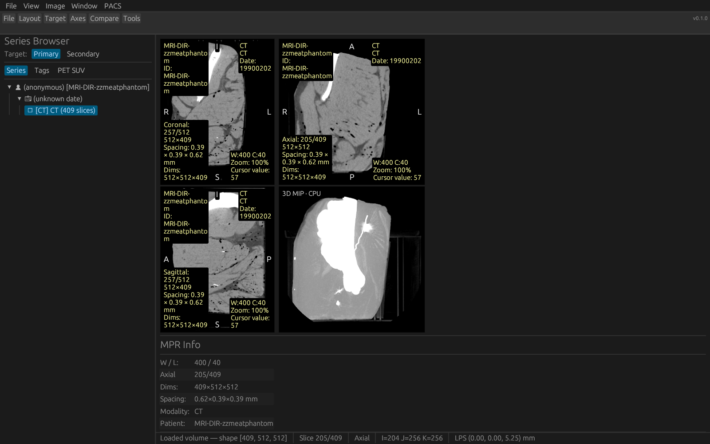

The capture is byte-identical across two independent runs (SHA-256
`f4b30c71bd57f54227f5eeec524cd72e93f56f68e834fed909b907f9ecace048`). Its
source revisions, executable digest, selected UID and command bounds are in
[`dicom-eframe-real-ct.json`](images/dicom-eframe-real-ct.json). The PNG is
committed because this is public CC BY 4.0 phantom data; private clinical
captures remain local and ignored.

### Capture a fitting CT volume through the eframe GPU projection

The same RITK-owned viewer also exercises its asynchronous wgpu projection
when the selected volume fits the device storage-buffer limits. The complete
409-file series above exceeds the reference adapter limit, so this reproducible
GPU check selects the first nine public Part 10 files as a small fitting volume:

```powershell
$subset = 'scratch\viewer\gpu-ct-input'
New-Item -ItemType Directory -Force $subset | Out-Null
Get-ChildItem test_data\3_head_ct_mridir\DICOM -Filter '*.dcm' |
  Sort-Object Name | Select-Object -First 9 |
  Copy-Item -Destination $subset
$env:WGPU_BACKEND = 'gl'
target\debug\ritk-snap.exe `
  $subset `
  --series-instance-uid 1.3.6.1.4.1.14519.5.2.1.1706.4996.115936088547498980797393821518 `
  --capture scratch\viewer\real-dicom-eframe-gpu.png
```

This command decodes the saved DICOM files, renders the axial, coronal and
sagittal views, submits the 3D projection to wgpu, waits for the matching
asynchronous readback, and exits successfully. The reviewed 1600 × 1000
capture below shows the public phantom anatomy and the `3D MIP · GPU` status
label in the running application:

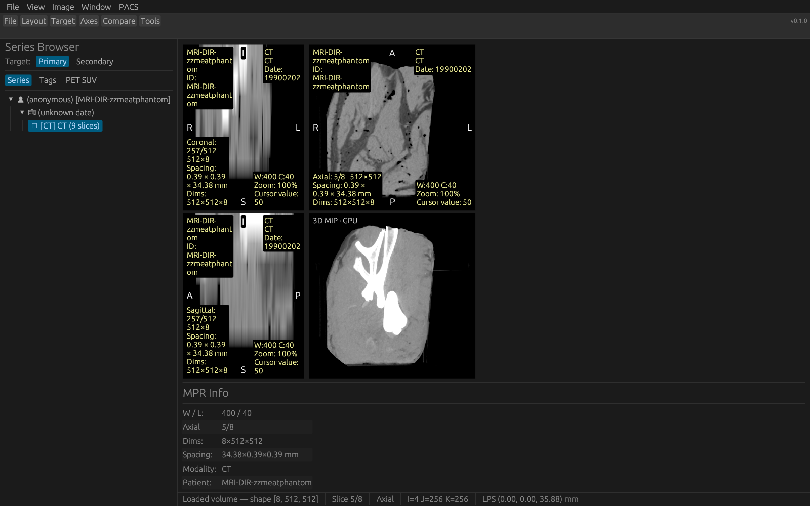

The capture is byte-identical across two runs (SHA-256
`d8c82a0c51b9172ca11a0947f10cc31e80b135a2f23f10ba879f18b228575a7c`). The
input file list, concatenated input digest, executable digest, graphics-backend
selection and bounds are recorded in
[`dicom-eframe-real-gpu-ct.json`](images/dicom-eframe-real-gpu-ct.json). The
GL selector makes the run reproducible on this host; the evidence records the
backend without claiming hardware acceleration.

### Capture the saved MRI study through Métis

The same native path accepts the saved MRI-DIR T2 series in
`test_data/2_head_mri_t2/DICOM/`. These are 94 real DICOM Part 10 files from
the public CC BY 4.0 porcine-head phantom; they are not generated fixtures and
do not contain private patient data. Run the viewer from the repository root:

```powershell
target\debug\ritk-snap.exe `
  test_data\2_head_mri_t2\DICOM `
  --metis-native `
  --capture scratch\viewer\real-mri-metis.png
```

RITK scans and decodes the MRI series, renders its axial, coronal and sagittal
planes, and transfers the resulting RGBA frame to the Métis native surface.
The reviewed 1280 × 800 output below is the actual run, not a made image:

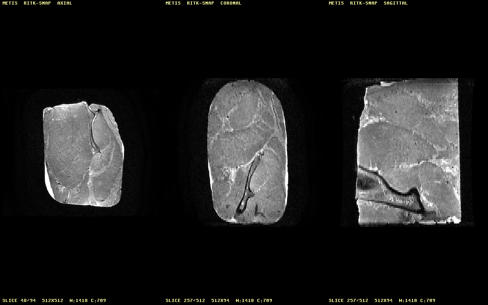

The input byte count, source revisions, executable digest and image digest are
recorded in [`dicom-metis-real-mri.json`](images/dicom-metis-real-mri.json).
The capture excludes operating-system chrome and remains a visual-content
check; native IME, accessibility and cross-platform host evidence are separate
gates. Replace the path with a private clinical study only for a local run;
private studies must not be committed or uploaded.

### Inspect the saved MRI study in the browser

The same saved 94-file MRI-DIR T2 study was opened through the packaged RITK
WASM browser entrypoint. The Codex in-app Chromium host mounted Métis, sent the
files through its bounded `DataTransfer`, and reported 49,807,236 bytes read
before RITK presented all three non-black canvases:

| Canvas | Presented pixels | Non-black pixels |
| --- | ---: | ---: |
| axial | 512 × 512 | 190,836 |
| coronal | 512 × 94 | 41,863 |
| sagittal | 512 × 94 | 38,843 |

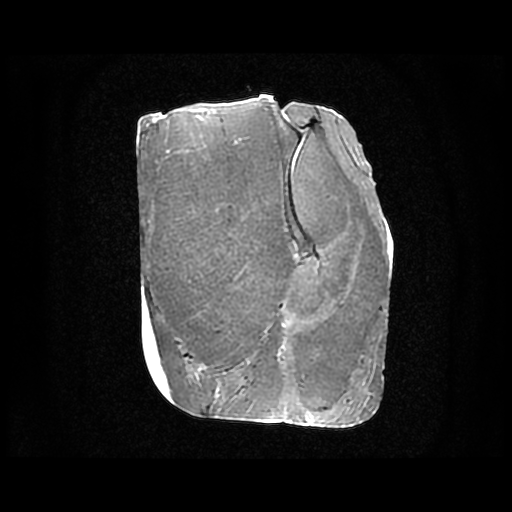

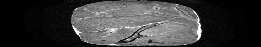

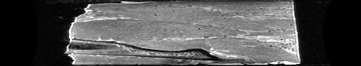

These are canvas PNGs exported from the live run after RITK decoded the real
DICOM bytes; they are not generated illustrations. The source revisions,
accepted-file bound, frame dimensions, non-black counts and SHA-256 digests are
recorded in
[`dicom-metis-real-browser-mri.json`](images/dicom-metis-real-browser-mri.json).
The capture excludes browser chrome. This run proves the saved MRI study through
one Chromium browser host and a bounded programmatic drop; physical drag-and-
drop, Firefox/WebKit, WebGPU and complete application-window capture remain
separate acceptance work.

## Inspect an actual DICOM study in the browser

The same RITK browser entrypoint was exercised against nine real Part 10 files
from the public MRI-DIR CT series. A local page mounted Métis, loaded the
packaged `ritk_snap` WebAssembly module, and transferred the files through a
bounded browser `DataTransfer`. RITK read 4,756,500 bytes and presented
non-black pixels on all three canvases. The Chromium run reported these frame
values:

| Canvas | Presented pixels | Non-black pixels |
| --- | ---: | ---: |
| axial | 512 × 512 | 120,515 |
| coronal | 512 × 8 | 1,879 |
| sagittal | 512 × 8 | 2,438 |

The axial canvas below is the PNG exported from the live browser canvas. It is
decoded from the public DICOM files, not a generated illustration.

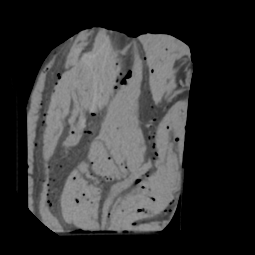

The capture provenance, source revisions, byte count, frame dimensions and
SHA-256 digest are recorded in
[`dicom-metis-real-browser.json`](images/dicom-metis-real-browser.json). The
capture scope is the canvas pixels; it excludes browser chrome. This run uses
a bounded programmatic `DataTransfer` in one Chromium host, so it demonstrates
real DICOM decoding and browser presentation but does not close physical
drag-and-drop, Firefox/WebKit, WebGPU or complete application-window capture.

### Three orthogonal canvases from the complete bounded real series

To exercise the orthogonal geometry with the complete saved study, the same
page accepted all 409 slices from the MRI-DIR series in one bounded browser
`DataTransfer`. RITK decoded 216,156,416 bytes and presented non-black pixels
on every canvas:

| Canvas | Presented pixels | Non-black pixels |
| --- | ---: | ---: |
| axial | 512 × 512 | 124,466 |
| coronal | 512 × 409 | 106,343 |
| sagittal | 512 × 409 | 140,317 |

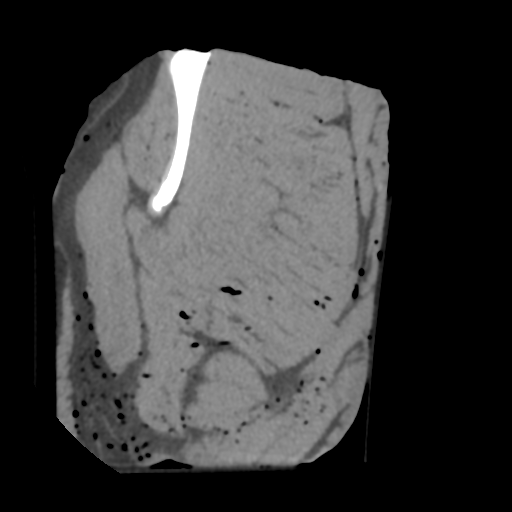

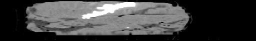

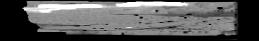

The run's source revisions, byte count, frame hashes and bounds are recorded
in [`dicom-metis-real-browser-orthogonal.json`](images/dicom-metis-real-browser-orthogonal.json).
The Métis/Moirai handoff admits at most 512 file entries and 256 MiB of file
bytes; this public 409-slice study is within both bounds. The capture scope is
the canvas pixels, excluding browser chrome. It demonstrates actual DICOM
loading and orthogonal presentation in the Codex in-app Chromium host through
a programmatic `DataTransfer`; physical drag-and-drop, Firefox/WebKit,
WebGPU and complete application-window capture remain separate acceptance
work. The public phantom data is the only committed image source; private
clinical studies stay local. A second run through Metis's pinned
`browser_drop.py` and Edge 153.0.4234.19 used a configured W3C session with
file-backed Chromium input; it matched the same file manifest, canvas RGBA
hashes and overflow rejections, captured the window and each canvas, and
closed the driver session. Its revision-bound trace is recorded in the
[Metis gallery manual](https://github.com/ryancinsight/metis/blob/main/docs/manual/browser.md#drop-a-study-into-the-gallery).

## Build the RITK SNAP executable and installer

RITK owns the application manifest at
[`metis.json`](../../metis.json). It declares
the single `ritk-snap` Cargo binary and contains no DICOM parser, decoded study,
or clinical resource. Métis supplies the packaging tool and Windows Installer
authoring; the viewer binary remains the RITK-owned DICOM implementation.

From a Windows x64 checkout of RITK and a local checkout of Métis, build the
packager and create a new output directory:

```powershell
cargo build --release --locked --manifest-path path\to\metis\Cargo.toml -p metis-cli
New-Item -ItemType Directory output -Force | Out-Null
path\to\metis\target\release\metis.exe package `
  metis.json output\ritk-snap-installer
```

The output contains `app\ritk-snap.exe`, the exact `inventory.json`, and the
Windows per-user MSI. Launch the portable executable with a study path, for
example `output\ritk-snap-installer\app\ritk-snap.exe study\`. The installer
does not bundle patient data or choose a study; DICOM opening still follows the
RITK workflow above. A package output directory is create-new and must not
already exist.

The manifest and package command are local integration evidence. The
[`metis-package.yml`](../../.github/workflows/metis-package.yml) workflow
repeats the same lock-pinned build on a Windows runner and uploads the
executable, inventory and MSI as a reviewable artifact. Registry publication,
signing, and release promotion remain separate release-authority decisions.

## Open dropped DICOM files in the browser host

The browser build uses the same RITK byte loader as the native dropped-input
path. The HTML page supplies a Métis mount point and a named canvas:

```html
<main id="metis-app" aria-label="Métis browser host"></main>
<canvas id="ritk-canvas"></canvas>
<script type="module">
  import init, { start_web } from "./ritk_snap.js";

  await init();
  await start_web("ritk-canvas");
</script>
```

Métis registers the browser drag-and-drop listeners and transfers one bounded
batch of named bytes. The RITK browser adapter constructs its neutral
`DroppedInput` value directly; the shared policy then detects Part 10 content
or a DICOM suffix, and `dicom::loader` performs the existing scan, series
selection, budgeted preflight, and decode. No filesystem path, browser handle,
DICOM tag, or parser object crosses into Métis. A malformed or oversized
payload follows the same typed rejection path as a native byte drop.

The browser acceptance checks are the locked `wasm32-unknown-unknown` build and
warning-denied Clippy for `ritk-snap`, plus the RITK byte-routing and loader
tests. The standalone consumer lock and graph now use the merged [Mnemosyne
#141](https://github.com/ryancinsight/Mnemosyne/pull/141) and [Mnemosyne
#143](https://github.com/ryancinsight/Mnemosyne/pull/143), [Coeus
#393](https://github.com/ryancinsight/Coeus/pull/393), [Apollo
#386](https://github.com/ryancinsight/apollo/pull/386), and [Leto
#187](https://github.com/ryancinsight/leto/pull/187) portability fixes. Build
the RITK library target and package it with the pinned `wasm-bindgen 0.2.128`
CLI:

```powershell
cargo build --locked -p ritk-snap --lib --target wasm32-unknown-unknown --release
wasm-bindgen target/wasm32-unknown-unknown/release/ritk_snap.wasm `
  --target web --out-dir target/wasm-bindgen/ritk-snap
```

The package contains `ritk_snap.js`, `ritk_snap_bg.wasm`, and TypeScript
declarations. Run those commands from a standalone checkout or CI; the local
Atlas development overlay resolves first-party crates to working trees and is
therefore verified with the equivalent unlocked release build. The generated
module exports `start_web`, `start_web_canvas` and
`start_web_orthogonal_canvases`; packaging proves the consumer artifact
boundary. The local browser visual smoke below exercises the
packaged module against a real synthetic DICOM drop.

The direct Métis canvas workflow is also available for the first browser
presentation slice. It keeps the canvas outside Métis's `#metis-app` mount and
uses the RITK-owned browser loop:

```html
<main id="metis-app" aria-label="Métis browser host"></main>
<canvas id="ritk-snap-canvas" width="512" height="512"></canvas>
<script type="module">
  import init, { start_web_canvas, stop_web_canvas } from "./ritk_snap.js";

  await init();
  start_web_canvas("ritk-snap-canvas");
  // Call stop_web_canvas() when the page or route is torn down.
</script>
```

`start_web_canvas` mounts Métis, consumes its bounded named-byte drop batch,
and passes the files to RITK's existing DICOM classifier and byte-series
loader. A valid drop replaces the RITK study and presents the selected slice on
the named canvas; malformed, oversized, or non-DICOM input follows RITK's
typed error and status paths. The browser host receives only the borrowed
RGBA frame. DICOM parsing, metadata, geometry, window/level and viewer state
remain in RITK. The named canvas now retains bounded pointer and wheel
listeners and routes target-local events through RITK's shared
presentation/action reducer; pointer cancel and provider failures clear the
active gesture. Physical browser-driver input, cross-engine evidence and browser
WebGPU remain separate acceptance work; the native eframe volume upload now
preflights device limits, reports pending GPU readback, and uses the CPU
projection path when the GPU path is unsupported or fails.

The direct three-view entrypoint uses three canvases and preserves the same
format-neutral boundary:

```html
<main id="metis-app" aria-label="Métis browser host"></main>
<section aria-label="RITK orthogonal views">
  <canvas id="ritk-snap-axial"></canvas>
  <canvas id="ritk-snap-coronal"></canvas>
  <canvas id="ritk-snap-sagittal"></canvas>
</section>
<script type="module">
  import init, {
    start_web_orthogonal_canvases,
    stop_web_canvas,
  } from "./ritk_snap.js";

  await init();
  start_web_orthogonal_canvases(
    "ritk-snap-axial",
    "ritk-snap-coronal",
    "ritk-snap-sagittal",
  );
  // Call stop_web_canvas() when the page or route is torn down.
</script>
```

The entrypoint drains one bounded Métis file batch, opens it through RITK's
existing loader and presents the axial, coronal and sagittal
`PresentationFrame` values in that order. RITK's presentation tests assert the
axis order and slice dimensions; the packaged three-canvas capture below
verifies the runtime dimensions and non-black pixels. Each canvas now routes
its bounded pointer and wheel batch to the matching RITK axis. Physical
browser-driver input, cross-engine evidence and browser WebGPU remain separate
acceptance work; native eframe GPU uploads are guarded by the same RITK device
limit check and have a fitting-volume visual capture in the eframe workflow
above.

Each RITK canvas also publishes a bounded semantic snapshot for workflow
drivers. `data-ritk-load-state` is `empty` or `ready`,
`data-ritk-frame-state` is `empty` or `presented`, and the axis, zero-based
slice index/count, and presented pixel dimensions are available as
`data-ritk-axis`, `data-ritk-slice-index`, `data-ritk-slice-count`,
`data-ritk-frame-width`, and `data-ritk-frame-height`. An empty frame reports
zero dimensions. These attributes are produced by RITK after its own DICOM
load and presentation decisions; they contain no patient or DICOM metadata.
The generic Métis runner may read them as consumer assertions, but it does
not assign them meaning.

The shared RITK viewport mapper accepts finite display geometry independently
of egui. Native eframe placement converts its coordinates at the host boundary;
the browser canvas and viewer action path use the same RITK-owned mapping
without importing GUI carrier types.

The browser task also tears down the Métis mount when a frame, input, or timer
failure ends the loop. This failure path is distinct from an explicit
`stop_web_canvas` call: it releases provider listeners before the task exits so
the next route generation cannot retain callbacks or stale pointer capture.

The drop reducer consumes RITK's `DroppedInput` value rather than an eframe
carrier. Native eframe input is converted at the host edge; browser payloads
from Métis enter the same RITK value directly. This keeps DICOM filename, MIME,
Part 10 detection, byte-series assembly, and loader decisions in RITK while
leaving Métis responsible only for bounded browser file transfer.

## Inspect the browser canvas visual smoke

The packaged bundle was served from a local HTTP origin and given the three
Part 10 files generated by `dicom_workflow`. A browser `DataTransfer` dispatched
the drop to the Métis host. The browser accessibility state reported three
accepted files (654 bytes each) and 1,962 bytes read; the RITK canvas reported
`dicom-frame-visible` and returned a non-black 4 × 2 RGBA frame displayed at
512 × 512 CSS pixels. The capture uses RITK's synthetic numeric fixture, so it
contains no patient data.


This image is the PNG exported by the canvas during that run and is inspected
as an application-content snapshot. The synthetic DOM event is untrusted, so
the smoke proves the packaged byte-to-frame path but does not close physical
drag-and-drop, physical pointer input, cross-engine browser input, GPU, or
complete application-window capture acceptance.

## Inspect the browser orthogonal visual capture

The packaged module at RITK revision `f0144c4a5` was produced with
`wasm-bindgen 0.2.128` and served from the same local origin after the
three-canvas entrypoint landed. The browser dispatched the three synthetic
Part 10 files through Métis's bounded drop zone; RITK reported 1,962 bytes read and
presented non-black frames with dimensions 4 × 2 (axial), 4 × 3 (coronal), and
2 × 3 (sagittal). The reviewed PNG is generated from those live canvas pixels,
contains no patient data, and preserves the axial/coronal/sagittal order.

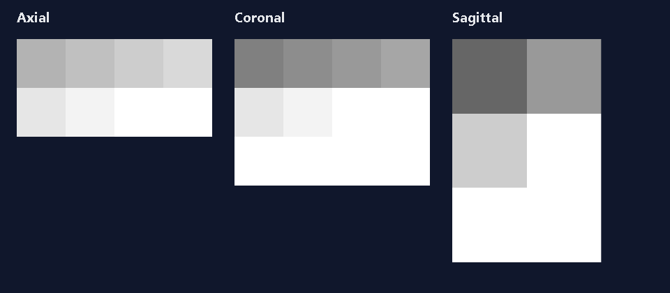

This runtime capture proves the packaged three-canvas presentation path. The
drop event is still synthetic, so physical drag-and-drop, cross-engine pointer
input, GPU upload, and complete application-window capture remain open. The
format-neutral pointer and wheel handoff itself is implemented: each canvas
retains a bounded queue, preserves target-local coordinates, normalizes line
and page wheel units, routes events to its RITK axis, and cancels an active
gesture on `pointercancel` or provider failure. Those behaviors are covered by
the RITK presentation/action tests and ADR 0031; a trusted browser-driver
capture is still required before claiming physical or cross-engine evidence.

## Run the Metis trusted canvas trace

The reusable browser transport lives in the Metis repository. Run it from a
Metis checkout that contains the canvas scenario, and point it at the served
RITK page. The page must expose the RITK-owned canvases and use the real RITK
browser entrypoint:

```text
python scripts/browser_runtime.py --scenario canvas --engine chromium \
  --driver-url http://127.0.0.1:9515 \
  --url http://127.0.0.1:8080/ritk.html \
  --consumer-revision <RITK-40-HEX> \
  --canvas-id ritk-snap-axial \
  --canvas-id ritk-snap-coronal \
  --canvas-id ritk-snap-sagittal
```

To carry RITK's own semantic evidence in the generic trace, add one
`--canvas-attribute` argument per bounded canvas attribute:

```text
python scripts/browser_runtime.py --scenario canvas --engine chromium \
  --driver-url http://127.0.0.1:9515 \
  --url http://127.0.0.1:8080/ritk.html \
  --consumer-revision <RITK-40-HEX> \
  --canvas-id ritk-snap-axial \
  --canvas-id ritk-snap-coronal \
  --canvas-id ritk-snap-sagittal \
  --canvas-attribute data-ritk-load-state \
  --canvas-attribute data-ritk-frame-state \
  --canvas-attribute data-ritk-axis \
  --canvas-attribute data-ritk-slice-index \
  --canvas-attribute data-ritk-slice-count \
  --canvas-attribute data-ritk-frame-width \
  --canvas-attribute data-ritk-frame-height
```

Metis records these requested values opaquely under each canvas snapshot and
uses `null` when an attribute is absent. RITK interprets the values using the
semantic contract above; the generic runner does not interpret DICOM or
clinical state. The Metis attribute capture was added in [PR #73](https://github.com/ryancinsight/metis/pull/73)
at commit `fb4ad93`.

Replace the driver endpoint and page URL with the configured local service,
then repeat the run for Firefox and WebKit. Set `<RITK-40-HEX>` to the exact
RITK revision serving the page. The Metis trace records the negotiated browser
capabilities, bounded canvas dimensions, trusted pointer-drag and wheel
actions, full-window PNGs, element PNGs, and both repository revisions. A
missing driver endpoint is a failed invocation, not a skipped engine.

The trace is transport and presentation evidence only. RITK must assert the
accepted byte batch, Part 10 classification, selected study and series, axis
order, decoded dimensions, expected slice/viewport changes, and stale-frame
rejection after teardown. These DICOM and viewer assertions stay in RITK; the
Metis runner neither reads DICOM bytes nor interprets clinical pixels.

### Validate the RITK meaning in a trace

After the Metis runner writes a passed canvas trace, run the RITK-owned
validator from the RITK checkout:

```text
cargo run --locked -p ritk-snap -- \
  --validate-browser-trace output/browser/runtime/chromium-canvas.json
```

The command checks the schema and both repository revisions, the closed browser
engine matrix, the ordered axial/coronal/sagittal canvases, all seven
`data-ritk-*` values, intrinsic and presented dimensions, one trusted pointer
drag and wheel action per canvas, full-window and element screenshot scopes,
and input-source cleanup. Custom canvas identifiers use three repeated
`--canvas-id` options in the same order as the trace. A small structural
fixture is available at
[`crates/ritk-snap/tests/fixtures/browser-trace.json`](../../crates/ritk-snap/tests/fixtures/browser-trace.json)
for a local command demonstration; its digest fields exercise trace shape and
do not claim a visual capture. The validator never opens DICOM bytes or
interprets pixels, so clinical and decoded-value oracles remain the RITK
workflow tests above.

## Present validated RITK views through Métis

RITK remains the only DICOM owner. After RITK has opened the study, decoded the
selected frame, applied modality rescale, window/level, and colormap rules, the
`ritk-snap::presentation::PresentationFrame` boundary copies bounded, row-major
RGBA slices. The native session composes three such frames using the same
window/level, colormap, orientation, and physical-spacing rules as the RITK
viewer. The host receives one bounded framebuffer; DICOM identifiers, paths,
codec state, geometry, and volume storage stay in RITK.
The canonical handoff uses RITK's neutral `render_rgba` and RGBA orientation
path; the legacy eframe slice adapter is the only path in this handoff that
converts those pixels to `egui::ColorImage`.

On Windows, `run_native_viewer` loads the selected study in RITK, presents the
three orthogonal views through Métis's native surface, routes pointer events to
the panel under the pointer, translates each bounded native event batch to
`PresentationEvent`, and applies the resulting actions to RITK viewer state.
The focused suite checks slice pixels, all three panels, panel-specific wheel
navigation, resize/minimize, DPI, focus-loss cancellation, close, and bounded
hidden capture. The test proves the host boundary and the existing DICOM
workflow; it does not add a DICOM parser to Métis. Browser handoff and GPU
upload remain migration work; the RITK-owned manifest now exercises the Métis
executable and Windows MSI path without moving DICOM behavior across the
presentation boundary.

Primary-button drags follow the selected RITK tool through the same event path.
For the Pan tool, the resulting image-space offset is applied while RITK
recomposes the three panels, so the next Métis framebuffer reflects the drag as
well as the updated viewer state. This is a state-and-pixels check; it does not
move DICOM parsing or geometry ownership into Métis.

Keyboard page navigation follows the same RITK-owned action path. Page Down
advances the active slice and recomposes the native Métis framebuffer; the
native session test verifies both the slice index and changed pixels.

Deferred viewer loads use a bounded Moirai task per primary or comparison
target. RITK assigns each request a generation and checks cooperative
cancellation before publication, so a superseded or closed request cannot
replace the current study. A failed replacement reports its error while the
previous decoded study remains displayed. The load-task tests use the real
synthetic DICOM fixtures and assert decoded shape, spacing, series identity,
supersession, and close cancellation.

Wheel input is now reduced and applied by RITK for every host. The native
Moirai `ModifierState` is translated into the format-neutral
`PresentationModifiers`; the current egui producer emits the same
`PresentationEvent::PointerWheel` shape. Ctrl/Command plus a vertical delta
uses the existing zoom policy, while an unmodified vertical delta steps the
active slice. Non-finite deltas and events outside a viewport are rejected or
ignored before viewer state changes. Métis carries the event snapshot only; it
does not parse DICOM, retain a decoded volume, choose a series, or apply a
clinical display transform.

The existing `dicom-window.png` below remains the egui/eframe baseline. The
`dicom-metis-native.png` image is the reviewed Métis content capture; it is
generated from the same synthetic study and is not relabeled as an OS-window
golden.

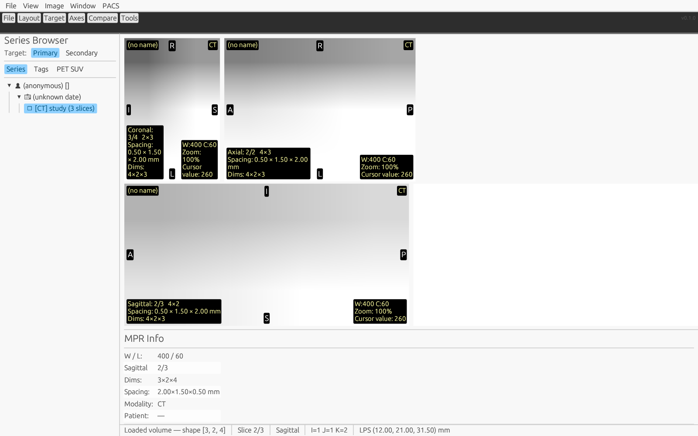

This egui/eframe capture runs on Windows at 125% display scale, producing a
1600 × 1000 root viewport. The viewer's current hanging protocol selects width
400 and center 60, unlike the software-grid oracle's width 510 and center 235.
Image placement preserves physical proportions in every layout. For this
fixture, displayed width/height is 2/3 for the depth slice, 1/3 for the row
slice, and 1/2 for the column slice: pixel count times sample spacing on each
axis. A quarter turn exchanges the two extents. The same placement determines
image bounds and cursor hit coordinates; tests inspect the actual egui image
shapes across layouts and rotations. Geometry that cannot be represented in
positive finite screen coordinates reports an explicit placement error.
The status bar's
cursor `[1, 1, 2]` maps to LPS `[12, 21, 31.5]` mm by the equation above, and
the decoded cursor value is 260. The capture demonstrates the existing viewer
baseline; it is not a Métis application screenshot.

Scalar readouts use “value” because this carrier does not establish physical
intensity units; PET SUV readouts retain their explicit SUV label.
Annotations use opaque backings for contrast. When the viewport cannot fit all
annotations without overlap, activate **Details** to read the complete metadata
in a scrollable popup. Press Escape or click outside the popup to close it.
With Details focused, press Enter or Space to open it. Arrow keys scroll by a
line, Page Up/Down by a page, and Home/End reach the content boundaries without
changing the study slice.

Secondary images use their own sampling distances. A fused image keeps the
primary output grid, then maps each primary voxel centre through the physical
affine

```text
P = origin + direction · diag(spacing) · [depth, row, column]
```

into the secondary grid before nearest-neighbour sampling. The two volumes
must carry the same `FrameOfReferenceUID`. When both identifiers are absent,
fusion is admitted only for exactly identical origin, direction and spacing;
different unknown grids are rejected. Non-parallel planes and a selected
secondary plane outside the secondary normal extent report an explicit error,
while secondary in-plane samples outside the field of view leave the primary
pixel unchanged. These rules prevent a normalized-coordinate blend from being
presented as registered anatomy.

The focused fusion suite contains manufactured translated, rotated and
anisotropic grids with known patient-space landmarks, plus incompatible-frame,
missing-frame, non-parallel and out-of-field rejection/retention cases. The
same affine transform is used by RT-STRUCT projection, so contour coordinates
and fused pixels share one physical convention.

The workflow writes a deterministic fused capture. It shifts the secondary
grid by one column spacing in LPS, gives both volumes the synthetic frame
identifier `2.25.20260905099`, and records the mapped landmarks in
`workflow.json`. The enlarged software buffer is the reviewed visual oracle;
the native window capture above remains the host-renderer demonstration.


| Primary voxel | Patient LPS (mm) | Secondary continuous voxel | Sampling result |
| --- | --- | --- | --- |
| `[1, 0, 0]` | `[12, 20, 30]` | `[1, 0, 1]` | Secondary column 1 |
| `[1, 0, 1]` | `[12, 20.5, 30]` | `[1, 0, 2]` | Secondary column 2 |
| `[1, 1, 2]` | `[12, 21, 31.5]` | `[1, 1, 3]` | Secondary column 3 |
| `[1, 1, 3]` | `[12, 21.5, 31.5]` | `[1, 1, 4]` | Primary retained (out of field) |

The capture is generated by the same `render_fused_slice` path used by the
viewer, rather than by a hand-assembled image. A changed capture must update
the reviewed `dicom-fusion.png` image only after the coordinate table and the
pixel tests agree.

## Keep cursor and measurements with transformed pixels

The viewer's **View → Orientation** commands and shortcuts apply the same
`ViewTransform` to the texture and every source-coordinate overlay:
**H** flips horizontally, **V** flips vertically, **R** rotates clockwise by
90°, **Shift+R** rotates counter-clockwise, and **O** restores the identity.
The linked cursor, pointer intensity, crosshair, label map, RT-STRUCT, RT-DOSE,
orientation labels, and measurement annotations all use source voxel
coordinates. Screen input first enters the displayed output rectangle and is
then mapped through the inverse transform, so a transformed click selects the
same voxel as an identity click at the corresponding source location.

The continuous mapping uses image-edge coordinates. For source size
`[width, height]`, the source domain is `[0,width] × [0,height]`; the output
dimensions swap for quarter turns. Pixel centres therefore map through the
same equations as the rendered image without a half-pixel offset. Annotation
lengths and ROI areas use the source plane spacing. Their checked constructors
reject non-positive, non-finite, or `f32`-unrepresentable spacing and reject a
non-finite derived result; the viewer reports the rejection and does not append
an invalid annotation.

The workflow also emits a deterministic transformed slice capture. It flips
the depth slice horizontally and rotates it clockwise, then enlarges the
result with nearest-neighbour sampling. The image is generated by the same
`apply_to_image` path used before texture upload and is compared byte-for-byte
with the reviewed manual image.


Temporal multiframe organization and default DICOM LINEAR/VOI semantics are
covered by the completed [RITK-SNAP-FRAMES-001](../../backlog.md#RITK-SNAP-FRAMES-001)
item. These workflows prepare the egui baseline for the Métis migration. The
browser handoff now has a compiled RITK adapter, manual workflow, and a local
synthetic runtime visual smoke; browser WebGPU, physical browser input, and
full application-window capture remain separate acceptance items in
[RITK-SNAP-METIS-001](../../backlog.md#RITK-SNAP-METIS-001).

The browser presentation seam is now explicit as well. `metis_web::CanvasFrame`
is implemented by RITK's `PresentationFrame`, and
`ritk_snap::presentation::WebCanvasPresenter` resolves a named canvas and
uploads that borrowed RGBA view through Métis and Moirai. The adapter carries
only dimensions and pixels; DICOM parsing, decoded volume state, geometry and
medical display policy remain in RITK. `start_web` now retains its async
JavaScript contract while delegating to the direct single-canvas workflow;
`start_web_canvas` is its synchronous form and
`start_web_orthogonal_canvases` exercises the three-canvas workflow. None of
these paths moves DICOM behavior into the GUI framework.
