# Verify DICOM viewer workflows

This workflow generates three small Part 10 instances, opens them through
the viewer's directory and dropped-byte loaders, checks their decoded values
and physical coordinates, and captures three orthogonal scalar and RGB slice
buffers plus a patient-coordinate fusion buffer.
It needs no downloaded datasets or patient information.

RITK owns the DICOM boundary used by presentation hosts. A host that receives
files or browser drops passes the named Part 10 byte batch to
`ritk_io::scan_dicom_part10_bytes` (or its budgeted form), then passes the
validated descriptor to `ritk_io::load_dicom_from_series`. The scanner and
loader retain the validated bytes, enforce the parser, retained-study, and
decoded-workspace budgets, and return the RITK `Image` plus
`DicomReadMetadata`. No GUI framework type or parser object crosses this
boundary; the host owns only input and presentation lifecycle.

The current standalone lock used by the viewer resolves the six Metis packages
to `1b10541c2ef7a849e6ff66a3c778874bdf96de7b`. Fifteen Moirai packages resolve
to `b77239dd10bcaf803394c26255c462bc858c1340`; these are the exact git sources
in `Cargo.lock`, which contains 63 first-party Git sources. The browser chooser
and Windows package workflows use these provider pins. Historical hosted captures
retain the provider revisions recorded in their own provenance files. RITK
continues to own DICOM scanning, decoding, geometry and clinical presentation.

This workflow is the DICOM opening demonstration for the default Windows Métis
shell and the explicit eframe compatibility shell. The code, fixtures, visual
goldens, and rejection tests remain in RITK so a framework migration cannot
fork medical-data semantics.

## Actual application gallery

The first visual proof is a real public MRI-DIR CT study opened by RITK and
presented through the Métis native window. It contains axial, coronal, sagittal,
and axial maximum-intensity-projection panels captured from the running Windows
HWND. The image is application output from 409 DICOM files, not generated
artwork; its source revisions, input bounds, panel counts, repeat digest, and
orderly close are recorded in the [window provenance record](images/dicom-metis-real-ct-mip-window.json).
Manual figures with a `.webp` suffix are pixel-identical lossless encodings of
the original PNG captures. Their provenance records retain the original PNG
name, byte count, and digest and identify the derived manual figure separately.


The merged Windows default-shell build was rerun against the same saved public
series on 2026-09-14. RITK selected all 409 files, rendered the three
orthogonal planes, rejected a missing study before publishing a capture, and
exited cleanly. Three bounded lifecycle runs produced the same 1280 × 800
application frame (359,857 non-black pixels; SHA-256
`8082cea87348126ce5a07cacb602bf71081747881481d2062bb1f2c7314113d3`). The
capture and process-tree measurements are bound to the exact RITK, Métis and
Moirai revisions in the [default-shell provenance record](images/dicom-metis-default-shell-ct.json).
The corresponding three-plane application image is the [reviewed capture](images/dicom-metis-installer-ct.webp);
private clinical studies remain local.

The same saved CT study also survives a live native resize. The initial
1280 × 800 client surface and the resized 1024 × 720 surface are the reviewed
[before](images/dicom-metis-real-ct-resize-initial.png) and
[after](images/dicom-metis-real-ct-resize-after.png) captures; both retain all
three decoded planes, and the exact dimensions, digests, source revisions and
orderly close are recorded in the [resize provenance record](images/dicom-metis-real-ct-resize.json).

The detailed synthetic, native, eframe, browser, and saved-study workflows
below explain how to reproduce and inspect each component boundary. RITK owns
scanning, decoding, geometry, and clinical presentation; Métis owns the bounded
host, canvas, and window lifecycle.

The current standalone lock pins the browser canvas provider to Moirai
`b77239dd10bcaf803394c26255c462bc858c1340` and the six Metis packages to
`1b10541c2ef7a849e6ff66a3c778874bdf96de7b`. Repeated RGBA frames with the
current extent retain the validated bitmap; a changed width or height takes
the bounded resize path. This keeps the browser presentation lifecycle stable
without changing DICOM decoding or the displayed pixels. It is an allocation
lifecycle guard, not a measurement of WebAssembly or browser memory.

RITK's presentation boundary exposes the same lifecycle primitive to every
host. A `PresentationFrame` swaps its completed RGBA storage with
caller-owned render scratch, and the browser viewer retains its frame slots
while a study remains loaded. After the first dimension for a browser slot is
established, slice, window/level and cine updates reuse the existing capacity;
the browser loop uploads a slot only after its pixels are rerendered, so an
idle animation callback does not transfer an unchanged bitmap. Study
replacement reclaims that capacity into the scratch owner before the next
load.

The native Métis session now retains one `PresentationFrame` and one
`FrameRenderScratch` per orthogonal plane. Each refresh renders the selected
slice into the retained frame, applies the orientation into the scratch
buffer, and swaps the completed storage back into the frame. The focused
`native_session_reuses_transformed_frame_storage_across_refreshes` test runs
two ninety-degree refreshes and checks byte-identical pixels, dimensions and
stable scratch capacities; the RGBA transform test checks the same result
against the allocating reference path. The optional scalar projection keeps
one retained frame plus scalar and RGBA scratch, so MIP, MinIP and Average
refreshes swap storage after warmup instead of allocating a new projection;
`native_projection_reuses_frame_and_scratch_storage_after_warmup` and
`native_projection_reuses_storage_when_statistic_changes` compare those
pixels, dimensions and spacing with the existing projection oracles. These
tests are allocation-lifecycle oracles, not process-memory or framework
comparison measurements.

### One state contract for native and browser hosts

RITK projects the host-visible viewer state into one typed
`PresentationSnapshot`. It contains the visual revision, loaded state, all
three slice selections and counts, effective window/level, cine state and
rate, viewport zoom/pan, orientation, linked crosshair state and cursor, active
window preset and interaction tool, and the completed-annotation count plus
latest kind/value summary. The
snapshot contains no DICOM path, identifier, metadata object, volume storage
or pixel bytes. Browser canvas semantics add only the dimensions of their
presented `PresentationFrame`; the native Métis outcome exposes the same
snapshot through `NativeViewerOutcome::snapshot()`.

This keeps the clinical contract in RITK while Métis remains a format-neutral
host. The browser publishes the snapshot's existing bounded slice, window/level,
cine, interaction, linked-cursor, orientation and completed-annotation values as `data-ritk-*`
attributes, so a visual test can correlate a real canvas image with the
reducer state that produced it. `data-ritk-linked-cursor` uses volume order
`z,y,x`; `data-ritk-view-flip-h`, `data-ritk-view-flip-v` and
`data-ritk-view-rotation` describe the orientation already applied to the
presented pixels. `data-ritk-annotation-count` is zero for an empty result;
`data-ritk-last-annotation-kind` is one of `length`, `angle`, `roi-rect`,
`roi-ellipse` or `hu-point`; and `data-ritk-last-annotation-value` carries the
finite primary value in the kind's documented units.
The native session records the snapshot whenever it records a frame or state
transition. The focused snapshot and native-session tests assert identical
slice, window/level, cine, zoom, pan, tool and revision semantics across the
two presentation paths.

The same public MRI replay was run three times through Métis's bounded
process-tree resource runner for the orthogonal frame path. All runs exited
with code 0, produced the same 418,490-byte capture and retained the 411,413
non-black-pixel result. With a 25 ms sample interval, mean peak private bytes
were 815,527,253 ± 110,596 and mean final private bytes were 440,169,813 ±
171,205 across the three bounded runs. These are lifecycle measurements for
this presentation path, not a cross-framework memory ranking. The exact
command fingerprint, revisions and bounded statistics are in the [native MRI
resource provenance record](images/dicom-metis-real-mri-resource.json).

The replay was also run three times with `--metis-native-layout
orthogonal-with-mip`, exercising the retained scalar projection frame and
scalar/RGBA scratch. All runs exited with code 0 and produced the same
1280×800, 614,907-byte capture (534,414 non-black pixels); the capture visibly
contains the saved axial, coronal and sagittal MRI planes plus the axial
`3D MIP` panel. Mean peak private bytes were 816,149,845 ± 1,137,625 and mean
final private bytes were 440,810,155 ± 1,082,268 across the three bounded runs.
These are lifecycle measurements for the projection path, not a framework
comparison. The exact command fingerprint, hashes, revisions and test oracles
are in the [native MRI projection resource provenance record](images/dicom-metis-real-mri-projection-resource.json).

Build from a standalone RITK checkout, then run the bounded demonstration:

```console
cargo build --locked -p ritk-snap --features eframe-shell --example dicom_workflow
python scripts/viewer.py target/debug/examples/dicom_workflow
```

On Windows the binary ends in `.exe`. Under Atlas, use the configured shared
target directory (`D:/atlas/target/debug/examples/dicom_workflow.exe`). Atlas's
development overlay changes dependency resolution; verification against the
committed standalone lock must run outside that overlay while retaining the
shared target and build settings.

The runner requires Python 3.11 or newer, enforces a 60-second deadline per process and replaces the fixed
artifact set in `scratch/viewer/`. Its `workflow.json` records the actual
decoded voxels, geometry, capture dimensions and SHA-256 hashes of the binary
and images. A failed run invalidates its previous success report.
It compares the generated PNG bytes exactly against the reviewed manual
images; the deterministic software renderer needs no tolerance. Use
`--update-goldens` only to regenerate deliberately changed captures, then
inspect the images and independent pixel tests before accepting them.

The example and required loader tests share the
[fixture source](../../crates/ritk-snap/src/dicom/loader/tests/fixtures.rs).
The fixture uses unsigned 8-bit, uncompressed, single-frame images with
MONOCHROME2 photometric interpretation. CT and MR modality labels are tested;
this small Secondary Capture object is not a complete CT or MR acquisition IOD.
Filenames and instance numbers run backwards relative to spatial position,
so sorting them by name would give the wrong answer.

| Quantity | Expected value |
| --- | --- |
| Volume shape `[depth, row, column]` | `[3, 2, 4]` |
| Stored samples in spatial order | `0, 10, …, 230` |
| Modality rescale | `decoded = 2 × stored − 20` |
| Decoded voxels | `−20, 0, …, 440` |
| Spacing `[depth, row, column]`, mm | `[2, 1.5, 0.5]` |
| First voxel LPS position, mm | `[10, 20, 30]` |
| Voxel `[2, 1, 3]` LPS position, mm | `[14, 21.5, 31.5]` |

Position and orientation give the independent coordinate equation
`P(d,r,c) = [10 + 2d, 20 + 0.5c, 30 + 1.5r]` mm. DICOM defines the row/column
spacing and orientation mapping in
[PS3.3 C.7.6.2.1.1, Equation C.7.6.2.1-1](https://dicom.nema.org/medical/dicom/current/output/chtml/part03/sect_C.7.6.2.html#sect_C.7.6.2.1.1).

## Open a multi-frame object

RITK inspects `NumberOfFrames` on each scanned member before choosing the
single-frame series decoder. A multi-frame object is decoded through
`ritk_io::load_dicom_multiframe_flat` (or its byte-payload counterpart), so
the resulting `LoadedVolume` has one depth entry for every decoded frame.
The path and dropped-byte entry points share the same frame buffer, modality
rescale, spatial orientation, and spacing checks. RGB multi-frame objects use
RITK's interleaved color reader and retain three channels per voxel.

The viewer rejects a multi-frame object that declares more than one temporal
position or names `TemporalPositionIndex` in its dimension organization. It
also rejects a batch that mixes a multi-frame object with conventional
single-frame members; neither case is silently presented as a spatial stack.
The regression fixtures use two distinct 2 × 2 frames with decoded values
`[-8,-6,-4,-2]` and `[12,14,16,18]`, assert both file and byte workflows, and
render each axial frame through `SliceRenderer` with independent pixel
oracles. A declared three-frame object with only two frames is rejected during
decode.

## Preserve RGB presentation

The same workflow writes a two-frame RGB object with interleaved unsigned
8-bit samples. RITK's color reader admits only `PhotometricInterpretation=RGB`,
`SamplesPerPixel=3`, `PlanarConfiguration=0`, and supported uncompressed or
codec-backed transfer syntaxes. Scalar, palette, YBR, CMYK, planar, signed, or
unsupported codec inputs fail at the DICOM boundary; they are never reduced to
the first channel.

The color object has shape `[depth, rows, columns] = [2, 2, 2]` and channel
samples `[red, green, blue, white]` in frame zero followed by
`[cyan, magenta, yellow, neutral]` in frame one. The filesystem and dropped-byte
loaders must return the same interleaved samples. `SliceRenderer` copies these
decoded channels directly into the display image for axial, coronal, and
sagittal views. Scalar window/level and colormap parameters are intentionally
not applied to RGB data, so a red source voxel remains red in the submitted
texture.

The images below are the actual RGB slice buffers enlarged with nearest-neighbor
sampling. The color-channel tests compare every RGBA pixel, and `viewer.py`
compares these grid bytes with the reviewed manual images.


## Present signed grayscale data

The scalar viewer follows the DICOM grayscale presentation contract after RITK
IO has decoded the stored samples and applied modality rescale. `MONOCHROME2`
keeps the mapped value and `MONOCHROME1` inverts it once after the VOI mapping.
When `VOI LUT Function (0028,1056)` is absent, the viewer uses DICOM's default
`LINEAR` function. Explicit `LINEAR_EXACT` and `SIGMOID` values select their
specified equations; an unsupported value or table-based `VOI LUT Sequence`
fails at load instead of being approximated as a window.

The workflow fixture stores signed samples `−10, 0, 10, 20`, applies slope `2`
and intercept `−10`, and declares `MONOCHROME1` with `LINEAR_EXACT`. The
decoded modality values are therefore `−30, −10, 10, 30`; with centre `0` and
width `40`, the displayed bytes are `255, 191, 64, 0`. The image is generated
by `SliceRenderer` and checked byte-for-byte by `scripts/viewer.py`.


The same presentation value is shared by scalar slices, MIP, volume rendering,
fused comparison, and native GPU paths. This keeps CPU and GPU output aligned
and prevents a second inversion or a renderer-specific window equation.

The images below come from `SliceRenderer`, which uses Iris's grayscale map.
They show the decoded pixel grid enlarged by nearest-neighbour sampling.
These are software slice-buffer captures before texture upload; they do not
show the application window or physical-aspect-ratio display. Axis labels refer
to storage dimensions because this study has a nonidentity orientation.

Depth index 1, size 4 × 2: expected bytes `80,90,100,110 / 120,130,140,150`.


Row index 1, size 4 × 3: expected bytes
`40,50,60,70 / 120,130,140,150 / 200,210,220,230`.


Column index 2, size 2 × 3: expected bytes `20,60 / 100,140 / 180,220`.


The chosen center 235 and width 510 cancel the fixture's modality rescale under
explicit `LINEAR_EXACT` metadata, so each grayscale byte equals its stored
sample. The tests also check the scratch-buffer rendering
path and reject malformed and truncated byte inputs. They separately verify
exact NIfTI file/byte roundtrips for `.nii` and `.nii.gz`.

## Open, select, and restore a study

Use **File → Open DICOM file…** to select a particular acquisition in a folder
containing several series. The selected instance's SeriesInstanceUID determines
which neighbouring image files load. **Open DICOM folder…** discovers the series
browser; if the folder contains several series, choose a series there instead of
accepting an arbitrary largest series. The highlighted series changes after
successful loading. Selecting a secondary series retains its own exact files.

For a scripted startup or a Métis-native capture, pass the selected
SeriesInstanceUID explicitly. RITK discovers the path and verifies the exact
member list again before pixel decode:

```console
cargo run --locked -p ritk-snap -- path/to/study \
  --series-instance-uid 2.25.20260905001 --metis-native --capture selected.png
```

An unknown UID, a non-DICOM path, or a changed member list fails with a typed
diagnostic. The launcher never chooses the largest or first series. This is the
safe path for saved patient folders that contain multiple acquisitions; keep
clinical files local and do not add them to the repository or its captures.

The interactive Windows Métis shell follows the same rule. `Ctrl+O` opens the
bounded folder picker; when the folder contains several acquisitions, RITK
renders a series selector over the current framebuffer. Use **Arrow Up/Down**
or **1–9**, then **Enter** to load the highlighted SeriesInstanceUID. **Escape**
cancels without replacing the current study. A failed scan or decode reports
the failure in the selector and keeps the previous decoded frame available,
so a recoverable reopen never terminates the Métis host.

**Open DICOMDIR…** uses the index's referenced image set. Missing references or
an invalid index report an error; unreferenced subdirectories do not supply a
replacement study. The reader follows the linked PATIENT/STUDY/SERIES/IMAGE
record tree, excludes inactive or unreachable records, rejects cycles and
out-of-sequence offsets, and verifies each IMAGE record's SOP class, SOP
instance, and transfer syntax against its referenced file. Dropped byte batches
must identify one image series.

Saving a session records the primary study's UID and exact files along with the
presentation controls. Restore validates those members before replacing the
current volume or controls. A missing member, changed UID, or member that is no
longer an image fails explicitly and leaves the current study displayed.
Older path-based sessions remain readable, but an ambiguous folder requires
selection. See the [public API migration guide](../migration_selected_dicom.md).
This session format does not persist the secondary comparison acquisition.

Native tests exercise the RITK series selector and exact UID load path alongside
the existing egui series-row pointer events, primary/secondary loads, failed
replacement, and session restore with deterministic Part 10 files.
The IO tests load a complete synthetic linked PATIENT/STUDY/SERIES/IMAGE index,
then exercise inactive and unreachable records, malformed links, identity
mismatches, and final-component symlinks. They compare active member paths and
exact pixel values and geometry with explicit member loading. DICOMDIR member
reads use `moirai_pal::fs::open_file_within_root`, which walks from the selected
root directory handle and returns the handle RITK reads. The Moirai PAL tests
reject parent traversal and intermediate/final links; browser file entries use
the DOM provider because the native path contract is unsupported on WebAssembly.

## Select a saved DICOM series from Python

The Python binding uses the same RITK-owned scanner and native loader. Pass
`series_instance_uid` when a saved directory contains more than one acquisition;
the UID is matched before pixel decode. This keeps acquisition selection in RITK
and leaves Metis format-neutral. The public MRI-DIR CT directory is a real
409-slice series, so it exercises the full native decode and explicit UID path
without exposing private clinical data. The multi-series and fail-closed
selection behavior is covered by the RITK integration test below:

```powershell
python -c "import hashlib, numpy as np, ritk; p=r'test_data\\3_head_ct_mridir\\DICOM'; uid='1.3.6.1.4.1.14519.5.2.1.1706.4996.115936088547498980797393821518'; image=ritk.io.read_image(p, series_instance_uid=uid); values=np.asarray(image.to_numpy()); print({'shape': values.shape, 'dtype': str(values.dtype), 'spacing': image.spacing, 'origin': image.origin, 'min': float(values.min()), 'max': float(values.max()), 'nonzero': int(np.count_nonzero(values)), 'sha256': hashlib.sha256(values.tobytes()).hexdigest()})"
```

The Windows `ritk-0.12.79-cp39-abi3-win_amd64.whl` built from this workflow
reported the following values for the saved public CT series:

| Quantity | Observed value |
| --- | --- |
| Shape | `(409, 512, 512)` |
| Dtype | `float32` |
| Spacing `(sz, sy, sx)` | `(0.390625, 0.390625, 0.625)` mm |
| Origin `(oz, oy, ox)` | `(-122.25, -100.0, -100.0)` mm |
| Intensity range | `[-2048.0, 3071.0]` HU |
| Non-zero voxels | `107130061` |
| Voxel byte SHA-256 | `70c414f86a387227ba4b79e92db43dc71551cd1cd911c2eb07b3ad3d33e2eec5` |

The command must report a three-dimensional `float32` array and a non-zero
voxel count. Omitting the UID for a directory with multiple series, passing an unknown or empty
UID, or passing a non-directory with a UID raises `OSError`; there is no
first-series fallback. The Rust integration test
`native_dicom_uid_selection_reads_only_the_requested_series` covers the same
positive and fail-closed cases with two generated acquisitions and exact voxel
assertions. The Python smoke test covers the keyword and non-directory error
boundary against the built extension.

## Resource-bounded DICOM ingress

The RITK DICOM boundary runs a structural Part 10 preflight before dicom-rs
materializes an object. `ritk_dicom::ParseBudget` limits the encoded byte span,
structural element count, and sequence nesting depth. The scanner checks
declared value spans, sequence and item delimiters, implicit sequence tags, and
encapsulated pixel fragments without copying their values. The reader exposes
matching `scan_dicom_*_with_budget` entry points and the series loaders expose
`load_*_with_budget` counterparts. They accept the typed `DicomReadBudget`,
which combines the parser budget with separate retained-study and
decoded-workspace ceilings. The default forms use finite shared ceilings;
constrained hosts can construct a smaller budget with
`DicomReadBudget::try_new(ParseBudget::new(...), retained_bytes, decoded_bytes)`.

The preflight accepts implicit little-endian, explicit little-endian, and
explicit big-endian datasets, plus the encapsulated pixel syntaxes used by the
native RITK codecs. Deflated dataset input is rejected with an explicit error
because the locked dicom-rs registry does not provide a bounded deflate decoder.
The DICOMDIR index uses the same parser preflight. Filesystem reads resolve and
open one path handle, compare its metadata with the resolved path, and read from
that handle; DICOMDIR member reads additionally use Moirai PAL's root-confined
directory-handle walk. Scanned slices retain the exact validated bytes for pixel decode.
The reader charges retained bytes before storing each member. The loader plans
the peak decoded frame, resample, and contiguous-volume workspace before any of
those buffers are allocated, including the temporary frame-vector handles.
Deterministic tests cover parser, DICOMDIR, retained-byte, decoded-workspace,
and replacement cases. Unix reads reject a final symlink with `O_NOFOLLOW`;
Windows reads request a reparse-point handle and reject a final reparse point.
The DICOMDIR record-tree and referenced-identity contract is delivered by
[RITK-SNAP-DIRECTORY-001](../../backlog.md#RITK-SNAP-DIRECTORY-001); the
root-confined filesystem contract is provided by Moirai PAL.

For a conventional scalar series, the scan retains each validated Part-10
payload only through reconstruction. The loader now writes uniform-spacing
frames directly into the destination volume, releases each temporary decoded
frame after its copy, and clears the encoded payloads before returning
`DicomReadMetadata`. This preserves the scan-to-decode replacement guarantee
without keeping a second encoded copy for the viewer lifetime. Irregular
spacing still uses the bounded frame set required by its interpolation
contract.

The Windows lifecycle measurement below reruns the saved public CT through the
same Métis command three times at a 100 ms sampling interval. It compares the
old collected-frame path with the bounded destination-write path; the metric is
the aggregate mean of the process tree's peak private bytes.

| Decoder path | RITK revision | Mean peak private bytes | Mean peak (GiB) |
| --- | --- | ---: | ---: |
| Collected decoded frames | `d365e339` | 2,938,277,888 B | 2.736 GiB |
| Bounded destination writes | `b2772322` | 2,336,589,141 B | 2.176 GiB |

The measured reduction is 20.48% in peak private bytes. All three runs of the
bounded path exited with code 0, and the real 1280 × 800 pixel capture remained
byte-identical (`4fac3ea73e58325755c780de51c1b1504c0fc391da5c48ed2f578810ff46ddcb`).
The repeat count, executable digest, sample summaries and dataset identity are
recorded in [the resource provenance record](images/dicom-metis-real-ct-resource.json).

## Capture the eframe application

Build the synthetic workflow example with the compatibility feature and run:

```console
cargo build --locked -p ritk-snap --features eframe-shell --bin ritk-snap --example dicom_workflow
python scripts/viewer.py target/debug/examples/dicom_workflow --native-binary target/debug/ritk-snap
```

Use `.exe` suffixes on Windows and the shared Atlas target paths when applicable.
The optional eframe workflow launches the real viewer with the generated study,
saves its rendered root viewport to `scratch/viewer/window.png`, and exits. It
then launches with a missing study and requires an explicit failure without a
screenshot. Each of the three processes has a 60-second limit; the complete
native workflow therefore has a maximum 180-second subprocess budget.

Capture uses the normal viewer update and egui/eframe screenshot response. The
capture wrapper keeps requesting bounded repaints while RITK's background load
publishes, then takes the screenshot; a failed or over-deadline load returns an
error instead of saving an empty frame. For your own local study, run the
dedicated compatibility executable:

```console
ritk-snap-eframe path/to/study --capture window.png
```

The supplied study must load and the PNG must save before success is reported.
The source-level equivalent is
`ritk-snap --features eframe-shell -- path/to/study --eframe --capture window.png`.
Native window images depend on the host renderer and fonts; the exact pixel
goldens above remain the deterministic software-rendering check.

### Capture the saved MRI in the eframe compatibility shell

The compatibility shell can open the same saved public MRI-DIR T2 study. This
is a real DICOM run through the RITK loader, not a generated illustration:

```powershell
target\debug\ritk-snap.exe `
  test_data\2_head_mri_t2\DICOM `
  --eframe `
  --capture scratch\viewer\real-mri-eframe.png
```

The reviewed capture is a 1600 × 1000 eframe application surface containing
the series browser, axial, coronal and sagittal planes, and the `3D MIP · GPU`
projection. Three bounded lifecycle repeats exited with code 0 and produced
the same PNG digest:

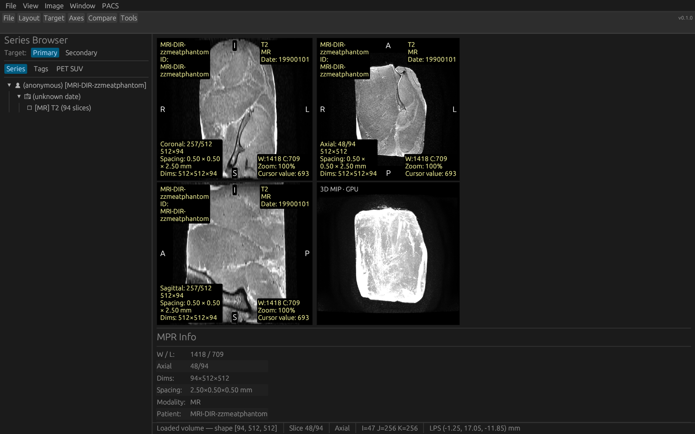

The image and resource measurements are recorded in
[`dicom-eframe-real-mri-resource.json`](images/dicom-eframe-real-mri-resource.json).
This is a useful egui/eframe baseline, but it is not a matched performance
fixture for the current 1280 × 800 Métis three-plane surface: eframe includes
the browser and GPU MIP. A common output contract is required before comparing
framework resource or latency numbers; GPUI and Tauri fixtures remain open.

### Capture the matched eframe orthogonal surface

The dedicated eframe binary also exposes a shell-free measurement surface. It
uses the same RITK loader, decoded pixels and spacing-aware `ImagePlacement`
path, while presenting only the three planes that the Métis host exposes:

```powershell
target\debug\ritk-snap-eframe.exe `
  test_data\2_head_mri_t2\DICOM `
  --presentation orthogonal-surface `
  --viewport-size 1024x640 `
  --capture scratch\viewer\real-mri-eframe-matched.png
```

The eframe viewport size is logical points. On the controlled Windows host,
the display scale is 125%, so `--viewport-size 1024x640` produces the same
1280×800 physical surface as the Métis native capture. Pass that option to the
command above when producing the matched resource fixture. The provenance
record keeps the requested logical size and observed physical PNG dimensions
together, so a DPI-dependent fixture cannot be mistaken for a rescaled image.

The reviewed capture below contains real saved MRI pixels in axial, coronal
and sagittal panels. The three panels preserve voxel spacing when they fit the
host rectangles; the shell-free mode does not add a series browser or MIP. The
committed manual figure is a 640×400 display of the 1280×800 source capture;
the provenance retains the source dimensions and digest.

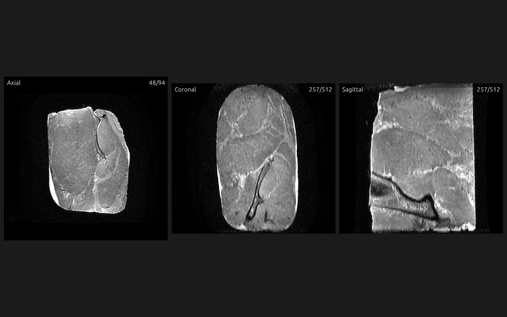

Three bounded lifecycle repeats exited with code 0 and produced the same source
PNG digest. Dimensions, resource samples, source revisions and the exact semantic
surface list are recorded in
[`dicom-eframe-orthogonal-surface-resource.json`](images/dicom-eframe-orthogonal-surface-resource.json).
The current standalone-lock sample records mean peak private bytes of
416,867,669 ± 30,202,762 and lifecycle duration of 2,123 ± 203 ms across three
bounded runs. The record binds RITK lock commit
`f1a556786e849696caa73d8c341adf309e87d163` with merged Metis
`8d4ab58e8731c51547bbca3ec87100facb698322` and Moirai
`f038622d24907884ce5f386da4e04d05bdb60d62`.
The matched 1280×800 record is the eframe half of the common fixture for
`METIS-PERF-001`; it does not rank frameworks. GPUI and Tauri captures still
require the same semantic surface and host-size contract before their resource
numbers can be compared.

For the migrated Windows host, run the same generated study through Métis:

```console
target/debug/ritk-snap.exe scratch/viewer/study --metis-native
```

On Windows the `--metis-native` spelling is optional for this command; the
Métis host is the default shell. Existing scripts may retain the explicit flag.
The separately named `ritk-snap-eframe` executable selects the compatibility
path without activating the legacy graph in the default package.

To open a saved study through the same host without typing its path, omit the
positional argument on Windows:

```powershell
target\debug\ritk-snap.exe --metis-native
```

Moirai opens the bounded native folder picker and returns only the selected
path to Metis. RITK then scans that folder, applies its DICOM series contract,
decodes the stored pixels, and renders the selected study. Cancelling the
picker returns an error before a window is created. A folder containing more
than one acquisition must use the explicit path and
`--series-instance-uid` command above; the picker path never selects a series
implicitly.

The Windows picker was exercised on 2026-09-14 with the saved public MRI-DIR
T2 study: launch without PATH, navigate to its parent directory, click `DICOM`,
then click **Select Folder**. The actual interactive window shows all three
RITK MRI planes and closes with exit 0:

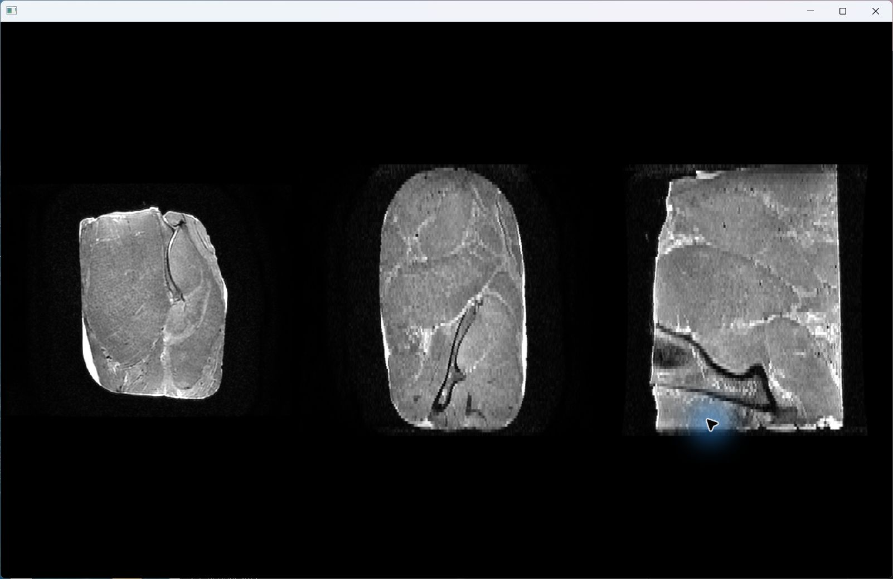

Repeating the same selection with `--capture-application --capture <PNG>`
exits 0 and produces the existing [MRI framebuffer](images/dicom-metis-real-mri.png):
1280 × 800 with 411,589 non-black pixels. Its PNG is byte-identical to an
explicit-path capture from the same executable. Clicking **Cancel** in a third
pathless launch exits 1 with `native Métis file selection was cancelled` and
creates no viewer window. [Capture provenance](images/dicom-metis-real-mri.json)
records the binary hash, provider revisions, commands and evidence limits.
This closes Windows single-series folder selection; native permission-denial
UI, process coverage and other host workflows remain separate acceptance work.

While a study is open, press **Ctrl+O** to reopen the bounded native folder
picker. Selecting a folder loads its DICOM study through the same RITK scanner,
decoder and three-plane compositor, then presents the replacement frame in the
existing Métis window. The current frame remains intact when the picker is
cancelled. A selected folder that is not a readable DICOM study returns an
explicit load error and leaves the prior volume unmodified; the browser
`Ctrl+O` shortcut remains owned by the browser file chooser.

The Métis host owns the window handle, finite event wait, retained framebuffer,
resize/minimize handling, DPI updates and terminal cleanup. RITK owns the file
open, DICOM decode, selected volume, window/level, colormap, slice navigation
and action reduction. The host receives only a bounded RGBA
`PresentationFrame`; no DICOM identifier, path, parser object or decoded volume
crosses the seam. Plain vertical wheel input steps the active slice, and
Ctrl/Command plus vertical wheel applies the existing zoom policy. Focus loss
cancels an in-progress pointer gesture.

Each `PresentationFrame` also carries its validated `PresentationSpacing` row
and column sample distances. RITK derives these values once from the loaded
volume and axis. Native placement and the browser
`data-ritk-display-aspect` attribute consume that same frame metadata. An
anisotropic slice therefore keeps its physical extent
when the host changes, while Metis only validates the format-neutral positive
finite contract.

The deterministic Métis capture path is hidden and bounded: it exits after the
first idle event batch and writes the complete three-panel RITK composition as
PNG. The fixed capture surface is 1280 × 800 pixels; the panels are axial,
coronal, and sagittal from left to right, separated by four-pixel black gaps.

```console
target/debug/ritk-snap.exe scratch/viewer/study --metis-native --capture scratch/viewer/metis-frame.png
```

This capture checks real DICOM opening, RITK rendering, orthogonal slice
selection, physical-aspect placement, and Métis framebuffer transfer. It is a
content capture without OS chrome or application overlays; the native host owns
the surface while RITK owns every DICOM and clinical display decision. This
pixel-only form remains the deterministic framebuffer check. To demonstrate
the viewer content state as it appears in the Métis surface, request the
bounded RITK application overlay explicitly:

```powershell
cargo build --locked -p ritk-snap
target\debug\ritk-snap.exe `
  test_data\3_head_ct_mridir\DICOM `
  --metis-native `
  --capture-application `
  --capture scratch\viewer\real-dicom-metis-application.png
```

The overlay is emitted as a Métis `metis_ui_lang::DisplayList` and rendered
into the same 1280 × 800 framebuffer after the real decoded planes are
composed. It identifies the Métis/RITK host, plane, slice range, frame
dimensions, and window/level values without adding patient metadata.
Operating-system decorations remain outside the capture contract.
The reviewed public CT result is [the application-content capture](images/dicom-metis-real-ct-application.png), with machine-readable
[provenance](images/dicom-metis-real-ct-application.json).


This image is application output from the saved public DICOM pixel data; it is
not an illustration or a generated image. The default capture and the
application-content capture share the same RITK decode and presentation path;
the latter adds only bounded viewer labels for visual inspection.

### Show the real study with a native scalar projection panel

The native host can expose the same scalar axial MIP already used by the RITK
eframe viewer, or the typed minimum and average reductions. The option is
explicit so the default three-panel capture stays stable, while a matched
capture can show all four RITK projections through the same Métis framebuffer:

```powershell
cargo run --locked -p ritk-snap -- `
  test_data\3_head_ct_mridir\DICOM `
  --series-instance-uid `
  1.3.6.1.4.1.14519.5.2.1.1706.4996.115936088547498980797393821518 `
  --metis-native `
  --metis-native-layout orthogonal-with-mip `
  --capture-application `
  --capture scratch\viewer\real-dicom-metis-mip.png
```

The lower-right panel is the RITK axial MIP. The other three panels keep their
existing axial, coronal, and sagittal event routing; the MIP is display-only.
This command opens the saved public 409-slice CT series and writes actual
decoded DICOM pixels. The committed image and its provenance record below are
the visual demonstration; no generated or private patient image is used.


The capture metadata, source revisions, panel order, dimensions, and digest are
in the accompanying [MIP provenance record](images/dicom-metis-real-ct-mip.json).

The same real study can select the minimum or arithmetic-mean scalar statistic
without moving voxel semantics into Métis:

```powershell
cargo run --locked -p ritk-snap -- `
  test_data\3_head_ct_mridir\DICOM `
  --series-instance-uid `
  1.3.6.1.4.1.14519.5.2.1.1706.4996.115936088547498980797393821518 `
  --metis-native `
  --metis-native-layout orthogonal-with-minip `
  --capture-application `
  --capture scratch\viewer\real-dicom-metis-minip.png

cargo run --locked -p ritk-snap -- `
  test_data\3_head_ct_mridir\DICOM `
  --series-instance-uid `
  1.3.6.1.4.1.14519.5.2.1.1706.4996.115936088547498980797393821518 `
  --metis-native `
  --metis-native-layout orthogonal-with-average `
  --capture-application `
  --capture scratch\viewer\real-dicom-metis-average.png
```

Both commands decode the saved public 409-slice CT series and render actual
DICOM pixels. The overlay labels the lower-right panel `MinIP` or `Average`
and includes its frame dimensions. The committed MIP image above remains the
reviewed visual oracle; these commands exercise the same four-panel host path
with the two additional typed reductions.

### Use the responsive Métis pane layout

The native Métis host can select a pane count from the actual surface extent.
`responsive` uses one axial pane below 640 × 480, two orthogonal panes from
640 × 480 through 959 × 639, and a four-pane axial/coronal/sagittal/MIP grid
from 960 × 640 upward. Each pane still uses the spacing-aware RITK placement,
so anisotropic voxels are letterboxed instead of stretched:

```powershell
cargo run --locked -p ritk-snap -- `
  test_data\2_head_mri_t2\DICOM `
  --metis-native `
  --metis-native-layout responsive `
  --capture-application `
  --capture scratch\viewer\real-mri-metis-responsive.png
```

This command decodes the saved public MRI-DIR Part 10 files and writes the
actual RITK pixels. The native layout tests exercise all three thresholds,
disjoint pane rectangles, physical aspect placement and the display-only MIP;
the existing [real MRI native capture](images/dicom-metis-real-mri.png) is the
pixel reference for the decoded study. A responsive replay at 1280×800
produced axial, coronal, sagittal and axial-MIP anatomy; its run-output PNG
was 1280×800 RGBA with 534,414 non-black pixels and SHA-256
`056bf2cd8828df63972af2fe785e436ef0256e501a3ac7386535db0db169a0c9`.
Rust consumers can invoke `run_responsive_native_app_with_options`; the
existing exhaustive `NativePresentationMode` enum remains unchanged.

The browser exposes the same policy through a trusted container element. The
four canvas IDs are ordered axial, coronal, sagittal and projection. RITK
updates the container's CSS grid when the measured extent crosses a layout
threshold. Hidden orthogonal canvases are recreated without input listeners,
while the visible axial, coronal and sagittal canvases retain the normal Métis
event seam. Responsive canvases receive definite grid-cell width and height
after physical aspect metadata is published; `object-fit: contain` preserves
anisotropic voxel spacing without allowing a pane to expand outside the
trusted container:

```javascript
import init, { start_web_responsive_canvases, stop_web_canvas } from "./ritk_snap.js";

await init();
start_web_responsive_canvases(
  "ritk-responsive-container",
  "ritk-snap-axial",
  "ritk-snap-coronal",
  "ritk-snap-sagittal",
  "ritk-snap-projection",
  0, // maximum-intensity projection
);
// Call stop_web_canvas() when the route is torn down.
```

The browser publishes `data-ritk-pane-layout`, `data-ritk-pane-role` and
`data-ritk-pane-visible` on the container and canvases. The listener-count
oracle therefore distinguishes a one-pane mount (one interactive guard), a
two-pane mount (two guards) and a four-pane mount (three guards plus a
display-only projection). The fixed three-canvas and four-canvas entrypoints
remain available for existing pages and captures.

The saved-study gallery also has a responsive consumer mode. It moves the
same four canvas elements into its direct trusted container before mounting
RITK, so the transfer, slice, projection, crosshair and listener oracles
exercise the adaptive page with the public MRI study:

```powershell
python scripts/browser_gallery.py `
  --metis-root ..\metis `
  --engine chromium `
  --driver-url http://127.0.0.1:9515 `
  --device-scale 2 `
  --input chooser `
  --files test_data\2_head_mri_t2\DICOM `
  --pattern '*.dcm' `
  --oracle ..\metis\output\browser\mri-projection-oracle.json `
  --consumer-revision (git rev-parse HEAD) `
  --canvas-capture screenshot `
  --canvas-context 2d `
  --projection mip `
  --crosshair-controls `
  --page-query layout=responsive `
  --page-query projection=mip `
  --canvas-attribute data-ritk-pane-role `
  --output ..\metis\output\browser\results\chromium-responsive
```

The committed browser workflow runs this mode against Chromium and Firefox and
records the inspected canvas pixels beside the fixed-engine captures. Hosted
run [35724926751](https://github.com/ryancinsight/ritk/actions/runs/35724926751)
passed both responsive lanes against RITK `67d4ad44` and Metis `776dbbf9`;
Chromium artifact [10693572248](https://github.com/ryancinsight/ritk/actions/runs/35724926751/artifacts/10693572248) and Firefox artifact
[10692907100](https://github.com/ryancinsight/ritk/actions/runs/35724926751/artifacts/10692907100) record the exact traces:
Chromium accepted all 94 files and produced four complete 1390×762 element
captures, while Firefox accepted the same 94 files and produced four complete
1404×808 element captures. The three interactive axes restore their exact
initial RGBA hashes after the three bounded rejection probes; the MIP
projection is display-only, 512×512, 214,859 non-black pixels and 21 consumer
listeners. The run's WebGPU no-adapter and Safari bounded-read results remain
separate residuals.

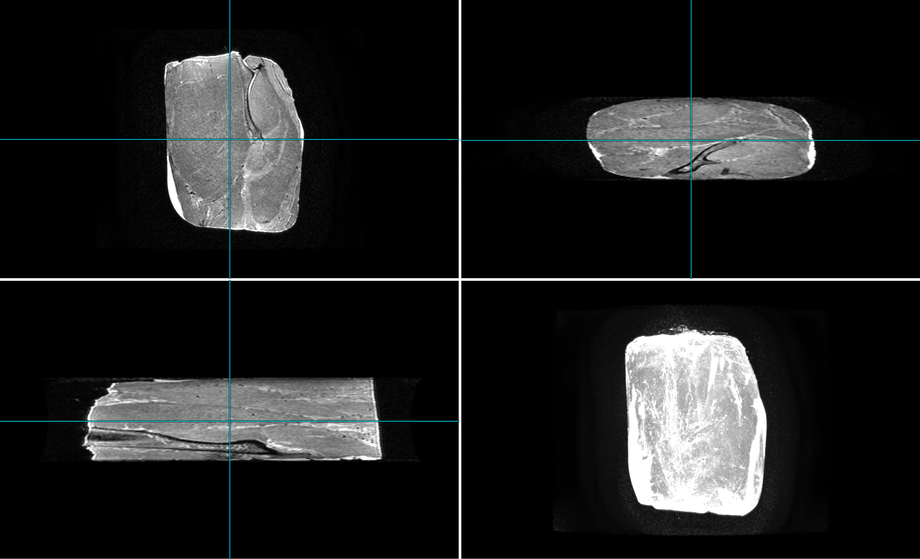

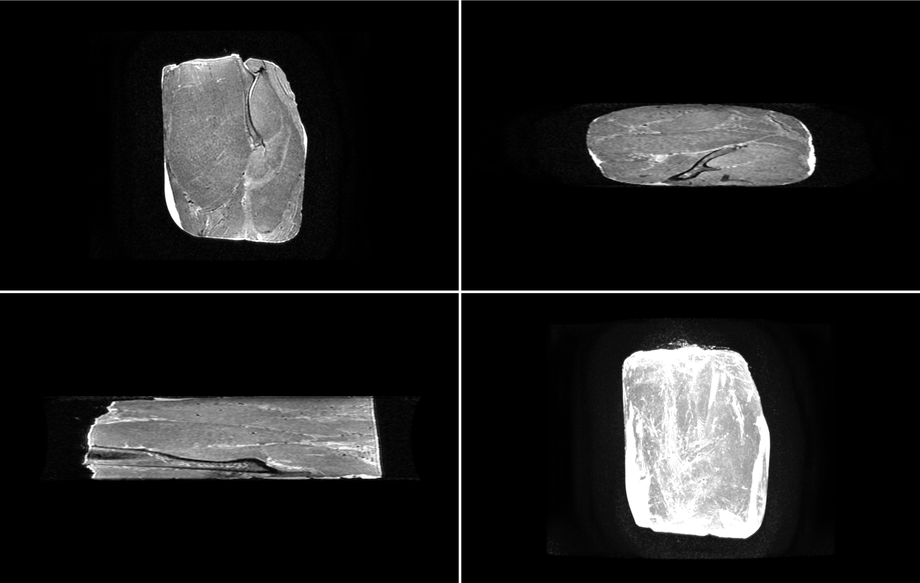

The full trace hashes, artifact identifiers, source revisions, semantic slice
states, rejection actions and cleanup counts are in the
[responsive browser provenance record](images/dicom-metis-real-browser-mri-responsive.json).
The PNGs are reviewed display derivatives of the hosted element captures; the
provenance record retains their original dimensions and hashes. The WebKit
entry continues to exercise its existing fixed entrypoint.

### Request a bounded slab statistic from RITK

RITK keeps slab sampling in the viewer domain so a native shell, browser
consumer, VTK pipeline, or future GPU renderer shares one indexing contract.
The current API accepts a scalar `LoadedVolume`, an axis (`0` depth, `1` row,
`2` column), a centre voxel and an inclusive half-width. It returns exact
maximum, minimum, or arithmetic-mean samples in the same plane order as slice
extraction:

```rust
use ritk_snap::render::{ProjectionStatistic, SlabProjection};

let request = SlabProjection::try_new(&volume, 0, 204, 2)?;
let plane = request.compute(&volume, ProjectionStatistic::Average)?;
assert_eq!(plane.dimensions(), [volume.shape[2], volume.shape[1]]);
```

Requests that cross the volume boundary, target RGB data, or use malformed
payloads return typed errors. No index is clamped and no DICOM metadata enters
the host contract.

### Request a physical oblique plane

The same viewer domain now accepts a patient-space plane without asking the
host to reproduce the DICOM affine. The example uses a unit-spacing volume;
real callers derive these vectors from the loaded study. `origin` is the first output pixel centre;
the horizontal, vertical and depth vectors are millimetres per output sample.
The depth vector may be zero for a single plane or may carry a bounded slab:

```rust
use ritk_snap::render::{
    ProjectionStatistic, ResliceInterpolation, ReslicePlane,
};

let plane = ReslicePlane::try_new(
    &volume,
    [0.0, 0.0, 0.0],       // patient-space origin
    [0.0, 0.0, 1.0],       // horizontal step
    [0.0, 1.0, 0.0],       // vertical step
    [1.0, 0.0, 0.0],       // through-plane step
    [512, 512],
    32,
    ResliceInterpolation::Linear,
)?;
let output = plane.compute(&volume, ProjectionStatistic::Maximum)?;
assert_eq!(output.dimensions(), [512, 512]);
```

Construction validates the source affine, plane basis, request corners and
bounded work before reading a voxel. Nearest-neighbour and trilinear sampling
are explicit, and maximum, minimum and average reductions share the same
contract. `compute_into` lets repeated native or browser presentations retain
their scalar scratch capacity. The output remains a format-neutral scalar
plane; host wiring, GPU dispatch and interactive oblique gestures are separate
surfaces. The decision and limits are recorded in
[ADR 0044](../adr/0044-oblique-reslice-contract.md).

### Capture the complete Métis application window

The framebuffer capture above intentionally excludes operating-system chrome.
To inspect the application as a user sees it, run the generic Métis Windows
capture utility against the visible RITK process. The utility passes each
argument separately, follows the supervised frontend process, captures the
first visible top-level HWND and closes the process with `WM_CLOSE`:

```powershell
$target = (cargo metadata --format-version 1 --no-deps |
  ConvertFrom-Json).target_directory
python ..\metis\scripts\python_native_capture.py `
  --command (Join-Path $target "debug\ritk-snap.exe") `
  --argument=test_data\3_head_ct_mridir\DICOM `
  --argument=--series-instance-uid `
  --argument=1.3.6.1.4.1.14519.5.2.1.1706.4996.115936088547498980797393821518 `
  --argument=--metis-native `
  --output docs\manual\images\dicom-metis-real-ct-window.png
```

The reviewed [complete-window capture](images/dicom-metis-real-ct-window.png)
is 1296 × 839 pixels: a 1280 × 800 Métis client surface inside the visible
Windows frame. It shows the actual saved public CT volume in axial, coronal and
sagittal views. Its executable, runtime, dimensions and image digest are in
the accompanying [provenance record](images/dicom-metis-real-ct-window.json).
The capture includes host decorations and therefore varies with Windows theme,
scale and font rasterization; the deterministic 1280 × 800 framebuffer remains
the pixel-level regression oracle. Private patient studies and identifiers stay
local and are never committed.


### Capture the saved CT window through a native resize

The generic Métis capture utility can resize the running top-level window and
capture the same study after the layout lifecycle completes. Run it from the
RITK checkout after building `ritk-snap`:

```powershell
$target = (cargo metadata --format-version 1 --no-deps |
  ConvertFrom-Json).target_directory
python ..\metis\scripts\python_native_capture.py `
  --command (Join-Path $target "debug\ritk-snap.exe") `
  --cwd (Get-Location).Path `
  --argument=test_data\3_head_ct_mridir\DICOM `
  --argument=--series-instance-uid `
  --argument=1.3.6.1.4.1.14519.5.2.1.1706.4996.115936088547498980797393821518 `
  --argument=--metis-native `
  --resize 1024 720 `
  --output docs\manual\images\dicom-metis-real-ct-resize-initial.png `
  --resize-output docs\manual\images\dicom-metis-real-ct-resize-after.png
```

The reviewed run captured the three decoded planes at a 1280 × 800 client
surface, applied the requested 1024 × 720 client size, captured the same real
DICOM pixels again, and closed with code 0. The before/after PNGs and their
source, input, executable, dimension, DPI and digest evidence are in the
[resize provenance record](images/dicom-metis-real-ct-resize.json). Use the
same command with a local study path and explicit SeriesInstanceUID when
validating a clinical folder; keep local captures and identifiers outside the
public manual.

### Capture the complete MIP application window

The same visible-window check can select the explicit four-panel native layout.
This command leaves the RITK process running for the capture utility, so the
result includes the operating-system frame as well as the Métis client surface:

```powershell
python ..\metis\scripts\python_native_capture.py `
  --command (Join-Path $target "debug\ritk-snap.exe") `
  --argument=test_data\3_head_ct_mridir\DICOM `
  --argument=--series-instance-uid `
  --argument=1.3.6.1.4.1.14519.5.2.1.1706.4996.115936088547498980797393821518 `
  --argument=--metis-native `
  --argument=--metis-native-layout `
  --argument=orthogonal-with-mip `
  --output docs\manual\images\dicom-metis-real-ct-mip-window.png
```

The reviewed [complete MIP window](images/dicom-metis-real-ct-mip-window.webp)
shows the saved public CT in axial, coronal, sagittal, and axial-MIP panels
inside the visible Windows frame. Two independent launches produced the same
PNG digest. Dimensions, source revisions, executable digest, panel counts, and
the orderly close are recorded in the [MIP window provenance record](images/dicom-metis-real-ct-mip-window.json).
The gallery at the front of this manual displays this capture; it is produced
by the running RITK/Métis application and is not a generated illustration.

The complete synthetic workflow can run this Métis check; it records the
executable hash, invalid-study rejection and `metis-frame.png` hash in
`scratch/viewer/workflow.json`:

```console
python scripts/viewer.py target/debug/examples/dicom_workflow.exe --native-binary target/debug/ritk-snap.exe --metis-native
```


The reviewed image is generated by the command above and compared byte-for-byte
by the workflow script. It is a deterministic application-content snapshot,
not a screenshot of Windows decorations or host fonts.

### Exercise scalar multi-frame and RGB studies in the Windows shell

The same workflow now emits a scalar two-frame study and the two-frame RGB
study described above. Both are opened by the real Windows `ritk-snap.exe`
process through the Métis native surface. The scalar study decodes shape
`[2, 2, 2]` and values `[-8,-6,-4,-2,12,14,16,18]`; the RGB study retains
three interleaved channels and its cyan, magenta, yellow, and neutral second
frame. The RITK application-content captures were 1280 × 800 with 614,751 and
561,317 non-black pixels respectively.

The visible-window capture uses Métis's process-tree `PrintWindow` path, so it
includes the Windows frame. Both launches exited 0 at 120 DPI with a 1280 ×
800 client surface and a 1298 × 847 outer window. The reviewed captures are
[the scalar multi-frame window](images/dicom-metis-multiframe-window.png) and
[the RGB multi-frame window](images/dicom-metis-color-window.png). Their
digests and the exact commands, executable digest, decoded-value oracle, and
capture limits are recorded in the [synthetic native provenance record]
(images/dicom-metis-synthetic-native.json).

To reproduce the visible captures after building the workflow from a
standalone lock, generate the synthetic studies and run the native capture
utility from the RITK checkout:

```powershell
target\debug\examples\dicom_workflow.exe scratch\metis-synthetic
python ..\metis\scripts\python_native_capture.py `
  --command target\debug\ritk-snap.exe `
  --argument=scratch\metis-synthetic\multiframe-study `
  --argument=--metis-native `
  --output docs\manual\images\dicom-metis-multiframe-window.png
python ..\metis\scripts\python_native_capture.py `
  --command target\debug\ritk-snap.exe `
  --argument=scratch\metis-synthetic\color-study `
  --argument=--metis-native `
  --output docs\manual\images\dicom-metis-color-window.png
```

These runs exercise RITK's file-backed multi-frame decode, orthogonal
`PresentationFrame` rendering, and the native Métis framebuffer transfer. They
do not claim folder-picker input, browser, WebGPU, or private-study coverage;
those surfaces remain separate acceptance paths.

The same workflow passed on Windows at RITK revision
`7b33d9455e578ccfe2b7c558837dae0c27cfa9d1`. Its report recorded the synthetic
study shape `[3, 2, 4]`, spacing `[2.0, 1.5, 0.5]` mm, the expected landmark
at `[14.0, 21.5, 31.5]` mm, the Métis content-frame digest, and a non-zero
exit for the invalid-study probe. This binds the end-to-end evidence to an
RITK-owned DICOM decode and a format-neutral Métis frame transfer; no DICOM
parser or clinical state is present in the Métis workspace.

## Capture an actual DICOM study through Métis

The repository also includes the acquired MRI-DIR CT series under
`test_data/3_head_ct_mridir/DICOM/`. It is a public CC BY 4.0 porcine-head
phantom series from TCIA, not a generated Part 10 fixture and not private
patient data. The series contains 409 512 × 512 CT slices; its provenance and
license are recorded in [`test_data/README.md`](../../test_data/README.md).

Build the viewer, then pass that DICOM directory to the same RITK-owned loader
and Métis native surface used by the synthetic workflow:

```powershell
cargo build --locked -p ritk-snap
target\debug\ritk-snap.exe `
  test_data\3_head_ct_mridir\DICOM `
  --metis-native `
  --capture scratch\viewer\real-dicom-metis.png
```

The command decodes the real series, selects the current orthogonal slices,
renders their RGBA frames in RITK, and transfers those frames to the Métis
surface. The capture is 1280 × 800 pixels with axial, coronal, and sagittal
views from left to right. The reviewed output below is the actual run from
this workflow (SHA-256
`4fac3ea73e58325755c780de51c1b1504c0fc391da5c48ed2f578810ff46ddcb`):


This image is application output from DICOM pixel data; it is not an
illustration or a generated image. The PNG is a documentation snapshot of the
public phantom series. A private clinical study must remain outside the
repository and can be passed as the positional path locally; neither the
study files nor their identifiers belong in the manual or a public artifact.

This command proves the native Métis frame path. It does not claim a browser
WebDriver, WebGPU, or cross-engine run; those require configured browser
drivers and remain separate RITK integration gates.

The eframe viewer uses the same RITK loader and display state. Before uploading
the scalar volume, its GPU renderer checks both the device buffer and storage
binding limits. A volume that cannot fit, including this 409-slice public
series on the reference Windows adapter, is rendered by the existing CPU MIP or
volume-rendering path and emits a diagnostic instead of panicking in wgpu. The
GPU path remains available for volumes within the device limits; this guard
keeps a real saved study displayable on either path.

### Capture the saved CT study in the eframe compatibility package

The same public series can be opened in the complete eframe application with an
explicit acquisition selection:

```powershell
target\debug\ritk-snap-eframe.exe `
  test_data\3_head_ct_mridir\DICOM `
  --series-instance-uid 1.3.6.1.4.1.14519.5.2.1.1706.4996.115936088547498980797393821518 `
  --capture scratch\viewer\real-dicom-eframe.png
```

Build the package first with `cargo build --locked -p ritk-snap-eframe`. This
run decoded the saved 409-slice CT series and exited successfully with a
1600 × 1000 application-content capture. The image includes the Series Browser,
axial, coronal, sagittal and 3D MIP views, plus the RITK geometry and
window/level state. The scalar volume exceeds the reference adapter's GPU
storage-buffer limit, so the guard above selected the existing CPU projection
path and kept the actual DICOM pixels visible:


The capture is byte-identical across two independent runs (SHA-256
`f4b30c71bd57f54227f5eeec524cd72e93f56f68e834fed909b907f9ecace048`). Its
source revisions, executable digest, selected UID and command bounds are in
[`dicom-eframe-real-ct.json`](images/dicom-eframe-real-ct.json). The PNG is
committed because this is public CC BY 4.0 phantom data; private clinical
captures remain local and ignored.

### Capture a fitting CT volume through the eframe GPU projection

The same RITK-owned viewer also exercises its asynchronous wgpu projection
when the selected volume fits the device storage-buffer limits. The complete
409-file series above exceeds the reference adapter limit, so this reproducible
GPU check selects the first nine public Part 10 files as a small fitting volume:

```powershell
$subset = 'scratch\viewer\gpu-ct-input'
New-Item -ItemType Directory -Force $subset | Out-Null
Get-ChildItem test_data\3_head_ct_mridir\DICOM -Filter '*.dcm' |
  Sort-Object Name | Select-Object -First 9 |
  Copy-Item -Destination $subset
$env:WGPU_BACKEND = 'gl'
target\debug\ritk-snap-eframe.exe `
  $subset `
  --series-instance-uid 1.3.6.1.4.1.14519.5.2.1.1706.4996.115936088547498980797393821518 `
  --capture scratch\viewer\real-dicom-eframe-gpu.png
```

This command decodes the saved DICOM files, renders the axial, coronal and
sagittal views, submits the 3D projection to wgpu, waits for the matching
asynchronous readback, and exits successfully. The reviewed 1600 × 1000
capture below shows the public phantom anatomy and the `3D MIP · GPU` status
label in the running application:

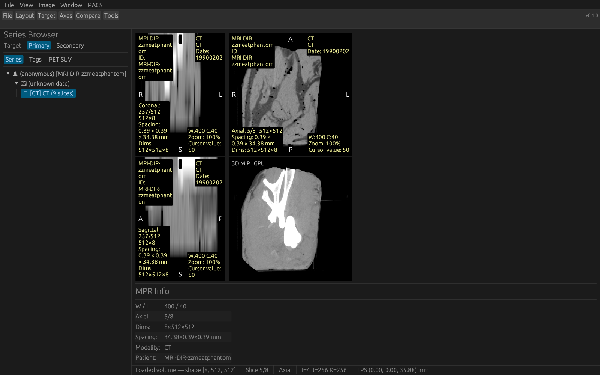

The capture is byte-identical across two runs (SHA-256
`d8c82a0c51b9172ca11a0947f10cc31e80b135a2f23f10ba879f18b228575a7c`). The
input file list, concatenated input digest, executable digest, graphics-backend
selection and bounds are recorded in
[`dicom-eframe-real-gpu-ct.json`](images/dicom-eframe-real-gpu-ct.json). The
GL selector makes the run reproducible on this host; the evidence records the
backend without claiming hardware acceleration.

### Capture the saved MRI study through Métis

The same native path accepts the saved MRI-DIR T2 series in
`test_data/2_head_mri_t2/DICOM/`. These are 94 real DICOM Part 10 files from
the public CC BY 4.0 porcine-head phantom; they are not generated fixtures and
do not contain private patient data. Run the viewer from the repository root:

```powershell
target\debug\ritk-snap.exe `
  test_data\2_head_mri_t2\DICOM `
  --metis-native `
  --capture scratch\viewer\real-mri-metis.png
```

RITK scans and decodes the MRI series, renders its axial, coronal and sagittal
planes, and transfers the resulting RGBA frame to the Métis native surface.
Press Space in the loaded viewer to toggle active-axis cine playback. The
native Métis session advances slices from its bounded event-wait clock and
requests a new presentation only when a frame boundary is reached; the same
host-neutral transition is used by the browser animation-frame loop and the
legacy eframe shell. A newly loaded study starts paused.
When cine is active, press `+` or `=` to increase the rate by one frame per
second, or `-` to decrease it. The native Métis footer shows the current rate
and these controls; the value is bounded to 1–60 FPS, repeated key-down events
are ignored, and a rate change reanchors the host clock so stale elapsed time
does not create a burst of slice advances. The eframe shell and browser canvas
adapter accept the same controls: browser `Equal` and `Minus` codes map through
the host-neutral reducer, which requests a repaint when the bounded rate
changes. The retained cross-engine study trace proves focused `Equal` delivery;
the extended cine-rate evidence below also checks repeated-key handling and frame generations.

The native W/L tool uses the same RITK pointer reducer. Select **W/L** in the
viewer, then drag inside a plane: horizontal motion changes window width and
vertical motion changes window centre. The native session test performs this
gesture against a loaded DICOM fixture and asserts changed center/width values,
changed presented pixels and an idle tool state after release
([`native_session_window_level_drag_updates_the_presented_study`](../../crates/ritk-snap/src/presentation/native_session/tests.rs)).

Press `X` in the native Métis viewer to show or hide the linked crosshair. The
browser gallery exposes the same transition through **Show crosshair**. RITK
keeps one voxel cursor across the axial, coronal and sagittal planes; each host
projects it after the current flip or quarter-turn, so the lines remain on the
same anatomy for anisotropic studies. The native lines are Métis display-list
commands clipped to the image panels. Browser lines are CSS overlays and leave
the canvas RGBA pixels unchanged. Repeated native `X` key-down events do not
toggle the state.

The snapshot carries `data-ritk-crosshair-visible` and the bounded cursor
attributes on every canvas. The browser control remains disabled until all
three real study frames are presented, and its status output reports the
current `z,y,x` coordinate. The crosshair display-list and browser semantic
tests provide geometry and state evidence; the saved MRI capture below remains
the clinical pixel evidence for the decoded study.
The real MRI capture below remains the pixel evidence for the saved-study
decode and three-plane Métis presentation; the test is the bounded input
evidence for the interactive W/L transition.
The reviewed 1280 × 800 output below is the actual run, not a made image:


The input byte count, source revisions, executable digest and image digest are
recorded in [`dicom-metis-real-mri.json`](images/dicom-metis-real-mri.json).
The saved-study harness reran this workflow on 2026-09-14 at RITK
`f6e82835b856c55adcc1b97ad173686903e6a974`, Métis
`ed3806811f23271310cb04078dff55aba5c90944` and Moirai
`a7fa2ba69f25070581f7245f059089705d8fc699`. It recorded 411,589 non-black
pixels and the image digest in the same 1280 × 800 frame. The capture remains
public MRI-DIR data; a private clinical run stays local.
A clean-main replay on 2026-09-16 used RITK `4a060dc75`, the locked Métis
consumer `88c60a0b` and Moirai `95275651`. It exited 0 after reading all 94
files, rejected the invalid-study probe with exit 1, and reproduced the same
411,589-pixel image; that historical executable digest and command remain in
the [provenance record](images/dicom-metis-real-mri.json).
The recorded standalone-lock replay on 2026-09-18 built the native viewer
outside the Atlas development overlay at RITK source
`8f8516065f6ab9405852d96885f54291d5e24a48`, Metis
`5e892245ac52c6455bbb57244fa654e6eb3cc9c1` and Moirai
`ae282117fd962f4b7c66d722aad9d3c2906320bb`. The command
`python scripts/viewer.py D:/atlas/target/debug/examples/dicom_workflow.exe
--native-binary D:/atlas/target/debug/ritk-snap.exe --metis-native
--real-study D:/atlas/repos/ritk/test_data/2_head_mri_t2/DICOM`
read all 94 files and exited 0; the invalid-study probe exited 1. It reproduced the committed 1280 × 800
frame byte-for-byte (`259dd79103482756c4e688621bebafc841cc40f1df10ff2bbd7f9d04b7b4d401`,
411,589 non-black pixels). The executable digest
`05aa4f42b075fd3913d2c43a152148e2dc1f9a946729a278f7d2c0dbac068b88`
(26,376,704 bytes) and standalone lock digest
`a602ec28d9fb3d2c73b6245067ec33e4648d66434de07087b0153c90aea12fbb`
are recorded in the [current replay evidence](images/dicom-metis-real-mri.json).
The capture excludes operating-system chrome and remains a visual-content
check; native IME, accessibility and cross-platform host evidence are separate
gates. Replace the path with a private clinical study only for a local run;
private studies must not be committed or uploaded.

A fresh provider-lock replay on 2026-09-18 rebuilt the native viewer from RITK
source `bf2526e90055bb8e6efbaa36d0f084baab2689da` with lock commit
`b3ce7d6d1`, Metis `82bb3af7bb1695b43767caf9cf1012273e58613d` and Moirai
`5075d4c70ba4f840d4c5a47b67c5d564405badf5`. The same command read all 94
files, exited 0, rejected the invalid-study probe with exit 1, and reproduced
the committed image byte-for-byte (`259dd79103482756c4e688621bebafc841cc40f1df10ff2bbd7f9d04b7b4d401`,
411,589 non-black pixels). The rebuilt executable is
`8a7ff0d40c119e19150f9ed9b643868eebff6d2865b6d3130e4a1014a3b7f995`
(53,939,200 bytes), and the standalone lock digest is
`3d06450ca51cdf42d4f0806b85f7589575ca753c92ad5ca74eff19dd592dee7e`.
This replay is tied to the updated provider lock; earlier provenance records
remain historical records for the revisions that generated them.

A current standalone-lock replay on 2026-09-22 rebuilt RITK from source
commit `e88a94219fac9f07339393da2cd0e7a19164f93b` against Metis revision
`1b10541c2ef7a849e6ff66a3c778874bdf96de7b` and the Atlas clean Moirai pin
`b77239dd10bcaf803394c26255c462bc858c1340`. The same saved 94-file MRI-DIR
study read 49,807,236 bytes, exited 0, rejected the invalid-study probe with
exit 1, and reproduced the 1280 × 800 frame pixel-for-pixel. The tracked
manual PNG is a lossless re-encoding of that capture; its decoded RGBA pixels
are byte-identical while its compressed artifact is 190,219 bytes. The
replay executable digest is
`7f81c6fc3d2e76c7e28d603fbaad3eece1fb67c694b7b97bf4ff6c7dc3325484`
(55,460,864 bytes), the example digest is
`560cc0d276c8d25a45bca44973a0cb6658b9b1b743aa1b88c6ca75811fa71019`
(24,423,424 bytes), and the standalone lock digest is
`d0d6abd6baf3f7d45943e9d1d3f85a2158b7dae605d3ec23ec07981b8b17a9cd`.
The lock resolves 63 first-party Git sources, including six Metis packages at
`1b10541c2ef7a849e6ff66a3c778874bdf96de7b` and fifteen Moirai packages at
`b77239dd10bcaf803394c26255c462bc858c1340`. The captured frame remains
`85071f20ca11cb4a9b2524db0a53b21695b7e93141831e7e0ab293c42fbcd582`
with 411,413 non-black pixels. The lossless manual image digest is
`959969ef69e66cebd3143b06468802e06ff68fbc6d94e2ed1d9a555f7e2ff98c`;
the executable, lock, capture and manual-image hashes are recorded in the
machine-readable provenance below. The native event translator
also retains bounded Moirai accessibility requests as typed RITK events and
returns an explicit unsupported-action error because this session does not yet
install a native accessibility semantics tree; requests are not silently
discarded.

### Run the saved-study visual smoke

The reusable viewer harness can run the synthetic contract workflow and then
open a caller-supplied saved study through the same native Métis executable.
It decodes the captured PNG with a bounded standard-library parser and records
its dimensions and non-black pixel count, so a successful process exit cannot
be mistaken for a blank image:

```powershell
python scripts/viewer.py `
  target/debug/examples/dicom_workflow.exe `
  --native-binary target/debug/ritk-snap.exe `
  --metis-native `
  --real-study test_data/2_head_mri_t2/DICOM
```

The report is written to the ignored `scratch/viewer/workflow.json` and the
real capture to `scratch/viewer/real-metis-frame.png`. For a saved local
patient study, replace `--real-study` with the private file or directory and
keep the output local. If a directory contains multiple acquisitions, pass
`--real-series-uid UID`; RITK rejects an unknown or ambiguous selection before
decoding. The harness stores only `input_kind`, selection state, dimensions,
pixel count and digests; it never copies the source path or DICOM bytes into
tracked documentation.

### Inspect the saved MRI study in the browser

The same saved 94-file MRI-DIR T2 study was opened through the packaged RITK
WASM browser entrypoint. The Codex in-app Chromium host mounted Métis, sent the
files through its bounded `DataTransfer`, and reported 49,807,236 bytes read
before RITK presented all three non-black canvases:

| Canvas | Presented pixels | Non-black pixels |
| --- | ---: | ---: |
| axial | 512 × 512 | 190,836 |
| coronal | 512 × 94 | 41,863 |
| sagittal | 512 × 94 | 38,843 |


These are canvas PNGs exported from the live run after RITK decoded the real
DICOM bytes; they are not generated illustrations. The source revisions,
accepted-file bound, frame dimensions, non-black counts and SHA-256 digests are
recorded in
[`dicom-metis-real-browser-mri.json`](images/dicom-metis-real-browser-mri.json).
The capture excludes browser chrome. This run proves the saved MRI study through
one Chromium browser host and a bounded programmatic drop; physical drag-and-
drop, Firefox/WebKit, WebGPU and complete application-window capture remain
separate acceptance work.

A clean-main replay on 2026-09-16 used the standard W3C chooser in headless
Chromium 152.0.7977.83. It accepted the same 94 files, reproduced all three
RGBA hashes, traversed 50 trusted slice-control actions, rejected 18 invalid
slice inputs, restored the starting indices exactly, and removed 24 diagnostic
listeners plus the four transfer listeners before closing the session. The
replay used RITK `4a060dc75`, Metis host sources matching main `743390ea` and
Moirai `95275651`; the machine-readable values are in the
[`local replay`](images/dicom-metis-real-browser-mri.json).

The same live page exposes the host and component state used during the visual
check. The Métis mount is `mounted` with 31 Rust-owned listener handles at
generation 3; the file chooser reports 94 accepted files and 49,807,236 bytes;
the Dark theme is selected; pointer capture is released after one source and a
pixel wheel action is reduced to a bounded pan; text composition is idle with a
UTF-16 caret; and the standalone page reports the expected absence of an
authorized backend bridge. The component values and the browser accessibility
and DOM observations are recorded in
[`dicom-metis-real-browser-mri-components.json`](images/dicom-metis-real-browser-mri-components.json).
The component artifact contains no patient identifiers or DICOM metadata; its
view dimensions and non-black counts refer to the hash-bound frame provenance
above.

## Inspect an actual DICOM study in the browser

The same RITK browser entrypoint was exercised against nine real Part 10 files
from the public MRI-DIR CT series. A local page mounted Métis, loaded the
packaged `ritk_snap` WebAssembly module, and transferred the files through a
bounded browser `DataTransfer`. RITK read 4,756,500 bytes and presented
non-black pixels on all three canvases. The Chromium run reported these frame
values:

| Canvas | Presented pixels | Non-black pixels |
| --- | ---: | ---: |
| axial | 512 × 512 | 120,515 |
| coronal | 512 × 8 | 1,879 |
| sagittal | 512 × 8 | 2,438 |

The axial canvas below is the PNG exported from the live browser canvas. It is
decoded from the public DICOM files, not a generated illustration.


The capture provenance, source revisions, byte count, frame dimensions and
SHA-256 digest are recorded in
[`dicom-metis-real-browser.json`](images/dicom-metis-real-browser.json). The
capture scope is the canvas pixels; it excludes browser chrome. This run uses
a bounded programmatic `DataTransfer` in one Chromium host, so it demonstrates
real DICOM decoding and browser presentation but does not close physical
drag-and-drop, Firefox/WebKit, WebGPU or complete application-window capture.

### Three orthogonal canvases from the complete bounded real series

To exercise the orthogonal geometry with the complete saved study, the same
page accepted all 409 slices from the MRI-DIR series in one bounded browser
`DataTransfer`. RITK decoded 216,156,416 bytes and presented non-black pixels
on every canvas:

| Canvas | Presented pixels | Non-black pixels |
| --- | ---: | ---: |
| axial | 512 × 512 | 124,466 |
| coronal | 512 × 409 | 106,343 |
| sagittal | 512 × 409 | 140,317 |


The run's source revisions, byte count, frame hashes and bounds are recorded
in [`dicom-metis-real-browser-orthogonal.json`](images/dicom-metis-real-browser-orthogonal.json).
The Métis/Moirai handoff admits at most 512 file entries and 256 MiB of file
bytes; this public 409-slice study is within both bounds. The capture scope is
the canvas pixels, excluding browser chrome. It demonstrates actual DICOM
loading and orthogonal presentation in the Codex in-app Chromium host through
a programmatic `DataTransfer`; physical drag-and-drop, Firefox/WebKit,
WebGPU and complete application-window capture remain separate acceptance
work. The public phantom data is the only committed image source; private
clinical studies stay local. A second run through Metis's pinned
`browser_drop.py` and Edge 153.0.4234.19 used a configured W3C session with
file-backed Chromium input; it matched the same file manifest, canvas RGBA
hashes and overflow rejections, captured the window and each canvas, and
closed the driver session. Its revision-bound trace is recorded in the
[Metis gallery manual](https://github.com/ryancinsight/metis/blob/main/docs/manual/browser.md#drop-a-study-into-the-gallery).

### Verify real browser slice navigation through Métis

The Edge run was repeated with the RITK-owned semantic trace validator and a
trusted pointer drag plus wheel action on each canvas. The same public 409-file
study remained loaded while the wheel changed every multi-slice index by one:

| Canvas | Initial index | After wheel | Slice count |
| --- | ---: | ---: | ---: |
| axial | 204 | 203 | 409 |
| coronal | 256 | 255 | 512 |
| sagittal | 256 | 255 | 512 |

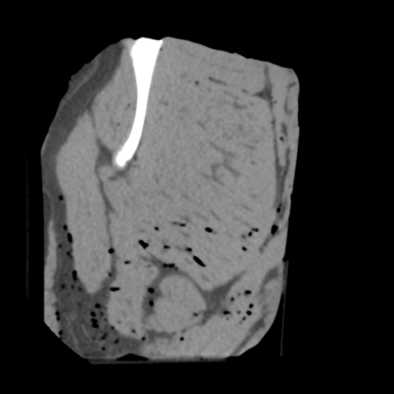

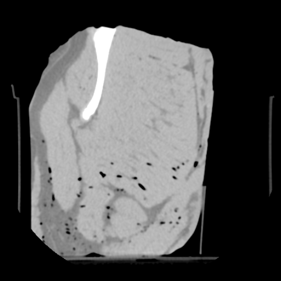

The paired axial images are decoded slices from the public DICOM series; their
PNG hashes differ and the corresponding coronal and sagittal pairs also differ.
The complete after-wheel browser viewport shows the three live canvases:

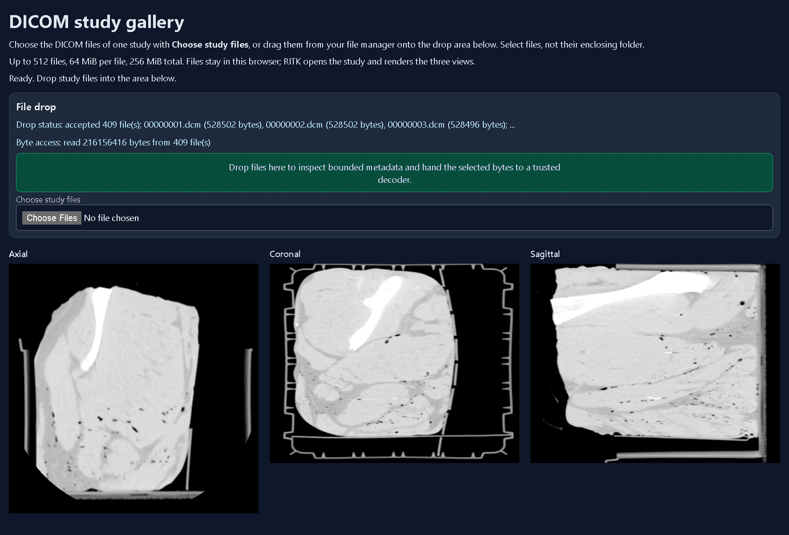

The [slice-navigation provenance record](images/dicom-metis-real-browser-ct-slice.json)
binds the Edge version, Metis/RITK/Moirai revisions, 409-file transfer, canvas
indices, screenshot hashes, overflow rejections and clean WebDriver teardown.
The RITK validator rejects a trace when a trusted wheel leaves a multi-slice
index unchanged; singleton axes remain valid at index zero. Physical file-manager
dragging, Firefox/WebKit, WebGPU and native OS permission evidence remain open.

### Select the saved study through the browser file chooser

On 2026-09-12 the packaged viewer was rebuilt from RITK revision
`52f5c52fbe3b8df18f275159ba7d79bd2a57c9c0` with Metis `8c105e1` and Moirai
`3caa6c24`. The Codex in-app Chromium host activated Metis's
`#file-input` and selected all 409 files in the saved public
`test_data/3_head_ct_mridir/DICOM/` series through the browser file chooser.
This is real file-backed input from the public CC BY 4.0 phantom; no DICOM
bytes were synthesized and no private patient data entered the run.

The browser reported `accepted 409 file(s)` and
`Byte access: read 216156416 bytes from 409 file(s)`. RITK's consumer-owned
canvas attributes then reported ready presented frames:

| Canvas | Axis | Slice/count | Frame |
| --- | ---: | ---: | ---: |
| axial | 0 | 204/409 | 512 × 512 |
| coronal | 1 | 256/512 | 512 × 409 |
| sagittal | 2 | 256/512 | 512 × 409 |

The live viewport showed non-black CT anatomy in all three planes. The
reviewable PNGs in this section and
[`dicom-metis-real-browser-orthogonal.json`](images/dicom-metis-real-browser-orthogonal.json)
remain the committed pixel baseline for the same public series. The chooser
run proves the RITK viewer consumes a user-activated Metis selection; physical
file-manager drag input, Firefox/WebKit and WebGPU remain separate gates.

The same chooser path was rerun with the saved MRI-DIR T2 study from
`test_data/2_head_mri_t2/DICOM/`. It accepted 94 real files and read
49,807,236 bytes. RITK reported ready presented frames at 512 × 512 for axial
(slice 47 of 94) and 512 × 94 for both coronal and sagittal (slice 256 of 512);
the live viewport showed non-black MRI anatomy. Modality interpretation and
pixel semantics remain in this RITK workflow.

### Observe committed WebAssembly linear memory

The same saved-study run also records the WebAssembly memory capacity exposed
by the generated `wasm-bindgen` initializer. This is a capacity observation in
the browser, not an allocator or process-memory measurement. Add the probe to
the browser bootstrap around the existing orthogonal-canvas call:

```javascript
const wasmRuntime = await init();
const wasmMemoryBytes = () => wasmRuntime.memory.buffer.byteLength;
const initialBytes = wasmMemoryBytes();

start_web_orthogonal_canvases(
  "mri-ritk-snap-axial",
  "mri-ritk-snap-coronal",
  "mri-ritk-snap-sagittal",
);
const mountedBytes = wasmMemoryBytes();

// Select the saved study through Métis and wait for all three canvases to be
// ready. Evaluate the next two lines after that frame-ready status appears.
const decodedBytes = wasmMemoryBytes();
console.table({ initialBytes, mountedBytes, decodedBytes });
```

The 2026-09-13 Chromium run recorded `1,769,472` bytes (27 WebAssembly pages) at
initialization, `1,835,008` bytes (28 pages) after mounting, and
`404,160,512` bytes (6,167 pages) after RITK decoded the 94-file public MRI-DIR
T2 study. A repeat reload produced the same three values. The DICOM payload
read by RITK was `49,807,236` bytes; it is a separate input-byte count and must
not be confused with committed linear memory. The repeat observations and
limits are recorded in
[`dicom-metis-real-browser-mri-memory.json`](images/dicom-metis-real-browser-mri-memory.json).
That reload baseline does not measure allocator-used or process memory.

### Repeat the saved-study lifecycle without reloading

On 2026-09-16, the saved 94-file, 49,807,236-byte study completed four cycles
per session on each path below. Every cycle mounted the same WebAssembly
instance, selected or dropped the files, checked all file hashes and three
exact RGBA oracles, exercised trusted cine-rate actions, and stopped the
viewer. RITK's native trace validator accepted all 12 individual cine traces.

| Engine and input | Cycles | Mounted host / canvas guards | Stopped guards | Capacity after decode |
| --- | ---: | ---: | ---: | ---: |
| Chromium 152.0.7977.83 chooser | 4 | 31 / 21 | 0 / 0 | 404,357,120 bytes |
| Firefox 156.0 chooser | 4 | 31 / 21 | 0 / 0 | 404,357,120 bytes |
| Chromium 152.0.7977.83 file-backed CDP drop | 4 | 31 / 21 | 0 / 0 | 404,357,120 bytes |

Capacity remained equal at every observed phase after the first decode. The
regression gate requires the five ordered phases, complete sequential cycles,
stable mounted guard counts, zero stopped guards and exactly equal per-phase
capacity after two warmup cycles. It also checks that file controls and
diagnostic globals are removed. Stop now drops the RITK viewer and its decoded
state synchronously before cancelling the animation task; the diagnostic
runner removes its own four transfer listeners and retained file references.

Use the RITK consumer wrapper with `--lifecycle-cycles 4`; it delegates the
format-neutral file and canvas transport to the pinned Metis checkout.
Repeated mode accepts 4–8 cycles and a maximum 300-second suite deadline,
including a reserved cleanup interval. Each `canvas-trace-cycle-N.json` must
pass RITK validation with `--validate-browser-trace <path> --require-cine-rate`.
The Chromium drop variant uses `--input chromium`; Firefox uses `--input chooser`.
The wrapper is `scripts/browser_gallery.py --metis-root <metis-checkout>` and
keeps DICOM and viewer assertions in RITK.

The [memory provenance](images/dicom-metis-real-browser-mri-memory.json)
retains the older reload baseline and adds `same_instance_cycles`, with every
phase's counters, input/oracle/source/asset hashes, engine versions and cine
trace digests. The measured sources are Metis `9d14da1` and RITK `4bc8ad724`.
Chromium exposes `performance.memory`; its stopped heap counters vary with
unforced garbage collection. Firefox reports that API unavailable, not zero.
Neither heap stability nor allocator-used bytes are claimed. Committed WASM
capacity does not shrink on free; four cycles cannot exclude a smaller leak
within existing capacity or establish long-duration behavior. Process,
compositor, GPU, physical file-manager input and matched-framework comparisons
remain outside this measurement.

### Re-run the saved MRI study through Edge

Each browser plane has a slice slider and a current-slice counter. Drag the
slider, use its arrow keys, or press Home/End to reach the first/last slice.
The axial range follows the acquired slices; coronal and sagittal ranges follow
the corresponding volume dimensions. The controls reflect wheel navigation and
cine playback through RITK's published slice state.

The gallery also exposes consumer-owned **Play**, **Pause**, and **Cine rate**
controls. They stay disabled until all three canvases present a loaded study.
RITK publishes `data-ritk-cine-enabled` and `data-ritk-cine-fps` on every
canvas; the Play button starts the host-neutral animation clock, and the range
input accepts only integer rates from 1 through 60 FPS. The typed WASM setter
rejects non-finite, fractional, and out-of-range values before viewer state or
rendered frames change. Pausing stops slice advancement while retaining the
current frame, and stopping the gallery disables both controls and releases
the RITK canvas listeners.

The same 94-file MRI-DIR T2 study was replayed through Métis's bounded browser
runner against Microsoft Edge 154.0.4258.12 in headless mode, isolating the final
capture from desktop input. The WebDriver session selected the
files through the W3C file chooser, RITK read all 49,807,236 bytes, and the
three canvas dimensions, non-black counts, and RGBA hashes matched the RITK
oracle. The runner also exercised the count, per-file byte, and batch byte
limits; each oversized input was rejected before reading, and the session
closed cleanly.

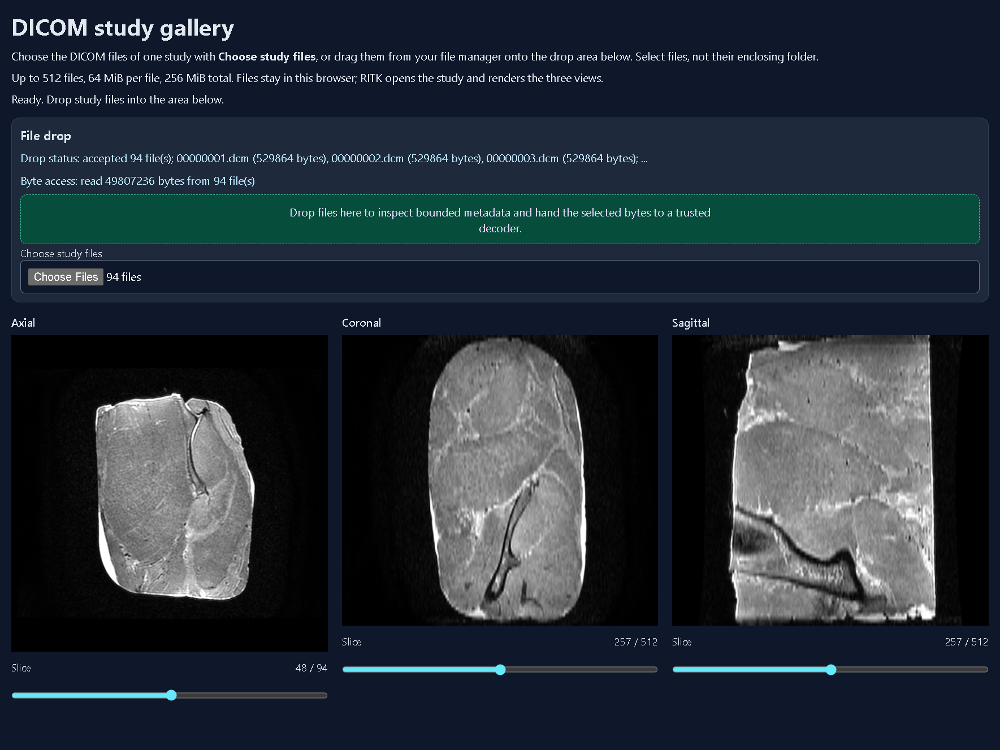

The gallery screenshot is the live browser viewport after file selection, with the
decoded axial, coronal, and sagittal anatomy visible. The corrected canvases use
physical spacing: 0.5 mm in-plane and 2.5 mm between slices. Coronal and
sagittal cover 256 × 235 mm and display at 560 × 514 pixels, replacing the
compressed 561 × 103 display. The backing 512 × 94 pixels and exact RGBA
hashes remain unchanged. CSS property publication respects the existing
security policy, and input bounds follow the displayed canvas dimensions.
The element captures are
[axial](images/dicom-metis-real-browser-mri-edge-axial.png),
[coronal](images/dicom-metis-real-browser-mri-edge-coronal.png), and
[sagittal](images/dicom-metis-real-browser-mri-edge-sagittal.png). Their canvas
dimensions, non-black counts, RGBA hashes, screenshot hashes, source revisions,
trusted events, rejection results, and cleanup state are recorded in
[`dicom-metis-real-browser-mri-edge.json`](images/dicom-metis-real-browser-mri-edge.json).
The evidence binds Métis revision
`da73f61d4d756f9cf1b66e5fa8e483abe2443626` to RITK basis
`840757653e68f36e5a65e3d279a3ddb4ece9ec65` plus the recorded slider source patch
and build-source hashes. It records the exact Métis driver and gallery
asset hashes, the harness working-tree source hashes and patch, and
the SHA-256 digests of the ignored source traces in the Métis
checkout at `output/browser/cine/{trace.json,canvas-trace.json}`.

The paired cine-rate trace applies six ordered actions to each canvas: focused
nonrepeat `=`; repeated `=` keydown plus keyup; focused nonrepeat `-`; repeated
`-` keydown plus keyup; pointer drag; and wheel. All observed DOM events were
trusted, targeted the selected canvas, and preserved the requested key/code
metadata. The repeated keydowns reported `repeat: true`; their keyups reported
`repeat: false`. For every canvas, cine rate followed
`12 -> 13 -> 13 -> 12 -> 12` frames per second through the keyboard stages.
Frame generation advanced by one for each effective nonrepeat rate change and
did not advance for either repeat. Slice index, dimensions, ready/presented
state, and canvas identity remained stable through all rate stages. The final
pointer-and-wheel stage decreased axial slice 47 to 46 of 94 and coronal and
sagittal slice 256 to 255 of 512, with a generation greater than the preceding
rate stage.

The 18 actions, 18 semantic snapshots, and 20 PNG records passed
`ritk-snap --validate-browser-trace --require-cine-rate`. All 18 diagnostic
listeners and active WebDriver input sources were released before the session
closed. The evidence JSON preserves every action, snapshot, and PNG digest
record; the raw traces remain gitignored run output. RITK owns the decoded
pixels, slice state, cine rate, and clinical presentation.

The slider trace adds 50 trusted keyboard and pointer actions across the 94,
512 and 512 slice ranges, plus 18 invalid-number API rejection probes. Every
axis reaches both endpoints, produces multiple distinct rendered frames and
restores its initial pixels exactly; changing one axis preserves the other
two planes. No-op selection preserves frame generation. Different slices can
contain identical pixels: independent DICOM decoding confirms both coronal
endpoint planes contain only zeros, so the trace does not require every index
to produce a unique hash. Batched restoration checks the resulting frame,
not rendering of every intermediate index. All 24 slider diagnostic listeners
are released.

### Change window/level on the saved study

The display-control row is consumer-owned: after a study is ready, RITK
publishes the modality's typed preset table to the select element. The current
centre, width and matching preset index are published on each canvas as
`data-ritk-window-center`, `data-ritk-window-width` and
`data-ritk-window-preset-index`. Selecting a preset uses a trusted WebDriver
click and keyboard sequence, changes all three RITK frames, and advances every
`data-ritk-frame-generation`; malformed indices are rejected before viewer
state or pixels change. The select is disabled and reports `No study` until a
frame is presented, so the control remains keyboard accessible throughout the
load and stop lifecycle. The CI canvas trace records the three window
attributes alongside the existing load, frame, slice and aspect semantics.

Run the consumer-owned replay with `--window-presets --cine-controls` in
addition to the standard chooser arguments:

```powershell
python scripts/browser_gallery.py --metis-root D:/atlas/repos/metis `
  --engine chromium --browser-name MicrosoftEdge --driver-url http://127.0.0.1:9517 `
  --headless --device-scale 1.25 --input chooser --window-presets --cine-controls `
  --files D:/atlas/repos/ritk/test_data/2_head_mri_t2/DICOM --pattern '*.dcm' `
  --oracle D:/atlas/repos/metis/output/browser/mri-oracle.json `
  --consumer-revision (git rev-parse HEAD) --output D:/atlas/repos/metis/output/browser/window-level
```

The accepted single-cycle raster capture is hosted in [run
35269645902](https://github.com/ryancinsight/ritk/actions/runs/35269645902),
using RITK `bdccdc569b57021613df8a82bc9ae99119eb6146` and Métis
`8e566af9a37dc0382e8e919c593d3838f5b08186`. The
[uploaded artifact](https://github.com/ryancinsight/ritk/actions/runs/35269645902/artifacts/10518409508)
contains the [machine-readable provenance](images/dicom-metis-real-browser-mri-window-level.json)
and the two PNGs below. The chooser accepted the saved public MRI-DIR study
(94 files, 49,807,236 bytes). The initial centre/width was `556.42126 / 1962.9222`;
trusted WebDriver selection chose `Brain T1` (index `0`, centre `500`, width
`800`). Six malformed API indices were rejected without changing viewer state
or RGBA pixels. All three frame generations advanced from `142` to `143`, and
each canvas RGBA digest changed. The trace recorded seven trusted select
events (click, two keydowns, two keyups, input and change), then released its
five diagnostic listeners and active input sources.

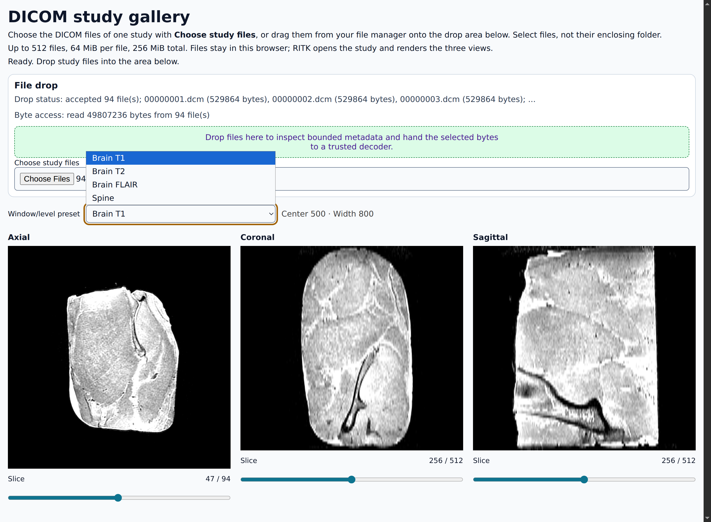

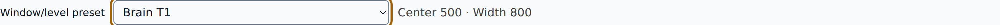

The bounded trace writes `window-level/gallery-window-level.json`, a viewport
PNG containing the real axial, coronal and sagittal MRI planes, and an element
PNG of the display-control row. Its semantic and RGBA records are the visual
acceptance oracle. The committed workflow passes `--window-presets` to every
single-cycle job; this Chromium raster job is the image and control evidence,
while WebGPU and WebKit remain separate host-capability probes.

With `--cine-controls`, the same single-cycle replay additionally writes
`cine/gallery-cine.json`, `cine/gallery-cine.png`, and
`cine/gallery-cine-controls.png`. The trace records the real saved-study
canvas generations and enabled state before and after Play, the exact 24-FPS
range selection, the paused stable state, seven malformed-rate rejection
probes, trusted button/range events, and `window.metisGallery.sample()` before
and after stop.
The post-stop sample must report zero RITK canvas listeners and both controls
disabled. The workflow passes this flag to every single-cycle engine job;
WebGPU and WebKit remain host-capability probes when their rendering or file
access differs from the raster Chromium evidence.

The workflow also passes `--tool-controls` in the same single-cycle job. Cine
capture leaves the mounted study available for the diagnostic-tool palette;
the tool capture owns the one final viewer teardown and completes the cine
artifact with that shared post-stop sample. This ordering prevents stale canvas
attributes from being mistaken for a live study while retaining one lifecycle
and one listener-release oracle for the full control workflow.

The browser gallery also exposes the complete RITK diagnostic-tool palette:
Pan, Zoom, W/L, Length, Angle, ROI Rect, ROI Ellipse, Crosshair, HU Point,
Label Paint and Label Erase. RITK publishes the selected zero-based index and
label as `data-ritk-active-tool-index` and `data-ritk-active-tool` on every
canvas. Buttons remain disabled until all three planes present a study, and
the selected state is mirrored across the three canvases. The typed
`select_web_tool` API rejects non-finite, fractional, negative and out-of-range
indexes before changing viewer state.

Run the consumer-owned diagnostic-tool trace with the same chooser arguments
and add `--tool-controls`:

```powershell
python scripts/browser_gallery.py --metis-root D:/atlas/repos/metis `
  --engine chromium --browser-name MicrosoftEdge --driver-url http://127.0.0.1:9517 `
  --headless --device-scale 1.25 --input chooser --tool-controls `
  --files D:/atlas/repos/ritk/test_data/2_head_mri_t2/DICOM --pattern '*.dcm' `
  --oracle D:/atlas/repos/metis/output/browser/mri-oracle.json `
  --consumer-revision (git rev-parse HEAD) --output D:/atlas/repos/metis/output/browser/tools
```

The bounded trace selects every palette button, focuses the axial canvas and
uses the `P` shortcut, then sends trusted drags and clicks for each tool. The
length and angle tools receive two and three points respectively; both ROI
tools receive a drag; HU, crosshair and label tools receive a click. Every
gesture must advance a fresh presented frame on all three canvases. The five
measurement gestures must also increment the shared annotation count, publish
the expected kind (`length`, `angle`, `roi-rect`, `roi-ellipse` or `hu-point`)
and publish a finite input-sensitive primary value. Pan, zoom, window/level,
crosshair and label gestures must preserve the completed result. This proves
that the real decoded MRI study responds with a computed result rather than
only changing a button label. Invalid API probes, trusted event metadata,
the per-canvas result transitions, viewport capture and palette capture are
written to `tools/gallery-tools.json`, `tools/gallery-tools.png` and
`tools/gallery-tools-controls.png`. The post-stop sample must report zero
RITK canvas listeners and all palette buttons disabled.

To capture the linked crosshair over the same saved MRI study, add
`--crosshair-controls` to the consumer replay:

```powershell
python scripts/browser_gallery.py --metis-root D:/atlas/repos/metis `
  --engine chromium --browser-name MicrosoftEdge --driver-url http://127.0.0.1:9517 `
  --headless --device-scale 1.25 --input chooser --crosshair-controls `
  --files D:/atlas/repos/ritk/test_data/2_head_mri_t2/DICOM --pattern '*.dcm' `
  --oracle D:/atlas/repos/metis/output/browser/mri-oracle.json `
  --consumer-revision (git rev-parse HEAD) --output D:/atlas/repos/metis/output/browser/crosshair
```

The workflow toggles the browser control on and off, checks that all three
canvases publish one linked voxel and that both CSS lines are visible on every
plane, then writes `crosshair/gallery-crosshair.json` and the real-study
`crosshair/gallery-crosshair-controls.png`. The screenshot is a consumer
overlay capture; the canvas RGBA oracle remains the unmodified clinical frame.

The merged-main replay in GitHub Actions run [35530079967](https://github.com/ryancinsight/ritk/actions/runs/35530079967) used Chrome 152.0.7977.82 on Linux with RITK `7eb4a0a1513248755d7d09b7ac8e3363113163a7` and Métis `b58d64b1bebe76bb32570339c4a349cc1b0d7086`. Its Chromium window lane accepted the 94-file, 49,807,236-byte public MRI-DIR study, changed `crosshair_visible` from `false` to `true` and back to `false`, and reported the same linked cursor `46,255,255` with visible row and column lines on all three planes. The source screenshot is preserved in artifact [10611440694](https://github.com/ryancinsight/ritk/actions/runs/35530079967/artifacts/10611440694); the manual image is a display-size derivative with its source digest recorded in [`dicom-metis-real-browser-mri-crosshair.json`](images/dicom-metis-real-browser-mri-crosshair.json).

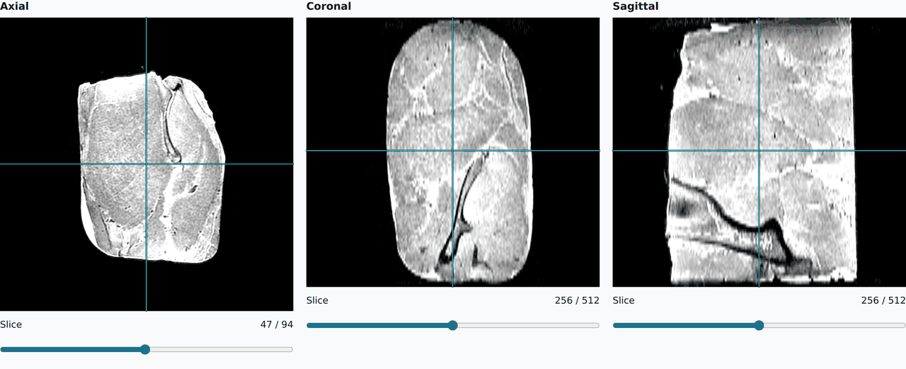

The same run passed the Chromium projection lane and the Firefox raster lane. WebKit still rejects the bounded whole-file read after chooser acceptance, and Chromium WebGPU reports no adapter; those are recorded residuals in the run artifacts and do not change the raster crosshair result.

The merged-main Chromium-window replay in
[run 35724926751](https://github.com/ryancinsight/ritk/actions/runs/35724926751)
used Chrome 152.0.7977.82 on Linux with RITK
`67d4ad4457823f928b02739ec120bc0329a1b7f0`, Métis
`776dbbf94593e42d0a5686b587ed27b72f885a73` and Moirai
`0e2e1bbb2d81e16dd9c694ba46a9e9710e034417`. The chooser accepted the saved 94-file, 49,807,236-byte public
MRI-DIR study. The replay runs the five measurement tools before viewport-
changing tools so fixed coordinates remain over decoded anatomy. It publishes
these finite transitions on all three canvases: Length `102.75155` mm, Angle
`3.5569937` degrees, ROI Rect `5402.25` mm², ROI Ellipse `4146.0703` mm², and
HU Point `27.0`. Pan, Zoom, W/L, Crosshair, Label Paint and Label Erase
preserve the final count `5`, kind `hu-point` and value `27.0`; seven malformed
tool-index probes are rejected. The mounted sample has 21 consumer and 34 host
listeners, and the post-stop sample has zero of each with the controls disabled.
The complete machine-readable record is
[dicom-metis-real-browser-mri-tools.json](images/dicom-metis-real-browser-mri-tools.json);
the full-resolution source is in the
[Chromium-window artifact](https://github.com/ryancinsight/ritk/actions/runs/35724926751/artifacts/10693163040),
and the committed PNG is a budgeted display derivative.

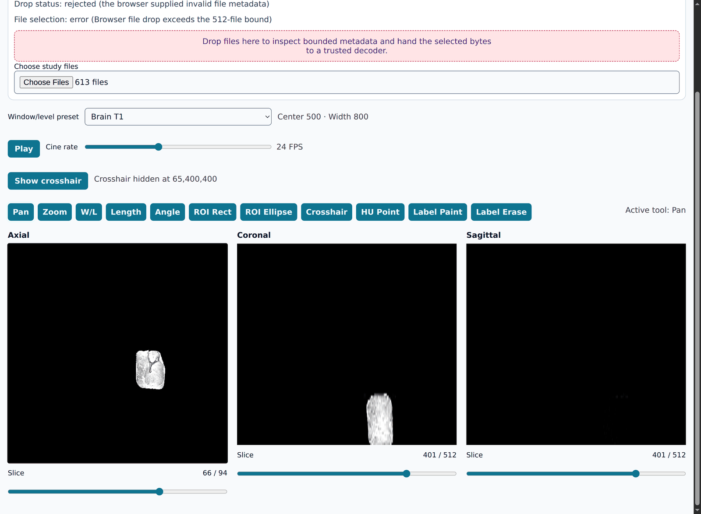


The red host rejection status visible in the viewport is intentional: the
trace executes bounded invalid-metadata and file-count probes after the real
study capture. The accepted-study trace remains bound to 94 files and the
three non-black decoded planes; the rejection probes do not stand in for
DICOM presentation.

Reproduce the file-backed run from the Métis checkout with an Edge WebDriver
already listening on port 9517:

```powershell
python scripts/browser_drop.py --driver-url http://127.0.0.1:9517 `
  --browser-name MicrosoftEdge --headless --device-scale 1.25 --input chooser `
  --files D:/atlas/repos/ritk/test_data/2_head_mri_t2/DICOM --pattern '*.dcm' `
  --oracle output/browser/mri-oracle.json `
  --consumer-revision 651b4a808374afc3efca35b71b9583b0a2a17248 `
  --canvas-trace output/browser/cine/canvas-trace.json `
  --keyboard-trace cine-rate `
  --slice-controls `
  --canvas-attribute data-ritk-load-state `
  --canvas-attribute data-ritk-frame-state `
  --canvas-attribute data-ritk-axis `
  --canvas-attribute data-ritk-slice-index `
  --canvas-attribute data-ritk-slice-count `
  --canvas-attribute data-ritk-frame-width `
  --canvas-attribute data-ritk-frame-height `
  --canvas-attribute data-ritk-cine-fps `
  --canvas-attribute data-ritk-frame-generation `
  --canvas-attribute data-ritk-display-aspect `
  --output output/browser/cine
```

Validate that trace from the RITK checkout:

```powershell
ritk-snap.exe --validate-browser-trace `
  D:/atlas/repos/metis/output/browser/cine/canvas-trace.json `
  --require-cine-rate
```

This capture establishes protocol-level trusted repeat metadata, not physical
keyboard hold duration or operating-system repeat timing. Frame generation
counts fresh RITK render-and-upload completions, not compositor presentation or
playback cadence. The evidence covers this Edge version on Windows only; other
engines, physical file-manager drag input, WebGPU, native file dialogs, native
process launch, and OS permission flows remain separate acceptance gates.

The reproducible cross-engine chooser workflow is
[metis-browser-dicom.yml](../../.github/workflows/metis-browser-dicom.yml).
The current merged-main
[run 35724926751](https://github.com/ryancinsight/ritk/actions/runs/35724926751)
rebuilt RITK at `67d4ad4457823f928b02739ec120bc0329a1b7f0` against Métis
`776dbbf94593e42d0a5686b587ed27b72f885a73` and Moirai `0e2e1bbb2d81e16dd9c694ba46a9e9710e034417`. Chromium and
Firefox each accepted the 94-file study, read 49,807,236 bytes, matched the
exact axial, coronal and sagittal RGBA oracles through four lifecycle cycles,
and released their listeners. The Chromium-window lane passed the 11-tool
replay and the Chromium MIP lane passed the display-only projection.

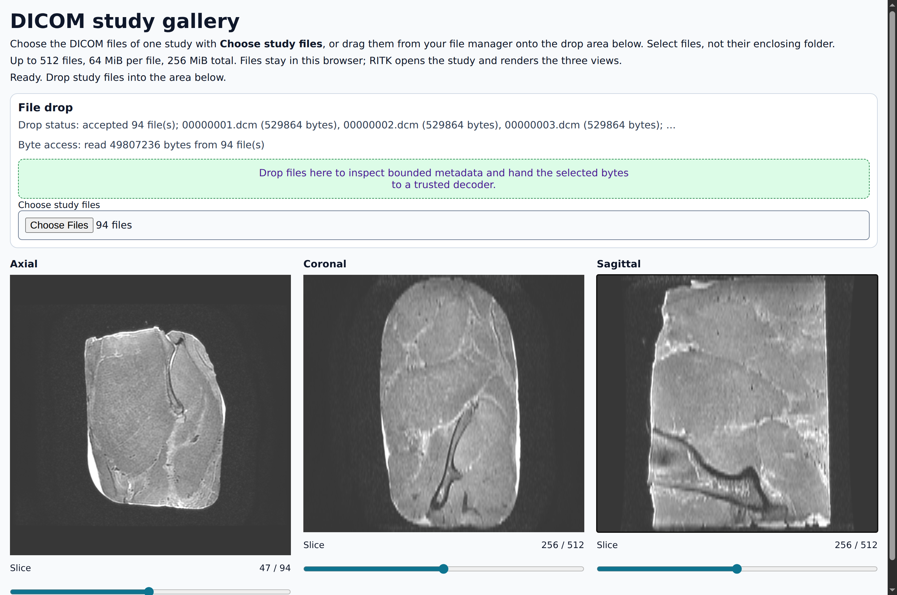

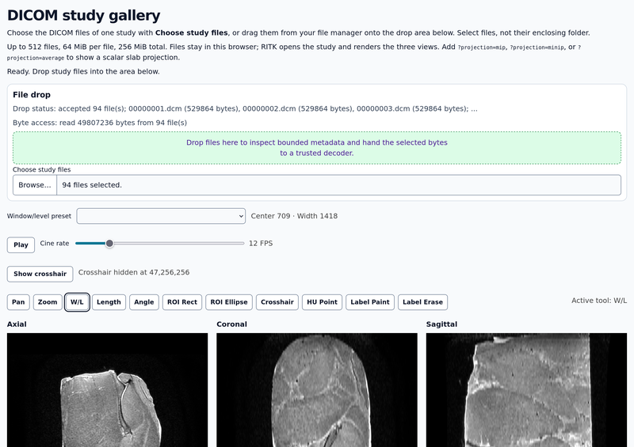

These PNGs are budgeted display derivatives of the current run's
[Chromium raster artifact](https://github.com/ryancinsight/ritk/actions/runs/35724926751/artifacts/10692527516)
and [Firefox raster artifact](https://github.com/ryancinsight/ritk/actions/runs/35724926751/artifacts/10692817486). The
Chromium-window 11-tool replay is recorded separately in
[artifact 10693163040](https://github.com/ryancinsight/ritk/actions/runs/35724926751/artifacts/10693163040) and shown above. The
[machine-readable provenance](images/dicom-metis-real-browser-mri-cross-engine.json)
retains the artifact identifiers, source hashes, exact canvas values, annotation
transitions and cleanup state. Chromium WebGPU reports no adapter and Safari
26.6.2 accepts all 94 chooser paths but rejects the bounded whole-file read;
their current artifacts and diagnostics remain explicit capability residuals.

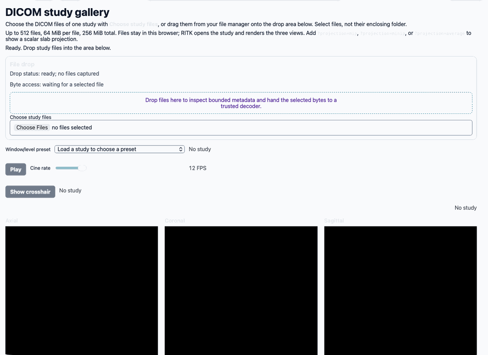

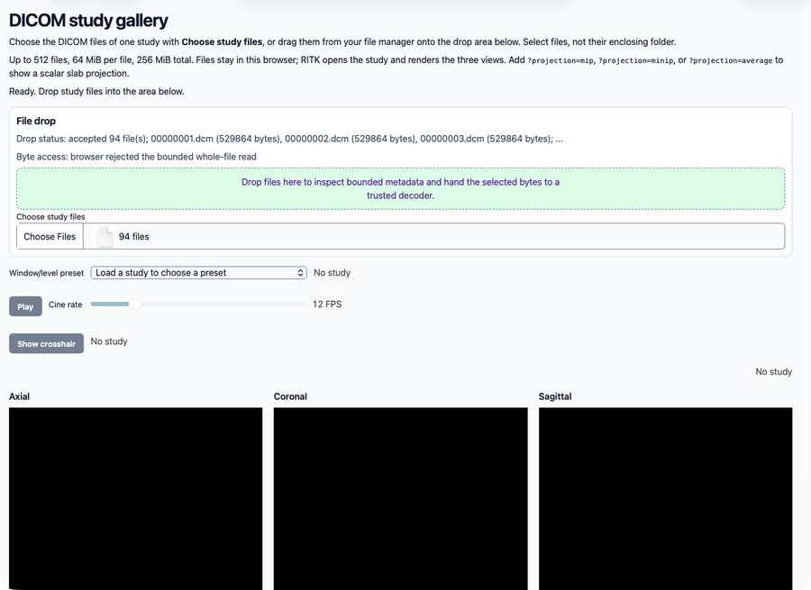

The Safari figures show the residual's two observable states: an empty chooser
before selection and the accepted 94-file selection after the browser rejects
the bounded read. Their full-resolution source hashes and artifact provenance
are recorded in the cross-engine JSON.

The historical Chromium application-window probe in run `35395627386` accepted
the 94-file study and rendered partial anatomy, then failed to observe a
presented cine slice before teardown. The [failure artifact](https://github.com/ryancinsight/ritk/actions/runs/35395627386/artifacts/10567752411)
and [captured state](images/dicom-metis-real-browser-mri-application-window-failure.png)
retain that earlier diagnostic; the current paired replay below supersedes this
application-window presentation residual.

The current lock-pinned pair replay in hosted run
[`35487777698`](https://github.com/ryancinsight/ritk/actions/runs/35487777698)
rebuilt RITK at `4cbef46ef4be41fe2a93bcb79c81a02d2c73d685` against Métis
`165c4ec923e76ea7bc32b6b4fb99b4338166b3a3`. Its Chromium-window job passed
the saved-study workflow and cine validator. The chooser accepted all 94 MRI-DIR
files (49,807,236 bytes); `trace.json` reports status `passed`, and the cine
artifact records sagittal slice 255 at generation 126, 256 at generation 127
after Play, and 257 at generation 128 after the rate change to 24 FPS. The
pause snapshot is stable at generation 128, and all three canvases retain
non-black pixels in the 2,880 × 2,114 `gallery-cine.png` capture retained by
[artifact 10597873405](https://github.com/ryancinsight/ritk/actions/runs/35487777698/artifacts/10597873405).
The Firefox job in the same run also passed its four-cycle saved-study replay.
The combined cine/tool workflow leaves one final teardown owner:
the pre-stop sample is mounted with 21 consumer listeners, the post-stop sample
is unmounted with zero host and consumer listeners, and the cine evidence marks
`teardown.owner=tool-controls`. The complete machine-readable evidence and
PNG are retained in [artifact 10597873405](https://github.com/ryancinsight/ritk/actions/runs/35487777698/artifacts/10597873405).

RITK owns DICOM scanning, decoding, geometry, clinical presentation and pixel
assertions; Métis remains the format-neutral host and canvas boundary, and
Moirai owns the bounded browser file read. Physical file-manager drag input,
native file dialogs, native process launch, OS permission grants, WebGPU and
Safari's file-backed WebDriver read remain separate acceptance gates.

### Verify embedded canvas content coordinates

The RITK-owned local-box regression compares the saved MRI study in unstyled,
`content-box`, and `border-box` canvases. The styled cases add fractional
dimensions, asymmetric borders and padding, nested reflection, rotation and
nonuniform scaling. The driver computes forward affine viewport targets from
the fixture geometry and calibrates their origin against the browser rectangle.
This is browser integration evidence, not an independent layout-measurement
oracle. Trusted clicks must select the same exact
voxel, content wheels must step one axial slice, and wheels in padding or
borders must leave all three slice indices unchanged.

After rebuilding the RITK WASM package and Metis gallery, run from the RITK
checkout with an Edge WebDriver listening on a dedicated port:

```powershell
python scripts/browser_local_box.py --metis-root ../metis `
  --driver-url http://127.0.0.1:9518 --browser-name MicrosoftEdge --headless `
  --files test_data/2_head_mri_t2/DICOM --pattern '*.dcm' `
  --output output/browser/local-box.json
```

The bounded output records voxel transitions, trusted event samples, each
loaded bundle's file hashes and the three repositories' source fingerprints.
Temporary styled galleries are removed when the run ends. This checks browser
input and RITK voxel selection, not clinical interpretation or compositor
timing. The [embedding contract](../adr/0032-browser-semantic-snapshot.md)
states the supported geometry and inspectable-ancestry requirement.

## Build the RITK SNAP executable and installer

RITK owns the application manifest at
[`metis.json`](../../metis.json). It declares
the single `ritk-snap` Cargo binary and contains no DICOM parser, decoded study,
or clinical resource. Métis supplies the packaging tool and Windows Installer
authoring; the viewer binary remains the RITK-owned DICOM implementation.

From a Windows x64 checkout of RITK and a local checkout of Métis, build the
packager and create a new output directory:

```powershell
cargo build --release --locked --manifest-path path\to\metis\Cargo.toml -p metis-cli
New-Item -ItemType Directory output -Force | Out-Null
path\to\metis\target\release\metis.exe package `
  metis.json output\ritk-snap-installer
```

The output contains `app\ritk-snap.exe`, the exact `inventory.json`, and the
Windows per-user MSI. Launch the portable executable with a study path, for
example `output\ritk-snap-installer\app\ritk-snap.exe study\`. The installer
does not bundle patient data or choose a study; DICOM opening still follows the
RITK workflow above. A package output directory is create-new and must not
already exist.

The package boundary was exercised again on Windows x64 on 2026-09-15 from
the standalone locked graph at RITK `3f5c35c98d82cd01d53e972cbb9dc174725bf3fb`
and Métis `c4276f2586f1ae9a1e3c0fa1dcb1507be4555f24`. The packaged executable
was launched with `--metis-native --capture-application --capture`; it exited
with code 0 and rendered decoded axial, coronal, and sagittal anatomy. The
portable payload is 24,672,768 bytes (SHA-256
`c24d21755e2f7cc8fa45e039cb1ed4ed76bc76cfc1d4607319ffe6b505ccff9c`) and the
MSI is 9,424,896 bytes (SHA-256
`7f05da20c3a09c65681b34916921b82310475536611417f4809a04c9875df632`):

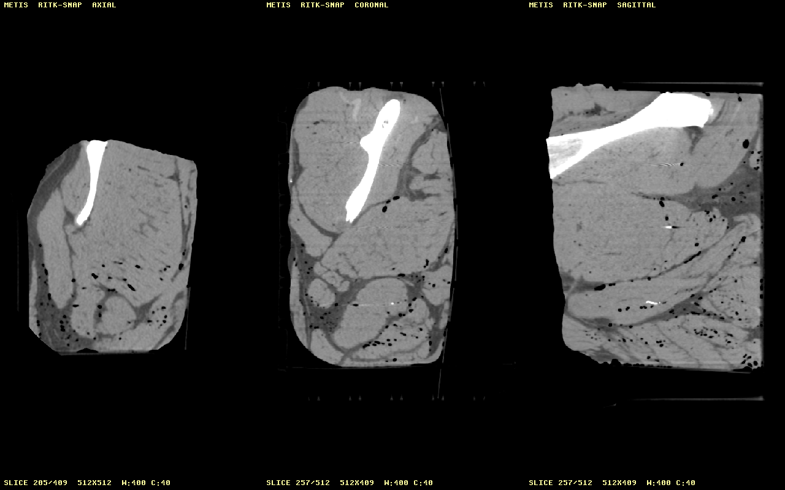

The portable executable and MSI hashes match the package's `inventory.json`.
The capture, input manifest hash, package hashes, source revisions, and limits
are recorded in
[`dicom-metis-installer.json`](images/dicom-metis-installer.json). This is a
real file-backed DICOM run from the RITK-owned viewer; no image was generated
for the manual. When the Atlas development overlay is active, run the locked
package command from outside that overlay (for example, the drive root) so
Cargo resolves the standalone lockfile; the checked-in workflow remains
lock-pinned.

The MSI lifecycle was also exercised in the current user scope. Silent install
returned 0, placed the executable under `%LOCALAPPDATA%\org.ritk.snap\`, and
rendered a byte-identical capture from the same study. Silent uninstall returned
0 and removed both that registry entry and install directory. The lifecycle
results are included in the provenance artifact; no elevation, signing key, or
patient data was used.

The manifest and package command are local integration evidence. The
[`metis-package.yml`](../../.github/workflows/metis-package.yml) workflow
repeated the same lock-pinned build on a Windows runner in run
[34990164849](https://github.com/ryancinsight/ritk/actions/runs/34990164849).
All package and inventory checks passed. Its reviewable artifact is
`ritk-snap-package` (artifact `10406835672`, digest
`sha256:7772adcad26328ffad8eff114a93bfd7fb7974b38a146075013f004d92f90ec2`)
with a 24,657,920-byte executable and 9,416,704-byte MSI; the exact hashes
are in [`dicom-metis-installer.json`](images/dicom-metis-installer.json). A
local replay of that hosted executable opened the same saved study and
produced the byte-identical three-plane capture. The hosted workflow itself
checks packaging and `--help`; it does not execute DICOM or install the MSI.
Registry publication, signing, and release promotion remain separate
release-authority decisions.

## Open dropped DICOM files in the browser host

The browser build uses the same RITK byte loader as the native dropped-input
path. The complete DICOM consumer page is kept in
[`crates/ritk-snap/web/gallery`](../../crates/ritk-snap/web/gallery), and the
workflow passes it explicitly to Metis after building the RITK WebAssembly
package. This keeps the chooser wording, slice controls and three-canvas
presentation with the DICOM consumer. The HTML page supplies a Métis mount
point and a named canvas:

```html
<main id="metis-app" aria-label="Métis browser host"></main>
<canvas id="ritk-canvas"></canvas>
<script type="module">
  import init, { start_web } from "./ritk_snap.js";

  await init();
  await start_web("ritk-canvas");
</script>
```

Métis registers the browser drag-and-drop listeners and transfers one bounded
batch of named bytes. The RITK browser adapter constructs its neutral
`DroppedInput` value directly; the shared policy then detects Part 10 content
or a DICOM suffix, and `dicom::loader` performs the existing scan, series
selection, budgeted preflight, and decode. No filesystem path, browser handle,
DICOM tag, or parser object crosses into Métis. A malformed or oversized
payload follows the same typed rejection path as a native byte drop.

The browser acceptance checks are the locked `wasm32-unknown-unknown` build and
warning-denied Clippy for `ritk-snap`, plus the RITK byte-routing and loader
tests. The standalone consumer lock and graph now use the merged [Mnemosyne
#141](https://github.com/ryancinsight/Mnemosyne/pull/141) and [Mnemosyne
#143](https://github.com/ryancinsight/Mnemosyne/pull/143), [Coeus
#393](https://github.com/ryancinsight/Coeus/pull/393), [Apollo
#386](https://github.com/ryancinsight/apollo/pull/386), and [Leto
#187](https://github.com/ryancinsight/leto/pull/187) portability fixes. Build
the RITK library target and package it with the pinned `wasm-bindgen 0.2.128`
CLI:

```powershell
cargo build --locked -p ritk-snap --lib --target wasm32-unknown-unknown --release
wasm-bindgen target/wasm32-unknown-unknown/release/ritk_snap.wasm `
  --target web --no-typescript --out-dir target/wasm-bindgen/ritk-snap
```

The consumer package contains only `ritk_snap.js` and `ritk_snap_bg.wasm`;
`--no-typescript` omits declaration sidecars so Metis can validate the bounded
runtime pair. Run those commands from a standalone checkout or CI; the local
Atlas development overlay resolves first-party crates to working trees and is
therefore verified with the equivalent unlocked release build. The generated
module exports `start_web`, `start_web_canvas`,
`start_web_orthogonal_canvases` and their explicit asynchronous WebGPU
variants; packaging proves the consumer artifact boundary. The local browser
visual smoke below exercises the packaged raster module against a real public
MRI-DIR DICOM drop.

The direct Métis canvas workflow is also available for the first browser
presentation slice. It keeps the canvas outside Métis's `#metis-app` mount and
uses the RITK-owned browser loop:

```html
<main id="metis-app" aria-label="Métis browser host"></main>
<canvas id="ritk-snap-canvas" width="512" height="512"></canvas>
<script type="module">
  import init, { start_web_canvas, stop_web_canvas } from "./ritk_snap.js";

  await init();
  start_web_canvas("ritk-snap-canvas");
  // Call stop_web_canvas() when the page or route is torn down.
</script>
```

`start_web_canvas` mounts Métis, consumes its bounded named-byte drop batch,
and passes the files to RITK's existing DICOM classifier and byte-series
loader. A valid drop replaces the RITK study and presents the selected slice on
the named canvas; malformed, oversized, or non-DICOM input follows RITK's
typed error and status paths. The browser host receives only the borrowed
RGBA frame. DICOM parsing, metadata, geometry, window/level and viewer state
remain in RITK. The named canvas now retains bounded pointer and wheel
listeners and routes target-local events through RITK's shared
presentation/action reducer; pointer cancel and provider failures clear the
active gesture. Physical browser-driver input and Safari's file-backed
WebDriver read remain separate acceptance work. Browser WebGPU is selected
only through the explicit asynchronous `*_gpu` entrypoints or the gallery's
`?renderer=webgpu` query; hosted capability evidence is recorded below and
does not imply a device is present. The native eframe volume
upload now preflights device limits, reports pending GPU readback, and uses the
CPU projection path when the GPU path is unsupported or fails.
When browser GPU setup rejects, the RITK gallery preserves the underlying WASM
error text in `gallery-status`; a missing adapter or device is reported as a
setup failure rather than an `undefined` message.

The direct three-view entrypoint uses three canvases and preserves the same
format-neutral boundary:

```html
<main id="metis-app" aria-label="Métis browser host"></main>
<section aria-label="RITK orthogonal views">
  <canvas id="ritk-snap-axial"></canvas>
  <canvas id="ritk-snap-coronal"></canvas>
  <canvas id="ritk-snap-sagittal"></canvas>
</section>
<script type="module">
  import init, {
    start_web_orthogonal_canvases,
    stop_web_canvas,
  } from "./ritk_snap.js";

  await init();
  start_web_orthogonal_canvases(
    "ritk-snap-axial",
    "ritk-snap-coronal",
    "ritk-snap-sagittal",
  );
  // Call stop_web_canvas() when the page or route is torn down.
</script>
```

The entrypoint drains one bounded Métis file batch, opens it through RITK's
existing loader and presents the axial, coronal and sagittal
`PresentationFrame` values in that order. RITK's presentation tests assert the
axis order and slice dimensions; the packaged three-canvas capture below
verifies the runtime dimensions and non-black pixels. Each canvas now routes
its bounded pointer and wheel batch to the matching RITK axis. Physical
browser-driver input and Safari's file-backed WebDriver read remain separate
acceptance work. Browser WebGPU is available through the explicit asynchronous
`start_web_orthogonal_canvases_gpu` entrypoint; the gallery selects it only for
`?renderer=webgpu` and records setup failures instead of falling back. No real
GPU visual or equivalence claim is made for the recorded hosted run because its
browser reported no adapter. The generic Métis runner's `--canvas-capture screenshot
--canvas-context webgpu` mode captures those non-2D canvases as real element
PNGs and verifies the context without substituting a 2D readback. Native eframe GPU uploads are guarded by the same RITK device limit
check and have a fitting-volume visual capture in the eframe workflow above.

### Add a display-only scalar projection canvas

The four-canvas entrypoint keeps the established three interactive planes and
adds one RITK-owned scalar projection. Canvas identifiers are ordered axial,
coronal, sagittal, projection. The final argument selects `0` maximum
intensity (MIP), `1` minimum intensity (MinIP), or `2` arithmetic average:

```html
<main id="metis-app" aria-label="Métis browser host"></main>
<section aria-label="RITK orthogonal views and scalar projection">
  <canvas id="ritk-snap-axial"></canvas>
  <canvas id="ritk-snap-coronal"></canvas>
  <canvas id="ritk-snap-sagittal"></canvas>
  <canvas id="ritk-snap-projection"></canvas>
</section>
<script type="module">
  import init, {
    start_web_orthogonal_canvases_with_projection,
    stop_web_canvas,
  } from "./ritk_snap.js";

  await init();
  start_web_orthogonal_canvases_with_projection(
    "ritk-snap-axial",
    "ritk-snap-coronal",
    "ritk-snap-sagittal",
    "ritk-snap-projection",
    0,
  );
  // Call stop_web_canvas() when the page or route is torn down.
</script>
```

The first three canvases publish the existing `data-ritk-*` slice and input
contract. The projection canvas has no input listeners and publishes
`data-ritk-role="projection"`, `data-ritk-projection-statistic`,
`data-ritk-load-state`, `data-ritk-frame-state`, frame dimensions and physical
display aspect. RITK computes the typed full-depth scalar slab, then applies the
same DICOM window/level and colormap policy as the three planes. A color study,
malformed statistic index, or unavailable WebGPU device returns a typed setup
error; no browser fallback or DICOM interpretation occurs in Métis. The
`start_web_orthogonal_canvases_gpu_with_projection` export has the same canvas
order and selects WebGPU explicitly.

The native CT captures in [the scalar projection section](#show-the-real-study-with-a-native-scalar-projection-panel)
are the current visual oracle for the three statistics. The checked-in gallery
keeps the stable three-canvas default and accepts `?projection=mip`,
`?projection=minip`, or `?projection=average` for the four-canvas consumer
workflow. The hosted workflow exercises the MIP form with the real saved MRI
study. Its completed Chromium projection capture is recorded below with the
revision-bound artifact and the committed manual figure.

The hosted saved-study workflow
([`metis-browser-dicom.yml`](../../.github/workflows/metis-browser-dicom.yml))
includes a Chromium WebGPU matrix entry. It uses the same 94-file MRI-DIR
study and invokes the consumer page with `?renderer=webgpu`,
`--canvas-capture screenshot`, and `--canvas-context webgpu`. Its
`mri-webgpu-oracle.json` keeps the intrinsic canvas dimensions and RITK
semantic attributes while omitting the raster RGBA digest. The uploaded
`chromium-webgpu` directory contains the element PNG, canvas trace and
revision-bound manifest. A passed job proves that RITK opened the selected
study and presented each canvas through the requested context; it does not
prove 2D pixel equivalence, hardware acceleration, compositor timing or lower
memory use.

Hosted run
[35724926751](https://github.com/ryancinsight/ritk/actions/runs/35724926751)
rebuilt RITK `67d4ad4457823f928b02739ec120bc0329a1b7f0` against the lock-pinned
Métis revision `776dbbf94593e42d0a5686b587ed27b72f885a73` and Moirai
`0e2e1bbb2d81e16dd9c694ba46a9e9710e034417`. Its Chromium projection job accepted all 94 MRI-DIR files
(49,807,236 bytes; manifest SHA-256
`81b7b7f8ea473dfc12c25c07b4958762254a261ca49352af2adabc214d6e8d03`) and
passed the scalar contract. Its `projection.json` records a 512 × 512 MIP with
110,028 non-black pixels, RGBA SHA-256
`470e898c9dcd60a800155a29cfcd70acd72a597be7c98ac24d4a0d5e963d8924`,
`data-ritk-role="projection"`, `data-ritk-projection-statistic="MIP"`,
presented frame state, `consumer_listeners: 21`, and `display_only: true`.
The hosted result is in the
[chromium-projection-mip artifact](https://github.com/ryancinsight/ritk/actions/runs/35724926751/artifacts/10693317438);
the source element screenshot is 866 × 866 pixels with SHA-256
`e983de59e7cd235d1916fc6c67e849a20198219aea2112ebf064e16fd0cf8dcf`.
The committed figure is a budgeted display derivative of that source.

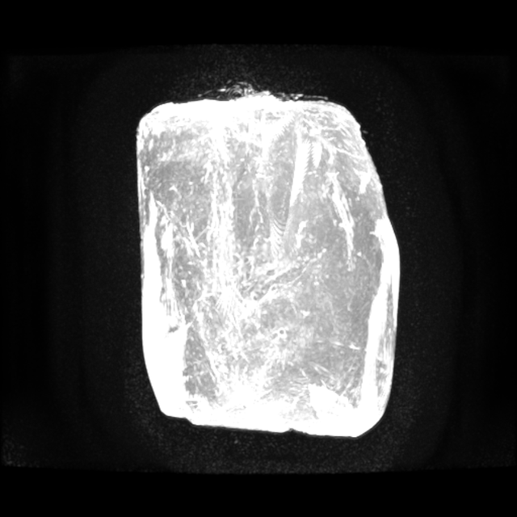

The current run's Chromium WebGPU job reported `Chromium returned no WebGPU
adapter before study presentation`. Its
[failure artifact](https://github.com/ryancinsight/ritk/actions/runs/35724926751/artifacts/10692602261)
contains the 2,880 × 1,914 failure capture (SHA-256
`419d62c3c2dd4385067068f6b0fc6147f06ce4b2e98ea98f93f0129830f2c8e7`) and a
clean session teardown. The bounded file probes were available before this
setup failure. This is a hosted capability residual, not a raster fallback or
a GPU presentation claim.

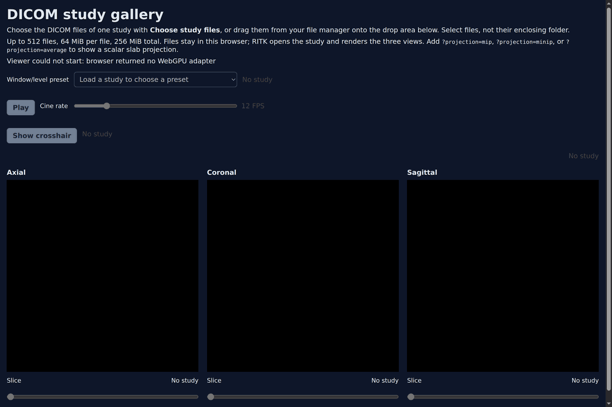

Each RITK canvas also publishes a bounded semantic snapshot for workflow
drivers. `data-ritk-load-state` is `empty` or `ready`,
`data-ritk-frame-state` is `empty` or `presented`, and the axis, zero-based
slice index/count, and presented pixel dimensions are available as
`data-ritk-axis`, `data-ritk-slice-index`, `data-ritk-slice-count`,
`data-ritk-frame-width`, and `data-ritk-frame-height`. An empty frame reports
zero dimensions. `data-ritk-cine-fps` reports the active bounded playback rate
from 1 through 60 frames per second. These attributes are produced by RITK
after its own DICOM load and presentation decisions; they contain no patient
or DICOM metadata.
The generic Métis runner may read them as consumer assertions, but it does
not assign them meaning.

The shared RITK viewport mapper accepts finite display geometry independently
of egui. Native eframe placement converts its coordinates at the host boundary;
the browser canvas and viewer action path use the same RITK-owned mapping
without importing GUI carrier types.

The browser task schedules each presentation tick with Moirai's owned
`requestAnimationFrame` future and passes its monotonic millisecond timestamp
to RITK's host-neutral cine clock. Loading a new study stops playback before
the new volume is published. The loop tears down the Métis mount when a frame,
input, or animation-frame failure ends it. This failure path is distinct from
an explicit `stop_web_canvas` call: it releases provider listeners before the
task exits so the next route generation cannot retain callbacks or stale
pointer capture.

The drop reducer consumes RITK's `DroppedInput` value rather than an eframe
carrier. Native eframe input is converted at the host edge; browser payloads
from Métis enter the same RITK value directly. This keeps DICOM filename, MIME,
Part 10 detection, byte-series assembly, and loader decisions in RITK while
leaving Métis responsible only for bounded browser file transfer.

## Inspect the browser canvas visual smoke

The packaged bundle was served from a local HTTP origin and given the three
Part 10 files generated by `dicom_workflow`. A browser `DataTransfer` dispatched
the drop to the Métis host. The browser accessibility state reported three
accepted files (654 bytes each) and 1,962 bytes read; the RITK canvas reported
`dicom-frame-visible` and returned a non-black 4 × 2 RGBA frame displayed at
512 × 512 CSS pixels. The capture uses RITK's synthetic numeric fixture, so it
contains no patient data.


This image is the PNG exported by the canvas during that run and is inspected
as an application-content snapshot. The synthetic DOM event is untrusted, so
the smoke proves the packaged byte-to-frame path but does not close physical
drag-and-drop, physical pointer input, cross-engine browser input, GPU, or
complete application-window capture acceptance.

## Inspect the browser orthogonal visual capture

The packaged module at RITK revision `f0144c4a5` was produced with
`wasm-bindgen 0.2.128` and served from the same local origin after the
three-canvas entrypoint landed. The browser dispatched the three synthetic
Part 10 files through Métis's bounded drop zone; RITK reported 1,962 bytes read and
presented non-black frames with dimensions 4 × 2 (axial), 4 × 3 (coronal), and
2 × 3 (sagittal). The reviewed PNG is generated from those live canvas pixels,
contains no patient data, and preserves the axial/coronal/sagittal order.


This runtime capture proves the packaged three-canvas presentation path. The
drop event is still synthetic, so physical drag-and-drop, cross-engine pointer
input, GPU upload, and complete application-window capture remain open. The
format-neutral pointer and wheel handoff itself is implemented: each canvas
retains a bounded queue, preserves target-local coordinates, normalizes line
and page wheel units, routes events to its RITK axis, and cancels an active
gesture on `pointercancel` or provider failure. Those behaviors are covered by
the RITK presentation/action tests and ADR 0031; a trusted browser-driver
capture is still required before claiming physical or cross-engine evidence.
The browser presenter also checks the Moirai trust snapshot and drops
script-created canvas events before the viewer reducer; this policy is recorded
in [ADR 0035](../adr/0035-browser-event-trust.md). The browser `isTrusted` bit
does not prove physical input, so the existing protocol and cross-engine limits
remain.

## Run the Metis trusted canvas trace

The reusable browser transport lives in the Metis repository. Run it from a
Metis checkout that contains the canvas scenario, and point it at the served
RITK page. The page must expose the RITK-owned canvases and use the real RITK
browser entrypoint:

```text
python scripts/browser_runtime.py --scenario canvas --engine chromium \
  --driver-url http://127.0.0.1:9515 \
  --url http://127.0.0.1:8080/ritk.html \
  --consumer-revision <RITK-40-HEX> \
  --canvas-id ritk-snap-axial \
  --canvas-id ritk-snap-coronal \
  --canvas-id ritk-snap-sagittal
```

To carry RITK's own semantic evidence in the generic trace, add one
`--canvas-attribute` argument per bounded canvas attribute:

```text
python scripts/browser_runtime.py --scenario canvas --engine chromium \
  --driver-url http://127.0.0.1:9515 \
  --url http://127.0.0.1:8080/ritk.html \
  --consumer-revision <RITK-40-HEX> \
  --canvas-id ritk-snap-axial \
  --canvas-id ritk-snap-coronal \
  --canvas-id ritk-snap-sagittal \
  --canvas-attribute data-ritk-load-state \
  --canvas-attribute data-ritk-frame-state \
  --canvas-attribute data-ritk-axis \
  --canvas-attribute data-ritk-slice-index \
  --canvas-attribute data-ritk-slice-count \
  --canvas-attribute data-ritk-frame-width \
  --canvas-attribute data-ritk-frame-height
```

Metis records these requested values opaquely under each canvas snapshot and
uses `null` when an attribute is absent. RITK interprets the values using the
semantic contract above; the generic runner does not interpret DICOM or
clinical state. The Metis attribute capture was added in [PR #73](https://github.com/ryancinsight/metis/pull/73)
at commit `fb4ad93`.

Replace the driver endpoint and page URL with the configured local service,
then repeat the run for Firefox and WebKit. Set `<RITK-40-HEX>` to the exact
RITK revision serving the page. The Metis trace records the negotiated browser
capabilities, bounded canvas dimensions, trusted pointer-drag and wheel
actions, full-window PNGs, element PNGs, and both repository revisions. A
missing driver endpoint is a failed invocation, not a skipped engine.

The trace is transport and presentation evidence only. RITK must assert the
accepted byte batch, Part 10 classification, selected study and series, axis
order, decoded dimensions, expected slice/viewport changes, and stale-frame
rejection after teardown. These DICOM and viewer assertions stay in RITK; the
Metis runner neither reads DICOM bytes nor interprets clinical pixels.

### Validate the RITK meaning in a trace

After the Metis runner writes a passed canvas trace, run the RITK-owned
validator from the RITK checkout:

```text
cargo run --locked -p ritk-snap -- \
  --validate-browser-trace output/browser/runtime/chromium-canvas.json
```

The command checks the schema and both repository revisions, the closed browser
engine matrix, the ordered axial/coronal/sagittal canvases, all seven
`data-ritk-*` values, intrinsic and presented dimensions, one trusted pointer
drag and wheel action per canvas, full-window and element screenshot scopes,
and input-source cleanup. Pointer/wheel mode compares the initial and
after-input `data-ritk-slice-index` values: a trusted wheel must move every
multi-slice canvas, while a one-slice axis may remain at zero; the declared
slice count must stay stable. In keyboard mode the trace adds one `after-keyboard` semantic
snapshot per canvas, keeps the slice count stable across that boundary, and
compares the wheel result with that snapshot so keyboard and wheel transitions
cannot cancel in the final-state comparison. Custom canvas identifiers use
three repeated `--canvas-id` options in the same order as the trace. A small
structural fixture is available at
[`crates/ritk-snap/tests/fixtures/browser-trace.json`](../../crates/ritk-snap/tests/fixtures/browser-trace.json)
for a local command demonstration; its digest fields exercise trace shape and
do not claim a visual capture. The validator never opens DICOM bytes or
interprets pixels, so clinical and decoded-value oracles remain the RITK
workflow tests above.

When a trace requests optional presentation state, the validator accepts the
complete window-level group (`data-ritk-window-center`,
`data-ritk-window-width`, `data-ritk-window-preset-index`) and the complete
interaction group (`data-ritk-cine-enabled`, `data-ritk-active-tool-index`,
`data-ritk-active-tool`) in addition to the seven base values. The linked
cursor/orientation group (`data-ritk-crosshair-visible`,
`data-ritk-linked-cursor`, `data-ritk-view-flip-h`, `data-ritk-view-flip-v`,
`data-ritk-view-rotation`) is optional and, when present, is validated
atomically alongside those groups. A partial group or unknown attribute is
rejected. This keeps the workflow's cine, window/level, tool and linked
cursor captures semantic without making the generic host interpret DICOM
data.

### Require trusted keyboard focus evidence

When the Metis trace was captured with `--keyboard-trace`, require the explicit
keyboard mode so every canvas proves that its own focus target received the
input:

```text
cargo run --locked -p ritk-snap -- \
  --validate-browser-trace output/browser/runtime/chromium-keyboard-canvas.json \
  --require-keyboard \
  --canvas-id ritk-snap-axial \
  --canvas-id ritk-snap-coronal \
  --canvas-id ritk-snap-sagittal
```

In this mode the validator requires one trusted `ArrowDown` keydown and keyup
for each canvas, with matching `key` and `code`, `repeat: false`, no modifier
flags, and the canvas as the event target. Missing focus, an untrusted event,
or a mismatched target fails the trace before any viewer claim is made. The
keyboard records are transport evidence; RITK's reducer remains the owner of
navigation and cine meaning. Hosted run
[34922946179](https://github.com/ryancinsight/ritk/actions/runs/34922946179)
passes this keyboard contract on Chromium 152 and Firefox 155. Safari's file
read failed before its canvases were presented, so no Safari keyboard claim is
made.

To verify the browser cine-rate control, capture with Metis's explicit rate
profile and include the rate attribute in the same allowlist:

```text
python scripts/browser_drop.py --driver-url http://127.0.0.1:9515\
  --engine chromium --input chooser\
  --files D:/atlas/repos/ritk/test_data/2_head_mri_t2/DICOM --pattern '*.dcm'\
  --oracle output/browser/mri-oracle.json\
  --consumer-revision <RITK-40-HEX>\
  --canvas-trace output/browser/runtime/chromium-cine-rate.json\
  --keyboard-trace cine-rate\
  --canvas-attribute data-ritk-load-state\
  --canvas-attribute data-ritk-frame-state\
  --canvas-attribute data-ritk-axis\
  --canvas-attribute data-ritk-slice-index\
  --canvas-attribute data-ritk-slice-count\
  --canvas-attribute data-ritk-frame-width\
  --canvas-attribute data-ritk-frame-height\
  --canvas-attribute data-ritk-cine-fps\
  --canvas-attribute data-ritk-frame-generation\
  --canvas-attribute data-ritk-display-aspect
```

Validate that trace with `--require-cine-rate`. For each focused canvas the
profile sends `=`/`Equal`, repeats that held key, sends `-`/`Minus`, and repeats
that held key. The effective actions change FPS by exactly one; each repeat
must preserve FPS, slice selection, frame generation and the previous image.
The sequence restores the initial global rate before testing the next canvas.
Each phase requires trusted, unmodified input evidence and its own semantic
snapshot and element screenshot. Screenshot dimensions are checked against
CSS geometry and the independently observed device scale.

`data-ritk-frame-generation` advances after a newly rendered frame uploads to
the canvas. Cached uploads on ordinary animation frames do not advance it.
It establishes fresh-frame presentation after an effective rate action; it
does not measure playback cadence, display refresh, or compositor timing.
Changing only the rate can leave the medical image pixels identical. The
pointer and wheel checks still require actual slice progression afterward.

## Present validated RITK views through Métis

RITK remains the only DICOM owner. After RITK has opened the study, decoded the
selected frame, applied modality rescale, window/level, and colormap rules, the
`ritk-snap::presentation::PresentationFrame` boundary copies bounded, row-major
RGBA slices. The native session composes three such frames using the same
window/level, colormap, orientation, and physical-spacing rules as the RITK
viewer. The host receives one bounded framebuffer; DICOM identifiers, paths,
codec state, geometry, and volume storage stay in RITK.
The canonical handoff uses RITK's neutral `render_rgba` and RGBA orientation
path; the legacy eframe slice adapter is the only path in this handoff that
converts those pixels to `egui::ColorImage`.

On Windows, `run_native_viewer` loads the selected study in RITK, presents the
three orthogonal views through Métis's native surface, routes pointer events to
the panel under the pointer, translates each bounded native event batch to
`PresentationEvent`, and applies the resulting actions to RITK viewer state.
The focused suite checks slice pixels, all three panels, panel-specific wheel
navigation, resize/minimize, DPI, focus-loss cancellation, close, and bounded
hidden capture. The test proves the host boundary and the existing DICOM
workflow; it does not add a DICOM parser to Métis. Browser handoff and the
explicit WebGPU upload entrypoints remain RITK-owned integration surfaces; the
RITK-owned manifest now exercises the Métis executable and Windows MSI path
without moving DICOM behavior across the presentation boundary. A real browser
GPU run remains unverified until a configured device produces revision-bound
artifacts.

Primary-button drags follow the selected RITK tool through the same event path.
For the Pan tool, the resulting image-space offset is applied while RITK
recomposes the three panels, so the next Métis framebuffer reflects the drag as
well as the updated viewer state. This is a state-and-pixels check; it does not
move DICOM parsing or geometry ownership into Métis.

Keyboard page navigation follows the same RITK-owned action path. Page Down
advances the active slice and recomposes the native Métis framebuffer; the
native session test verifies both the slice index and changed pixels.

Deferred viewer loads use a bounded Moirai task per primary or comparison
target. RITK assigns each request a generation and checks cooperative
cancellation before publication, so a superseded or closed request cannot
replace the current study. A failed replacement reports its error while the
previous decoded study remains displayed. The load-task tests use the real
synthetic DICOM fixtures and assert decoded shape, spacing, series identity,
supersession, and close cancellation.

Wheel input is now reduced and applied by RITK for every host. The native
Moirai `ModifierState` is translated into the format-neutral
`PresentationModifiers`; the current egui producer emits the same
`PresentationEvent::PointerWheel` shape. Ctrl/Command plus a vertical delta
uses the existing zoom policy, while an unmodified vertical delta steps the
active slice. Non-finite deltas and events outside a viewport are rejected or
ignored before viewer state changes. Métis carries the event snapshot only; it
does not parse DICOM, retain a decoded volume, choose a series, or apply a
clinical display transform.

The browser presentation now applies that same zoom and pan state to the
RITK-owned RGBA raster before it reaches the Métis canvas. Zoom samples around
the frame centre; the Pan tool shifts the displayed pixels and fills exposed
areas with opaque black. Pointer coordinates use the inverse of the same
transform, so a click selects the voxel that is visible under the pointer and
black panned edges do not create an annotation. The transform reuses the
browser frame scratch buffer after warmup; it does not add a JavaScript or CSS
pixel path. The focused proof covers identity bytes, zoom, pan, invalid state,
storage reuse and transformed pointer coordinates. The public 94-file MRI
replay below remains the real-image visual oracle for this workflow.

The existing `dicom-window.png` below remains the egui/eframe baseline. The
`dicom-metis-native.png` image is the reviewed Métis content capture; it is
generated from the same synthetic study and is not relabeled as an OS-window
golden.


This egui/eframe capture runs on Windows at 125% display scale, producing a
1600 × 1000 root viewport. The viewer's current hanging protocol selects width
400 and center 60, unlike the software-grid oracle's width 510 and center 235.
Image placement preserves physical proportions in every layout. For this
fixture, displayed width/height is 2/3 for the depth slice, 1/3 for the row
slice, and 1/2 for the column slice: pixel count times sample spacing on each
axis. A quarter turn exchanges the two extents. The same placement determines
image bounds and cursor hit coordinates; tests inspect the actual egui image
shapes across layouts and rotations. Geometry that cannot be represented in
positive finite screen coordinates reports an explicit placement error.
The status bar's
cursor `[1, 1, 2]` maps to LPS `[12, 21, 31.5]` mm by the equation above, and
the decoded cursor value is 260. The capture demonstrates the existing viewer
baseline; it is not a Métis application screenshot.

Scalar readouts use “value” because this carrier does not establish physical
intensity units; PET SUV readouts retain their explicit SUV label.
Annotations use opaque backings for contrast. When the viewport cannot fit all
annotations without overlap, activate **Details** to read the complete metadata
in a scrollable popup. Press Escape or click outside the popup to close it.
With Details focused, press Enter or Space to open it. Arrow keys scroll by a
line, Page Up/Down by a page, and Home/End reach the content boundaries without
changing the study slice.

Secondary images use their own sampling distances. A fused image keeps the
primary output grid, then maps each primary voxel centre through the physical
affine

```text
P = origin + direction · diag(spacing) · [depth, row, column]
```

into the secondary grid before nearest-neighbour sampling. The two volumes
must carry the same `FrameOfReferenceUID`. When both identifiers are absent,
fusion is admitted only for exactly identical origin, direction and spacing;
different unknown grids are rejected. Non-parallel planes and a selected
secondary plane outside the secondary normal extent report an explicit error,
while secondary in-plane samples outside the field of view leave the primary
pixel unchanged. These rules prevent a normalized-coordinate blend from being
presented as registered anatomy.

The focused fusion suite contains manufactured translated, rotated and
anisotropic grids with known patient-space landmarks, plus incompatible-frame,
missing-frame, non-parallel and out-of-field rejection/retention cases. The
same affine transform is used by RT-STRUCT projection, so contour coordinates
and fused pixels share one physical convention.

The workflow writes a deterministic fused capture. It shifts the secondary
grid by one column spacing in LPS, gives both volumes the synthetic frame
identifier `2.25.20260905099`, and records the mapped landmarks in
`workflow.json`. The enlarged software buffer is the reviewed visual oracle;
the native window capture above remains the host-renderer demonstration.


| Primary voxel | Patient LPS (mm) | Secondary continuous voxel | Sampling result |
| --- | --- | --- | --- |
| `[1, 0, 0]` | `[12, 20, 30]` | `[1, 0, 1]` | Secondary column 1 |
| `[1, 0, 1]` | `[12, 20.5, 30]` | `[1, 0, 2]` | Secondary column 2 |
| `[1, 1, 2]` | `[12, 21, 31.5]` | `[1, 1, 3]` | Secondary column 3 |
| `[1, 1, 3]` | `[12, 21.5, 31.5]` | `[1, 1, 4]` | Primary retained (out of field) |

The capture is generated by the same `render_fused_slice` path used by the
viewer, rather than by a hand-assembled image. A changed capture must update
the reviewed `dicom-fusion.png` image only after the coordinate table and the
pixel tests agree.

## Keep cursor and measurements with transformed pixels

The viewer's **View → Orientation** commands and shortcuts apply the same
`ViewTransform` to the texture and every source-coordinate overlay:
**H** flips horizontally, **V** flips vertically, **R** rotates clockwise by
90°, **Shift+R** rotates counter-clockwise, and **O** restores the identity.
The linked cursor, pointer intensity, crosshair, label map, RT-STRUCT, RT-DOSE,
orientation labels, and measurement annotations all use source voxel
coordinates. Screen input first enters the displayed output rectangle and is
then mapped through the inverse transform, so a transformed click selects the
same voxel as an identity click at the corresponding source location.

The continuous mapping uses image-edge coordinates. For source size
`[width, height]`, the source domain is `[0,width] × [0,height]`; the output
dimensions swap for quarter turns. Pixel centres therefore map through the
same equations as the rendered image without a half-pixel offset. Annotation
lengths and ROI areas use the source plane spacing. Their checked constructors
reject non-positive, non-finite, or `f32`-unrepresentable spacing and reject a
non-finite derived result; the viewer reports the rejection and does not append
an invalid annotation.

The workflow also emits a deterministic transformed slice capture. It flips
the depth slice horizontally and rotates it clockwise, then enlarges the
result with nearest-neighbour sampling. The image is generated by the same
`apply_to_image` path used before texture upload and is compared byte-for-byte
with the reviewed manual image.


Temporal multiframe organization and default DICOM LINEAR/VOI semantics are
covered by the completed [RITK-SNAP-FRAMES-001](../../backlog.md#RITK-SNAP-FRAMES-001)
item. These workflows prepare the egui baseline for the Métis migration. The
browser handoff now has a compiled RITK adapter, manual workflow, and a local
synthetic runtime visual smoke. Browser WebGPU is an explicit opt-in path;
physical browser input, a real GPU visual run and full application-window
capture remain separate acceptance items in
[RITK-SNAP-METIS-001](../../backlog.md#RITK-SNAP-METIS-001).

The browser presentation seam is now explicit as well. `metis_web::CanvasFrame`
is implemented by RITK's `PresentationFrame`, and
`ritk_snap::presentation::WebCanvasPresenter` resolves a named canvas and
uploads that borrowed RGBA view through Métis and Moirai. The adapter carries
only dimensions and pixels; DICOM parsing, decoded volume state, geometry and
medical display policy remain in RITK. `start_web` now retains its async
JavaScript contract while delegating to the direct single-canvas workflow;
`start_web_canvas` is its synchronous form and
`start_web_orthogonal_canvases` exercises the three-canvas workflow. The
asynchronous `start_web_canvas_gpu` and
`start_web_orthogonal_canvases_gpu` entrypoints select WebGPU explicitly and
surface setup failures without falling back. None of these paths moves DICOM
behavior into the GUI framework.
